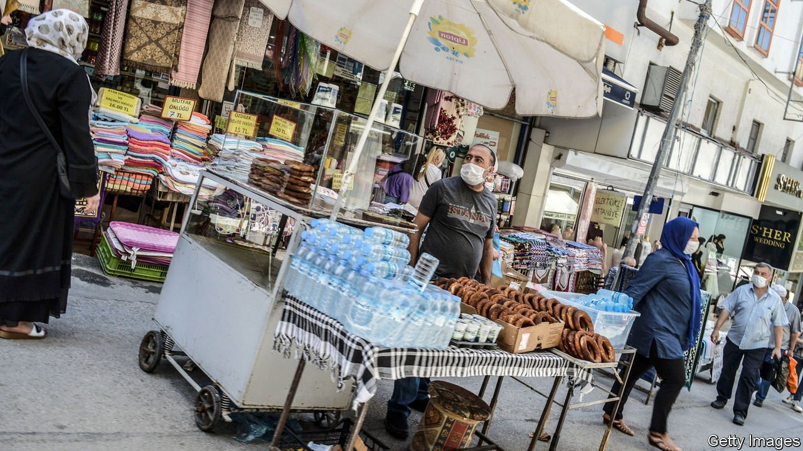

###### Buy the numbers

# Prices in Turkey are surging. But by how much? 

##### Depending on whom you ask, inflation is either around 17% or 40% 

 

> Jul 31st 2021 

EARLIER THIS summer Turkey’s president, Recep Tayyip Erdogan, announced that he had asked his central-bank governor, the fourth he has appointed in two years, to begin slashing interest rates. Mr Erdogan even provided a date for the start of the easing cycle. “We need to see July, August for interest rates to start coming down,” he said. He may have to wait much longer. A week ahead of the bank’s monetary-policy meeting on July 14th, the country’s statistical authority (TUIK) revealed that inflation had swollen to 17.5% in June, beating even the most pessimistic forecasts. That is more than three times the central bank’s inflation target of 5%, and close to the benchmark lending rate, 19%. In the event, the bank had no choice but to keep rates unchanged. It will almost certainly do the same in August.

Many Turks are convinced that the situation is even worse than the data suggest. According to a recent poll, a whopping 83% believe the true inflation rate is higher than the official one. The Inflation Research Group, an independent group of academics, believes it to be in the region of 40%. The group’s own index relies on price data gathered from online retailers and updated several times a day, says Veysel Ulusoy, the academic heading the project. Its basket of goods overlaps largely with TUIK’s, but excludes items like alcohol, education and health, where the government is able to control prices. Mr Ulusoy insists his price index is more consistent with consumer and market sentiment.


For their troubles, he and his colleagues may face charges. In May TUIK filed a criminal complaint against the researchers, claiming that the metadata on their website did not meet legal standards. The group has been “misinforming the public” and “undermining trust in official statistics”, the complaint says. That trust appears to be long gone.

Powered by stimulus spending and booming demand, inflation is mounting across most economies. But Turkey’s problem has much deeper roots. Double-digit inflation took hold four years ago, the result of cheap credit, bad monetary policy and a currency crisis, and has not relaxed its grip since. This has revived fears of a return to the 1970s, when inflation hovered near 20% for a few years, only to explode into triple digits. It took three more decades, and a painful economic crisis in 2001, to bring it below 10%.

The central bank has pledged to keep prices in check. But under pressure from Mr Erdogan, it will raise rates only as a last resort, and possibly too late. “If we can’t control inflation at the current levels, we may lose control,” warns Kerim Rota, a former treasury official and one of the founders of a fledgling opposition party. Mr Rota says he retains some faith in the official data. “But even with the TUIK figures”, he says, “this is a disaster.” ■

