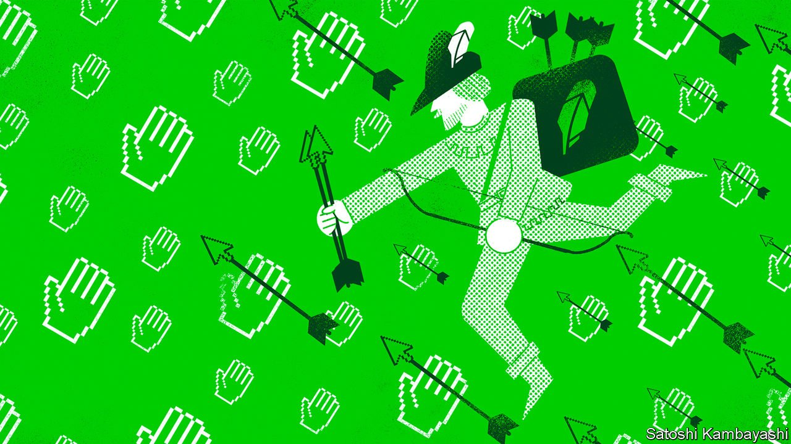

###### Robinhood and the merry mob

# Robinhood takes its IPO to the masses 

##### Our Wall Street correspondent participates 

 

> Jul 26th 2021 

 This article was updated after the first day of trading in Robinhood’s shares.

IT WOULD BE hard for a firm that describes itself as “democratising investing” to go public in any other way. After Robinhood’s listing on the Nasdaq on July 29th, institutional investors will, as is usual, be able to buy and trade shares on the exchange. Less conventionally, the broker also allowed its users to buy up to a third of its shares before trading. (They bought about a quarter, according to Bloomberg.)

Your correspondent felt a frisson of excitement as she took part in an initial public offering (IPO) for the first time, bidding for a single share in Robinhood. The slick graphics explained how IPO shares are allocated, and reassured punters that—as is not the case at other brokers—order size, assets and the age of the account would play no part in whether a bid was accepted or not. Before most firms go public they do a roadshow, which typically involves investment bankers compiling snazzy slideshows, donning their sharpest suits and fanning out to meeting rooms in big cities to canvass support from pension funds, asset managers and other institutional investors. Robinhood instead made its 40-minute pitch online to anyone who wanted to listen, on the Saturday afternoon ahead of its debut.


The anti-establishment approach is all too fitting. No other company’s fortunes have been as tied to the craze for meme stocks, fuelled by online forums and lockdown-induced spare time. Robinhood, which will go public at a valuation of $32bn, has seen its user base explode during the pandemic (see chart 1). It lost 8.4% of that value in the first day’s trading. Its longer-term prospects are likely to be determined by wherever the retail mania, the subject of much regulatory hand-wringing, goes next.

 


For decades retail investors were overlooked and underserved. The rich might have dabbled in trading stocks directly, but most workers earned defined-benefit pensions, which kicked any portfolio-management decisions regarding their biggest pot of savings to pension funds. The transition to self-directed 401K retirement plans, registered investment advisers and retail brokers was at first accompanied by wide trading spreads and meaty fees.

Then the adoption of new technologies—such as computerised trading and wicked-fast marketmaking algorithms—helped erode spreads. In 2013 Baiju Bhatt and Vlad Tenev, Robinhood’s founders and former employees of marketmakers, saw that it might be possible for a retail broker to make money by offering consumers commission-free stock trading. It could instead earn revenues through “payment for order flow”. This is the practice by which a high-frequency marketmaker pays a broker a cut of the spread it earns from trading in exchange for the broker directing its customers’ trades to the marketmaker.

For a time the big retail brokers ignored the plucky upstart and continued to charge commissions and fees. But by 2019 the writing was on the wall. A quick, brutal price war broke out. Charles Schwab, followed by E*Trade, TD Ameritrade and eventually the biggest broker of all, Fidelity, succumbed, scrapping their commissions and trading fees.

Lower costs for investors are a laudable thing. At Robinhood’s roadshow Mr Tenev claimed that his firm helped people buy shares in firms they love and got them excited about investing. By Robinhood’s reckoning, half of all brokerage accounts opened in America since 2015 have been set up on its platform. But the broker has also been at the centre of unease about the retail revolution, which peaked during the speculative frenzy in GameStop, a struggling video-game retailer, earlier this year. The company’s share price spiked from $17 in January to more than $450 two weeks later. So much of the trading volume came from retail investors, and so much of it was directed through Robinhood, that the broker was forced to suspend trading in GameStop because it lacked the capital to cover the two-day lag between its users’ trades and their settlement.

The queasiness over Robinhood’s success stems from two sources. For a start, when the price of something falls, people tend to do more of it. According to data in the firm’s IPO filing, around half of its users check their investments on its app every day. But plenty of research papers find that the more people trade, the worse their returns. Another concern is that Robinhood exposes its users to risky products. Its profit margins are slimmest for the vanilla stuff, like stock trading, but rise as its customers dabble in riskier, more complicated markets, such as trading derivatives or buying cryptocurrencies. Although options and cryptocurrencies make up about 17% of the $80bn in assets that Robinhood oversees, more than half of its transaction revenues come from these categories (see chart 2).

 


These worries have led lawmakers to question whether retail investors stand to make any gains from Robinhood. Summoned to Congress after the GameStop affair, Mr Tenev claimed that its users had earned more than $35bn in profits by buying stocks and investments, compared with what they had deposited with the broker. But Jim Himes, a congressman from Connecticut and a former banker, skewered him. “$35bn is a meaningless number unless you convert it to a rate of return so that I can compare it to Treasuries, so I can compare it to the S&amp;P 500.” Mr Tenev deflected, claiming the right comparison was the lower bar of “not investing at all” because many of Robinhood’s customers were new to trading.

Whether the firm’s empowerment of retail investors has been desirable or not is more than a philosophical matter. It is also the key question that any investor in Robinhood, institutional or retail, will have to wrestle with, because it pertains to where the potential risks and rewards lie. It is also a subject on which punters and regulators seem to disagree.

The downside for potential shareholders is that Robinhood is unlikely to escape the scrutiny of regulators. Much of the broker’s 300-page prospectus discusses the main risks to its business. These include the possible introduction of a financial-transaction tax, which might scupper its ability to offer free trading and deter customers from trading every day. It also allows for the possibility that payment for order flow, which accounts for 80% of Robinhood’s revenues, might be restricted or banned by regulators.

Indeed, Gary Gensler, the head of the Securities and Exchange Commission, has said his agency is looking closely into whether the current market structure creates conflicts of interest. The financial-services committee of the House of Representatives, which hosted the GameStop hearing, has drafted a bill that bans payment for order flow.

Retail punters, however, remain far more enthusiastic about Robinhood than regulators, which provides potential investors with an upside. It was common (including in the pages of The Economist) to expect that the GameStop episode could be the undoing of Robinhood; that its original adopters might feel betrayed by the firm’s suspension of trading in GameStop and junk the app. But the company’s user numbers suggest that the adage “all publicity is good publicity” still holds. In the first half of 2021 alone more than 10m funded trading accounts were opened on Robinhood, boosting the total number of accounts by 80%. If there is one constant about the retail mania, it is its sheer unpredictability. That might be why your correspondent feels comfortable with her single share, content mainly to watch from the sidelines.

