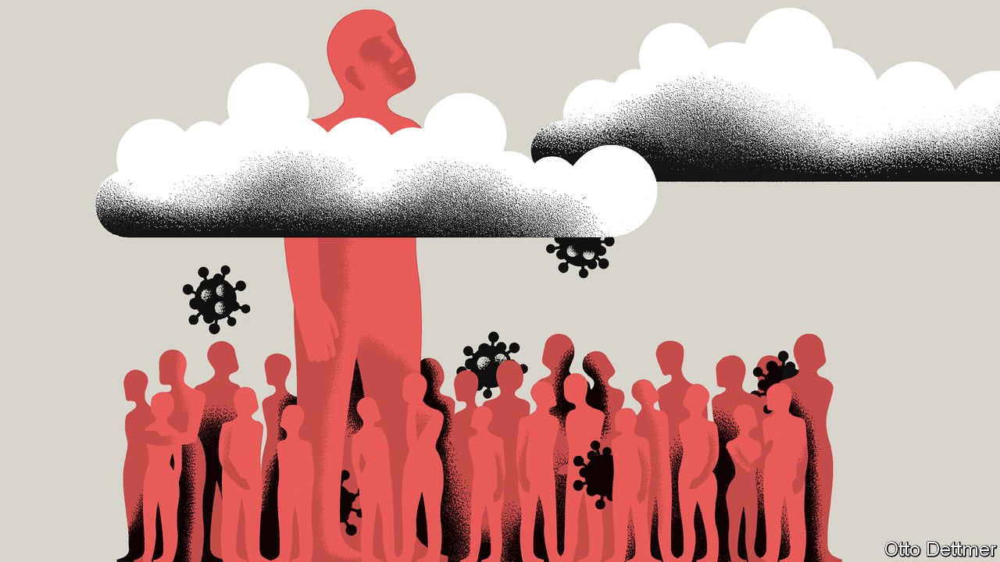

###### Free exchange

# Why have some places suffered more covid-19 deaths than others? 

##### Income inequality is a big part of the answer 

 

> Jul 31st 2021 

SEVENTEEN MONTHS into the covid-19 pandemic, plenty of questions about the catastrophe remain unanswered. It is still unclear how SARS-CoV-2 originated, for instance. Another puzzle is why some areas have had less destructive epidemics than others. Why has Florida had fewer deaths per person from covid-19 than the American average, even though restrictions there have been looser for longer? But researchers are getting closer to the “magic” variable: the factor that does most to explain variance in deaths from the virus. It turns out that this has little to do with health measures, climate or geography. Instead it relates to economics.

The huge literature on the determinants of covid-19 infections and deaths finds that many widely assumed relationships do not always hold in the real world. Everyone knows that the old are most at risk; but Japan, where 28% of people are over the age of 65 compared with 9% globally, has seen remarkably few deaths so far. Some studies suggest that places that had bad flu seasons before the pandemic suffered less since; but other researchers have called that conclusion into question. There is no consistent correlation between the toughness of lockdowns and cases or deaths.


Faced with these surprising results, a hunt has begun that is as morbid as it is nerdy. Wonks are searching for less obvious variables that do more to explain variation in deaths from covid-19. And so far the most powerful of them all is inequality—usually measured as the Gini coefficient of income, where zero represents perfect equality and one represents perfect inequality.

In a recent exercise Youyang Gu, a data scientist, ran multiple versions of a model that seeks to find correlations between 41 different variables and American state-level deaths from covid-19. Only three variables “consistently have non-zero coefficients”, he finds: inequality, population density and nursing-home residents per person. And of those three, inequality has the biggest effect.

Look around the world, and it seems that Mr Gu may be on to something. Deaths from covid-19 have been lower in egalitarian Scandinavia (even in Sweden, which imposed few restrictions) than for Europe as a whole. France, where the Gini is 0.29, has seen far fewer excess deaths than neighbouring Britain, where it is 0.34. New York state has both extremely high inequality and a huge covid-19 death toll; Florida is less exceptional on both counts.

Few other researchers rank the variables in the way that Mr Gu does. Yet our survey of the dozens of papers investigating the determinants of the toll from covid-19 finds that inequality has consistently high explanatory power. A recent study by Frank Elgar of McGill University and colleagues, looking at 84 countries, finds that a 1% increase in the Gini coefficient is associated with a 0.67% increase in the mortality rate from covid-19. Another, by Annabel Tan, Jessica Hinman and Hoda Abdel Magid of Stanford University, looks at American counties. They find that the association between income inequality and covid-19 cases and deaths varied over 2020 but was generally positive; higher inequality tends to lead to more suffering.

There is a lot less research on the potential reasons behind this intriguing relationship. Three sound plausible. The first relates to pre-existing health. A study in 2016 by Beth Truesdale and Christopher Jencks of Harvard University found “modest evidence” of a link between higher income inequality and lower life expectancy. This may be because of what economists call a “concave” relationship between health and income: giving a rich woman an extra dollar in income probably improves her health by less than removing a dollar from a poor man harms his. People in worse health tend to suffer more from covid-19 (and indeed some other research has drawn links between inequality and pre-existing conditions that may aggravate the disease, such as obesity).

The second potential factor is workplace relations. Workers in relatively egalitarian countries tend to have more bargaining power, and may therefore find it easier to air and redress concerns with employers. This can have its disadvantages, but it may help stop practices that aid the spread of covid-19. In Sweden, a country with strong workers’ rights, frontline (or “essential”) workers, such as meat-packers and police officers, have not on average faced a higher risk of dying from covid-19 than others, potentially limiting the overall number of deaths. This is in contrast to results from America, Britain and Canada, which are more lightly regulated. One study in California found that people in some jobs were much more likely to die of covid-19 than those in other occupations. Chefs and taxi drivers saw among the biggest increases in excess deaths in 2020.

The third factor relates to social capital. In areas of high inequality people are more likely to say they distrust strangers or to have little interest in civic engagement. Research published by the IMF in 2016 suggests why: in places where people have very different lifestyles, they see little in common with each other. Weak social capital almost certainly reduces people’s willingness to comply with virus-control measures, such as self-isolation or mask mandates, for which the private incentives to obey are weak.

Equal opportunity

There were already good reasons to think that inequality, at least in some countries, was too high. This is another. Yet turning around the income-distribution supertanker can hardly be done overnight, and some solutions to income inequality, such as raising taxes, bring trade-offs of their own. In the meantime, governments need to tailor their pandemic response to take account of inequalities. That could include, for instance, changing the economic incentives to stay at home if infectious—say, by using self-isolation payments—or investing more in poor children’s health to make them healthier adults. Without these improvements, high inequality is likely to continue to mean greater vulnerability to pandemics. ■

