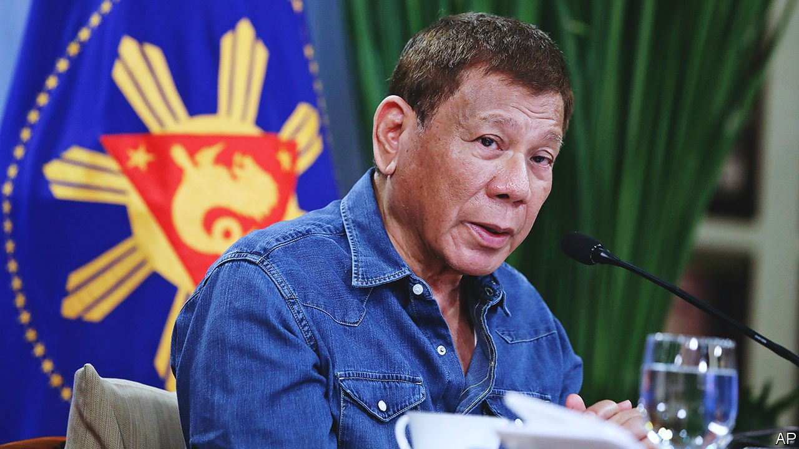

###### Bully for the Philippines

# Philippine President Duterte has shown how not to handle China 

##### Appeasement has brought few benefits and undercut a regional approach 

 

> Jul 31st 2021 

FACED WITH a bully, you have two choices. One is to confront, as Rodrigo Duterte threatened when campaigning in 2016 to become president of the Philippines: he declared he would deal with the country’s dispute with China in the Spratly Islands by riding a jet ski into the contested waters waving the national flag. In office, Mr Duterte has taken the other path, trying to bribe, flatter, cajole and wheedle the bully into more reasonable behaviour. This has turned out to be as silly and futile as a jet ski.

As  prepares to leave office next year at the end of the one term the constitution allows him, relations with China are no better than in 2016, when his term began. Benigno Aquino, his predecessor who died in June, once likened acceptance of China’s creeping maritime expansionism to the appeasement of Nazi Germany in the 1930s. Mr Duterte, in contrast, soon after becoming president, visited Beijing, where he announced his military and economic “separation” from America, telling his Chinese audience: “I will be dependent on you.” China promised billions of dollars in investment and concessionary loans. The two sides agreed to open negotiations over fishing waters in the South China Sea.


That swatted aside one of Aquino’s achievements: a landmark victory five years ago when a UN tribunal ruled that China’s expansive claims in the South China Sea had no basis in international law. China ignores the judgment, and Mr Duterte often rubbishes it. “That’s just a piece of paper,” he said in May. “I will just throw it into the wastebasket.”

Mr Duterte, however, does not have much to show for letting China trample his country’s rights. Only three of a planned 14 Chinese-financed infrastructure projects have broken ground. Of $15bn-worth of promised investment, only $3.2bn was approved in 2016-20. And although soft loans and grants from China have risen from $1.6m in 2016 to $590m in 2019, America provided almost as much; Japan’s aid totalled $8.5bn. Unusually for a South-East Asian country, the Philippines still does more trade with both Japan and America than it does with China.

Nor has the friendly approach restrained China’s maritime expansionism. In March some 200 of its fishing boats—or, as some called them, maritime militias—staged one of the biggest and longest-lasting incursions into Philippine waters. The Philippine foreign minister likened China to “an ugly oaf forcing [its] attentions on a handsome guy who wants to be a friend”. Mr Duterte, however, still insisted China was “a good friend”.

Yet Mr Duterte has not followed through on his other pledge in Beijing by jettisoning the alliance with the Philippines’ former colonial power, America, despite its infuriating harping on about his human-rights abuses. A 70-year-old mutual-defence treaty remains in place, and Mr Duterte’s threat to abrogate a Visiting Forces Agreement signed in 1998 has so far proved hollow. Facing resistance from the army and others, Mr Duterte has to keep “suspending” termination. Indeed, some of Mr Duterte’s own political allies take issue with his stance on China. And though he remains popular with voters, China does not. Whoever succeeds Mr Duterte is thus likely to revert to a more nuanced foreign policy, seeking to keep America engaged and to stand up more to China.

Nobody said that dealing with China would be easy. It likes to remind its neighbours that it is a big country that they will find hard to resist. South-East Asian countries have a weak hand. All the more reason not to throw away their three strongest cards, as Mr Duterte did so thoughtlessly.

One is regional solidarity. Other countries, too, including Malaysia and Vietnam, are at odds with China in the South China Sea, and their regional association, ASEAN, has long sought to get China to agree to a code of conduct there. The second is friendship with America, with all its military might. And the third is that, in the long run, playing these first two cards is the best way to encourage China to see that its interests lie in a world where countries agree to follow an accepted set of rules—and that, far from being a piece of waste-paper, that ruling five years ago was the law. ■

