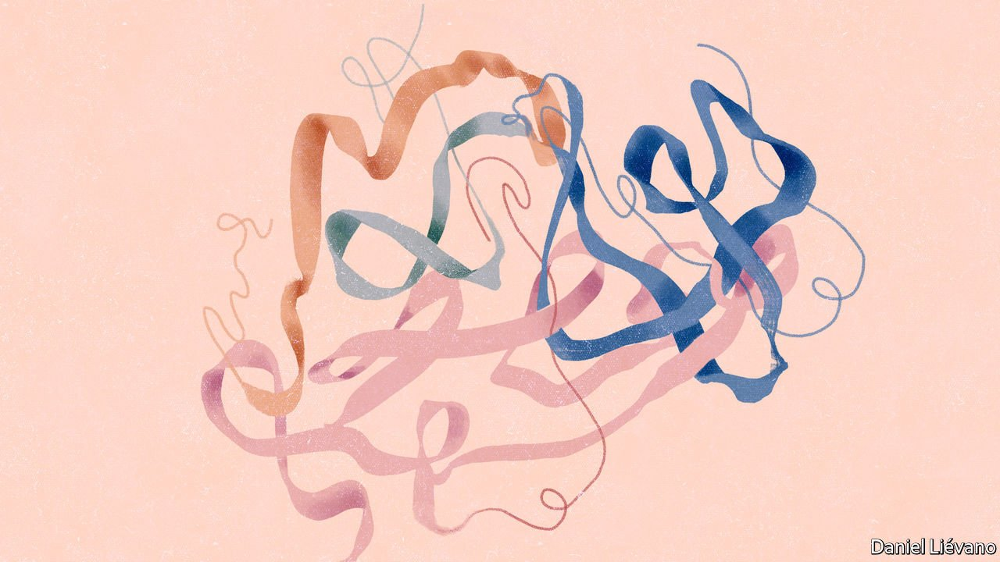

###### Proteinotopia

# Remarkable progress has been made in understanding the folding of proteins 

##### It will help open up almost limitless vistas 

 

> Jul 31st 2021 

WHEN ST JOHN THE EVANGELIST wrote of the Word becoming Flesh, he was drawing on ideas of reason and order derived from classical Greek philosophy. But he was also providing a succinct description of the most basic truth in molecular biology. In a wonderful and ancient mechanism called the ribosome, words—in the form of messages stored in DNA—are translated into flesh, in the form of proteins.

Proteins are flesh both literally, in that they give meat the texture and bloodiness that carnivores savour, and figuratively, in that their actions lie behind all the strengths and frailties of body and mind. Both their manipulation and their mass production are fundamental to modern pharmacology. The huge market for statins rests on the way they interact with the workings of a protein called HMG-CoA reductase; Keytruda, the world’s biggest-selling cancer drug, is a protein itself, a subtly tweaked antibody which turns off a mechanism that lets cancers evade the immune system. Understanding the form and function of proteins is crucial to medicine, to agriculture and to replacing the petrochemicals currently produced from oil. And that understanding is fast deepening.


Proteins are created as chains of smaller molecules called amino acids. The ribosome can fill each link in the chain with one of 20 different varieties of them. The words stored in DNA set out which of those 20 types of amino acid goes where. The process is explained in this week’s “Biology brief”, the first of six.

In order to take on the shape required of it, a protein must fold itself up into a specific form, a process which produces all manner of kinks, twists, swirls, sheets and cavities. The shape depends on the amino-acid sequence, but the interactions between the hundreds of amino acids are just too complex for the sequence alone to reveal much. To understand the structure of a protein in detail, scientists have had to make comparatively large amounts of it, coax those molecules into forming a crystal (or, more recently, flash-freeze them) and bombard the sample with X-rays (or, if it is a frozen one, electrons). These procedures take time, money and effort. Only a tiny fraction of the proteins whose sequences are known have been studied this way.

Now things look likely to get considerably easier. AlphaFold, a very elegant piece of software developed by DeepMind, a British AI company, has learned from the detailed study of sequence and structure to make predictions of protein shapes using just the amino-acid sequences of their very bendy backbones. On July 22nd DeepMind, which, like Google, is owned by Alphabet, made 350,000 of its predictions freely available to all, having released the code the week before. Millions more such predictions are expected soon.

As those suspicious of hype rightly point out, not all of these will be equally good and better prediction does not do away with the need for other ways of exploring protein structure. AlphaFold will not be the last word in the application of AI to the problem. All that said, the software looks likely to be massively useful, helping researchers spot possibilities and dead ends more quickly and letting them take on projects they would otherwise have steered clear of. If AlphaFold is not soon providing useful pharmacological results, as well as lots of basic biology, it will not be for want of application.

AlphaFold will also help usher in an era of altogether stranger things. Proteins are typically made from 20 different amino acids, each of which can, in principle, sit at any point in the chain. With 20 choices as to what should follow the first amino acid, you have 20x20=400 possible amino-acid doublets, 20x20x20=8,000 triplets and so on. By the time you get to an eight-amino-acid chain, there are more possibilities than there are people on Earth. Human proteins are typically 400 amino acids long; many have lengths in the thousands. There is no type of physical thing in the observable universe remotely as numerous as the possibilities inherent in a 400-amino-acid protein.

The “potential protein space” such calculations reveal is thus a cosmos unto itself, ordered yet near infinite. The bit that evolution has explored so far—which contains wonders as diverse as proteins that flex like springs, spin like wheels, extend like pistons and crank like ratchets, that turn sunlight into chemical energy, that build, demolish and recycle all the components of life and do more besides—is but the tiniest corner of it. Already some scientists are working on “de novo” proteins well outside nature’s comfort zone as ways of making tiny mechanisms and machines. As tools like AlphaFold increase the ease of molecular design, they will be joined by many more.

Compared with the designs evolution has honed over billions of years such things as this will be the crudest of toys, at least to begin with. But who can say what new flesh the designers’ words will eventually bring into being? ■

