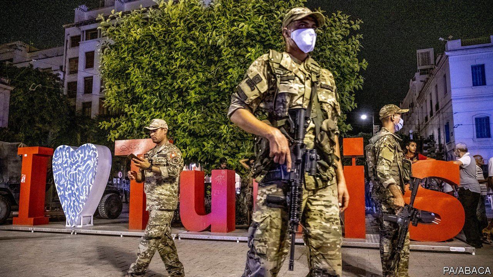

###### Relighting a beacon of democracy

# The way out of Tunisia’s crisis 

##### A new national dialogue is needed to repair a broken system 

 

> Jul 28th 2021 

THERE IS BUT one success story to come out of the Arab spring. Among the countries that toppled dictators a decade ago, only Tunisia emerged as a full democracy. Its free and fair elections, featuring Islamists and secularists, free-marketeers and communists, stand out in a region littered with despots. Liberals consider it a beacon of hope: if democracy could flourish in Tunisia, why not in the rest of the Arab world?

Tunisians don’t see their country as much of a model. Ten governments in ten years have failed to curb graft, improve services or create jobs. The most recent one, led by Hichem Mechichi, struggled to deal with one of Africa’s worst outbreaks of covid-19. On July 25th tens of thousands of Tunisians, braving the heat and defying a lockdown, protested against his inept administration. That night .


What a shame that it has come to this. Mr Saied was elected two years ago as a rebuke to the political class. He is popular, in large part because he has no political experience. Many Tunisians celebrated his power grab, hoping that he would clean things up. Yet democracy is a fragile thing and Mr Saied is treating it roughly. His claim to be acting in line with the law rings hollow. Large parts of parliament have rejected his actions, some calling them a “coup”. Already facing economic and health crises, Tunisia now faces a constitutional one as well.

This is not the first time its nascent democracy has been pushed to the brink. Secular and Islamist forces faced off in 2013-14 after two political assassinations. Tunisia’s leaders, urged on by labour unions and civil-society groups, eventually hashed out compromises that saved the system. Since then, though, unemployment has remained high and corruption rife. As in other countries, the . Many Tunisians are nostalgic for the period before the revolution, when there was at least the perception of order under Zine el-Abidine Ben Ali, the last dictator.

However, Ben Ali also left Tunisians angry and despondent (even as he tortured dissidents and plundered the state). A replacement strongman is not the answer to Tunisia’s problems. Does Mr Saied hope to become one? The former law professor strikes many as incorruptible, but also unyielding. Under the constitution, he can suspend parliament for a maximum of 30 days, yet he says he may wait “until the situation settles down”. He has barred public gatherings of more than three people. The police in Tunis have raided Al Jazeera, a media outlet seen as sympathetic to the Islamists of Ennahda, the biggest party in parliament. None of this bodes well for Tunisian democracy.

Mr Saied makes no secret of wanting radical reform of the political system. To begin with, he would like the president to have more power and to get rid of parties and some elections. Such is the dismal state of Tunisia that no idea should be dismissed. But even if he has the solutions to the country’s political problems, Mr Saied will struggle to implement them alone. Supporters of Ennahda, which styles itself “Muslim democratic”, will not roll over. Nor will the other parties pushed aside by the president, who is an independent.

Many Tunisians blame Ennahda for their country’s ills. But Rachid Ghannouchi, its leader and the Speaker of parliament, helped Tunisia through the crisis in 2013-14 by joining a national dialogue and working with Beji Caid Essebsi, a rival at the time. To his credit, Mr Ghannouchi is again being pragmatic. Ennahda has called on its supporters to leave the streets and suggested a new national dialogue. Mr Saied should take up its offer.

Western democracies ought to lend their support. Over the past decade countries such as America and France, Tunisia’s former colonial master, have done relatively little to keep the only true Arab democracy on track. More aid would certainly help. In a sense, the West must outbid Saudi Arabia and the United Arab Emirates, which have opposed the Arab spring. Yet in response to Mr Saied’s actions, America has merely expressed concern.

Ultimately, though, the responsibility for fixing Tunisia falls on its leaders. Painful reforms are needed to bring down big deficits and attract investment. Politicians have squandered a decade by taking, at best, half-measures. Tunisians are right to be angry, but they should not give up on democracy. Rather, when their leaders fail, they should vote them out. ■

