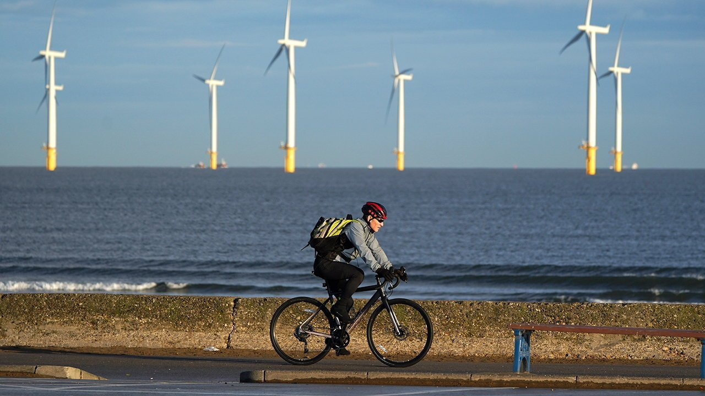
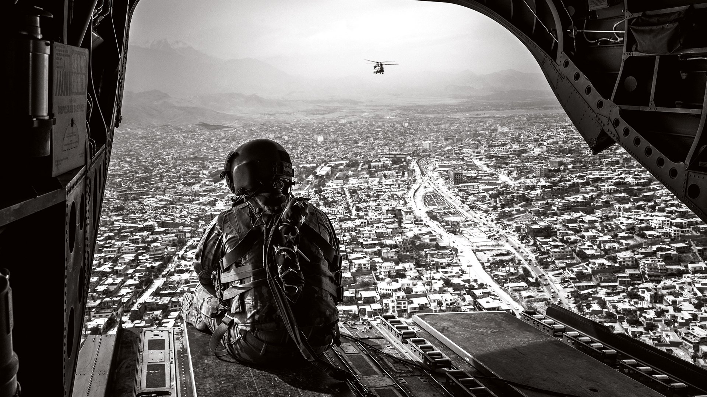
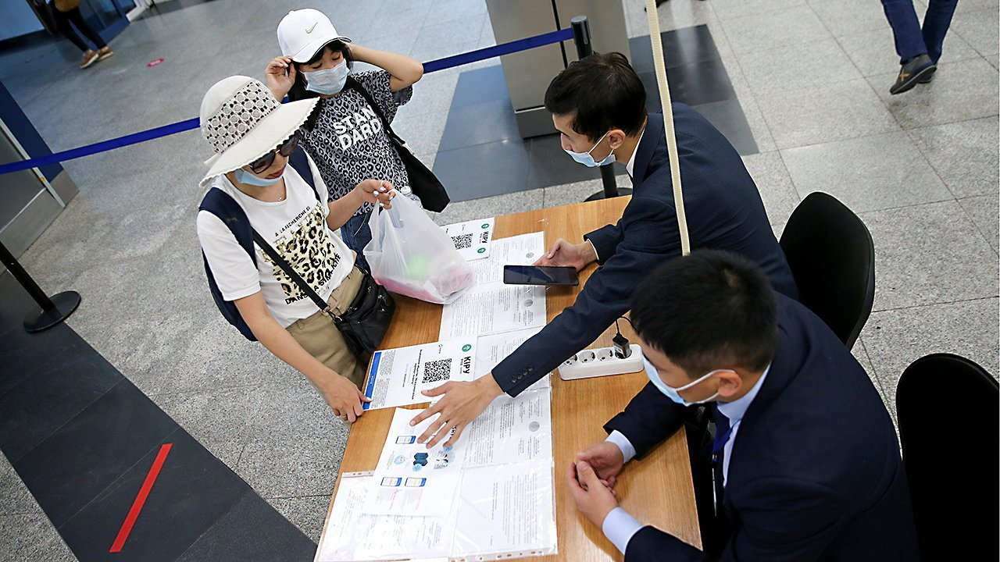

###### On China, Eswatini, climate change, Afghanistan, the Olympics

# Letters to the editor 

##### A selection of correspondence 

 

> Jul 31st 2021 

Letters are welcome via email at 

Liberty v security

“”, the cover title to your special report on the Chinese Communist Party (June 26th), might equally well be the result of unfettered capitalism, so why pick on China? The Economist does a decent job of presenting the pros and cons of government policies, but you seem incapable of seeing the basic role of government as most people in the world view it.


The vast majority of the globe’s inhabitants believe that the purpose of government is to maintain stability, tranquillity and national defence, and not to protect individual liberty or provide social equality. For most, those ideals are the antithesis of traditional social norms. I especially think you have a bad take on China. The fact that there were only ten dynasties in a 4,000-year history shows that rocking the boat was considered an affront to the ancestors, the gods and to humanity. Laws made sure the masses fell in line. It worked for them, where democracy may never.

Until you recognise that most cultures are still built on a firm foundation that ranks stability—from the rule of kings, dictators or imams—as the paramount necessity of a society’s existence, you will never understand the world as most people see it.

KIRK LOVENBURY

Williamsburg, Virginia

Your special report was a tour de force. Yet there was a contradiction. Your leader speaks of the Communist Party’s continuing popularity (“”, June 26th). But the report documented its ever more closer control and monitoring of the population. This doesn’t suggest a party confident of popular support. I’d put my money on the party’s judgment. We can never gauge popular feeling in a totalitarian state. Too easily we mistake resignation for support.

PETER ROWE

Former Australian ambassador to South and North Korea

Sydney

 


Absolute monarchs

In 1968 Eswatini (formerly Swaziland) emerged from 65 years of British colonial administration with a constitution considerably more inadequate than your article on the country’s present troubles suggests (“”, July 10th). Commonwealth Office officials admitted as much, describing King Sobhuza’s constitutional position as being more like that of Queen Victoria or even George III. This was in part the result of Sobhuza’s deft political manoeuvres. In embracing atavistic governance rituals he cultivated popular support among rural Swazis.

Curiously, he also won backing from white settlers fearful of one man, one vote, as well as tacit endorsement from apartheid South Africa’s leaders. Most notably of all, he convinced key Tory politicians in London that he was a loyal ally. Sobhuza’s costumed “tribal” performances had a magnetic appeal for Britons and settlers reared on the African imaginings of John Buchan and H. Rider Haggard, no less than for anthropologists from the London School of Economics.

Unexpectedly, the continuation of such performances today by King Mswati (pictured above) has suited South Africa’s African National Congress since 1994. And no one more so than Jacob Zuma, who empowered his own country’s traditional leaders and cultivated the old “reserve” areas as core bastions of party support.

PETER HENSHAW

Ottawa

 


Mitigation is worth it

“” (July 17th) reported on analysis by the Office for Budget Responsibility of Britain’s pathway to net-zero mitigation on climate change. You interpreted the cost calculated by the OBR as 15% of annual gross domestic product. Yet the figure could have also been reported as 0.5% of GDP a year, under the more realistic assumption that the £321bn ($443bn) net cost will be incurred over a 30-year period (the report looks forward to 2050). What is closer to 15% of annual GDP is the size of the fiscal measures that the British government has pledged for the post-pandemic recovery, according to the IMF. That is a useful number to consider because it makes the cost of decarbonisation paltry by comparison.

The example of insulating a building to illustrate the lag between the spending and the benefits of mitigation (lower heating bills, but in the future) did not really do the job either. Generally, return rates on energy savings outperform most other options for investments. If anything, it is an example of one of the most prudent forms of putting your money where your mouth is right now. And that is before the huge benefits of reducing emissions in terms of preventing damage from climate-change-induced extreme events or lessening the impact of air pollution on health. With all that in mind I am not sure on what basis your “Treasury insiders” expect public support for net zero to evaporate.

MARINA ANDRIJEVIC

Berlin

 


Nation-building crumbles

“” (July 10th)? Oh, come on. The American experience in Afghanistan is not appreciably different from the Soviet one in the 1980s and, indeed, the British experience in the 19th century. It is fundamentally flawed reasoning to assume that one can change a collection of tough people with an archaic, nay, atavistic, set of tribal ethics and mores into a larger nation with a representative government. It took the Western world 2,000 years to do this. What makes us think we can make it happen elsewhere, and in a comparatively short time frame, particularly now that colonialism is frowned upon?

Right from the outset, it was a commonplace observation among coalition troops in Afghanistan that where the Taliban was concerned, “We have the wristwatches, they have the time.” The outcome was always apparent; we knew it and so did they.

What is surprising is that we never seem to learn. The blood and treasure that has been spent in Afghanistan, and Iraq and Somalia, is a painful stupidity tax on our hubris.

K. JONES

Edmonton, Canada

 


Vaccines in Kazakhstan

The Economist rightly noted that there have been instances of fake vaccine passports being sold in Kazakhstan (“”, July 24th). This problem has been acknowledged by the government, including by President Kassym-Jomart Tokayev, who recently described it as “a very serious crime” and asked the government to toughen punishment for those who allow the falsification of vaccination passports.

At the same time, it is incorrect to suggest that Kazakhstan is “awash” in fake vaccination passports and that the black market is “thriving”. The majority of Kazakh citizens accept that vaccination saves lives, as demonstrated by the fact that almost half of the eligible population has already received at least one dose of the vaccine.

It is also worth noting that forged proofs of vaccination and covid testing have become an issue not just in Kazakhstan, but in countries across the world. As reported elsewhere, there are numerous websites globally selling fake vaccine passports. And in recent weeks, we have read that officials at Heathrow Airport catch “a reasonable number” of fake covid-test results each and every day.

That is to say, we are all in it together, having to tackle a new daunting challenge with a new and untested set of tools. Rather than singling out an individual country for the difficulties it is facing, the international community, national governments, NGOs, and media should all work together to defeat covid.

Your article is right in saying that better communication regarding the vaccine efforts is required. And, frankly, this better communication is required of us all.

ERLAN IDRISSOV

Ambassador of Kazakhstan

London

 


Young man…

Your leader on performance-enhancing drugs in sport stated that Russia is banned from the Tokyo Olympics for its doping programme (“”, July 17th). Although technically true, Russian athletes are still competing. They are not allowed to use the country’s flag; yet their uniforms are in Russia’s national colours. Their national anthem is also banned; though they are allowed to use Tchaikovsky’s Piano Concerto Number 1, music clearly associated with Russia.

That is not a serious deterrent. A more creative approach would have seen Russian medal winners taking to the podium accompanied by the triumphant chords of “YMCA”. No song could better distance these Olympians from Vladimir Putin’s mendacious and repressive regime. You might even throw in some rainbow uniforms to match.

JAMES D.J. BROWN

Tokyo

If the Olympic committee really wants to promote the games to a broader audience, it might be best not only to ban the latest tech running shoes, but revert to the ancient Olympic style and require everyone to compete naked.

JON GODFREY

Gilmanton, New Hampshire

