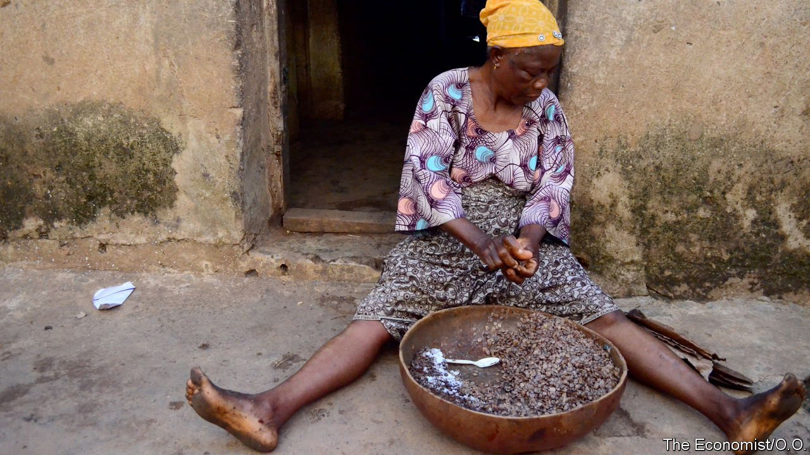

###### Superbeano!

# A tangy Nigerian cooking ingredient is cheering the diaspora 

##### Across the world, foodies may learn to savour a fermented African locust bean 

 

> Jul 31st 2021 

THE FERMENTED African locust bean, known in Yoruba as iru, has an unmistakable cheesy tang that hits you before you see it. “Iru isn’t just a flavour on the tongue,” says Ozoz Sokoh, a food blogger. After an elaborate process of fermentation, the smell is essential to its flavour. Iru is further enriched once tossed in smoky, bleached palm oil.

Long before Nestlé came to Nigeria with its Maggi bouillon cubes, iru was flavouring soups, stews and rice dishes. After independence the cube, with its monosodium glutamate seasoning, became more popular than iru, particularly in cities. But iru is making a worldwide comeback, thanks to a dish called ayamase which is packed with it.


A decade ago you would have been hard-pressed to find ayamase on a party menu. Instead you might have found ofada, a dish named after a town in south-western Nigeria close to Lagos, the commercial capital. It consists of unpolished rice and a spicy fried red-pepper beef stew. But now ayamase, the green-pepper rival of ofada, is wherever you find Nigerians, at home or abroad.

Bilikisu Raji, who lives in Ibadan, another big city in the south-west, was taught to ferment iru by her mother-in-law. The iru enterprise is run by women because, she jokes in Yoruba, the men aren’t up to it. She buys the yellow-tinged seeds in the market and boils them for 12 hours in a cauldron. She removes the chaff to reveal black-brown beans, peels them with the balls of her feet, washes them through a sieve, then boils them again. Eventually she dry-roasts them and covers them with a raffia tray to let them ferment overnight. Finally she rubs the iru in salt, then rolls it up in dry leaves, ready to sell. A small wrap weighing 20 grams goes for only 50 naira (an American dime). She survives on the patronage of foreign customers who buy as much as $25-worth at a time to use in ayamase abroad.

Nowadays you can find iru on shelves across the world. Ms Sokoh, who has lived in the Netherlands and Canada, has seen it in shops everywhere. “You find frozen iru, fresh iru, powdered iru, dried iru on the shelves in ways you couldn’t ten years ago,” she says. Suffering from high blood pressure, she steers clear of stock cubes in favour of iru. “There’s definitely a saltiness without being sodium-heavy,” she says.

To non-West Africans, iru is likely to remain a niche ingredient “like fish sauce”, sighs Tunde Wey, a popular Nigerian chef based in New Orleans. He has collaborated with an American company to sell iru in sleek jars, hoping to boost small farmers back home while getting fellow cooks abroad to appreciate its versatility. Whether or not Western foodies catch on to this superbean rich in probiotics, iru is fuelling Nigerian partygoers around the world.

