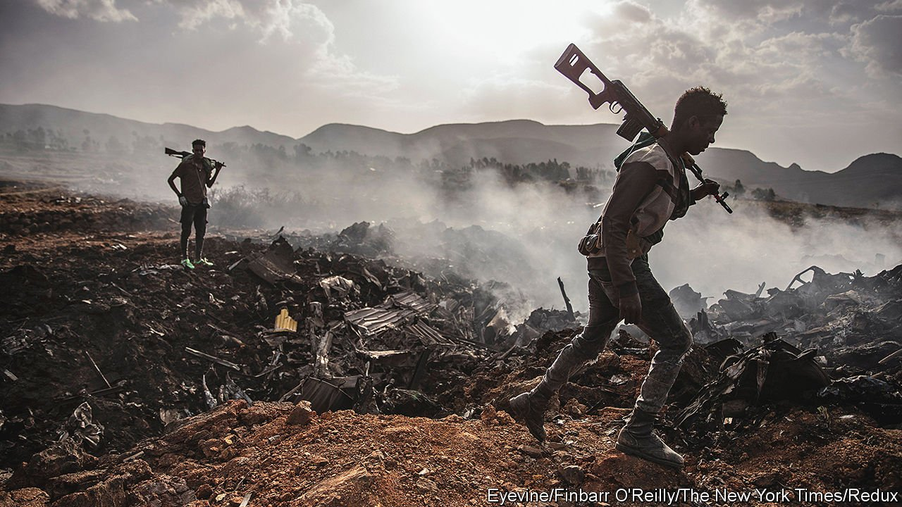
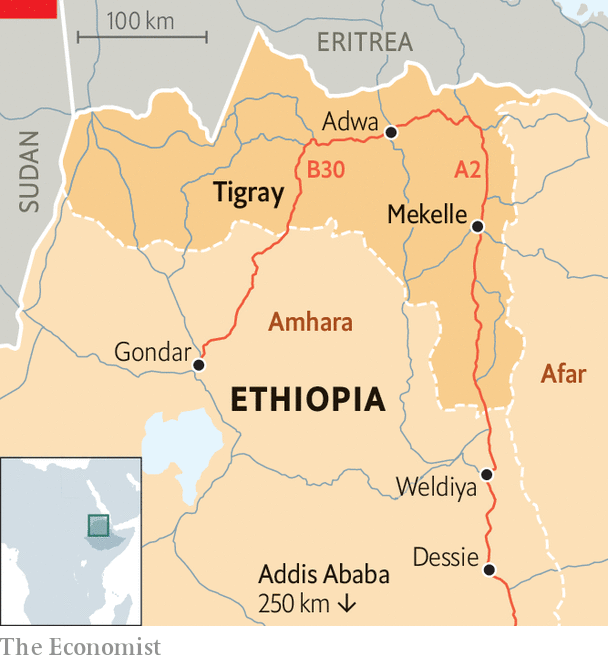

###### Down from the mountains

# In Ethiopia’s civil war, Tigrayan forces take the offensive 

##### The conflict has entered its most dangerous phase yet 

 

> Jul 31st 2021 

THE STREETS of Dessie, in Ethiopia’s Amhara region, are loud and bustling. So are its restaurants and bars. But as Ethiopia’s civil war edges closer, the mood is darkening. In the past week military-training camps have sprung up. Outside a hospital a tent has been erected; wounded soldiers lie on stretchers. Through mountain fog come the screams of ambulance sirens. Such is the tension gripping the place that when your correspondent visited, he was arrested almost immediately and held for several hours.

The jitters are because rebels from Tigray are advancing fast and meeting weak resistance. As The Economist went to press, the fighting was drawing near to Weldiya, a strategically important town about 80km north of Dessie. To the west they have penetrated to within perhaps 80km of Gondar, Ethiopia’s historic capital (see map).


A few weeks ago, when the insurgents captured most of the Tigray region, including Mekelle, the capital, there may have been a chance for a negotiated end to Ethiopia’s civil war and accompanying humanitarian crisis. Instead, the war may be entering its most dangerous phase yet.

 


On June 28th Abiy Ahmed, Ethiopia’s prime minister, announced a unilateral ceasefire and withdrew his troops from Tigray. Yet instead of using the opportunity to open talks with the rebels led by the Tigrayan People’s Liberation Front (TPLF), the region’s ruling party, Abiy tightened a blockade. Ignoring calls to join the ceasefire the TPLF has sent its forces well beyond Tigray’s borders. As well as into Amhara, they have marched east into the Afar region in what seems like a bid to control the road and rail link to Djibouti, through which about 95% of landlocked Ethiopia’s trade flows. The TPLF may even be mulling a march on Addis Ababa, the federal capital, to remove Abiy by force.

Abiy has responded with a call for total war, invoking the battle of Adwa, when Ethiopians from all corners defeated Italian invaders in 1896. The president of Amhara has ordered all armed residents to mobilise in a “campaign for survival”, while the president of Afar has called on his people to protect their land “whether by guns, sticks or stones”. Other regions have also sent in paramilitary forces.

The tactics on both sides are risky. The government’s mobilisation of ethnic militias is a recipe for bloodletting: most of their members are poorly trained and have been whipped up by allegations of Tigrayan atrocities. “Everyone is ready with anything they have, from machetes to Kalashnikovs,” says Teqil Nigusse, a merchant in Weldiya. In Addis Ababa and elsewhere, ordinary Tigrayans are being treated as fifth-columnists. Hundreds have been arrested and scores of Tigrayan-owned businesses, including hotels and bars, have been closed, in some cases simply for playing Tigrayan music.

For now, though, the Tigrayan forces have the upper hand. As the Ethiopian army has retreated, they have captured its heavy artillery. And they have turned their once-disorganised ranks into an effective fighting force, motivated by the murders and rapes committed by Ethiopian and Eritrean soldiers. The insurgents’ counterparts in Amhara, by contrast, lack training and have been hastily assembled. The Tigrayans “have the military advantage now”, frets a young policeman in Dessie.

Even so, the Tigrayans’ gamble is also risky. Rather than focus on reclaiming disputed territory occupied by Amhara forces in the west, they are attacking on many fronts—and risk overstretching themselves. Tigrayans make up only about 7% of Ethiopia’s population. Amharas alone outnumber them four to one.

Securing the road to Djibouti, moreover, is no easy feat. The scorching deserts of Afar are harsh terrain and, beyond their own borders, Tigrayan forces cannot rely on widespread local support. The fighting in Afar has already forced tens of thousands of civilians from their homes. The resistance may be stiffening. Federal troops backed by Afar paramilitary forces seem to have halted the Tigrayan advance in the east. “Invading Afar was a historic mistake,” argues Dawud Mohammed Ali, a local academic.

The second risk is political. When the TPLF arrived in Addis Ababa in 1991 as a band of guerrillas who had toppled Ethiopia’s then military dictatorship, it could count on support from many of Ethiopia’s more than 80 ethnic groups. But after almost three decades in charge of the government in Addis Ababa, it has few friends left. Many would regard any move towards the capital as a brazen attempt to put itself back on the throne.

Despite the dangers, neither side in the war appears especially interested in talks to end it. The TPLF, believing it can smell victory, wants a transitional government to replace Abiy. The prime minister, for his part, insists that the TPLF must be defeated entirely. Many Ethiopians agree with him. Yet much blood has been spilled trying to do this, even as the government’s prospects have inexorably worsened. ■

