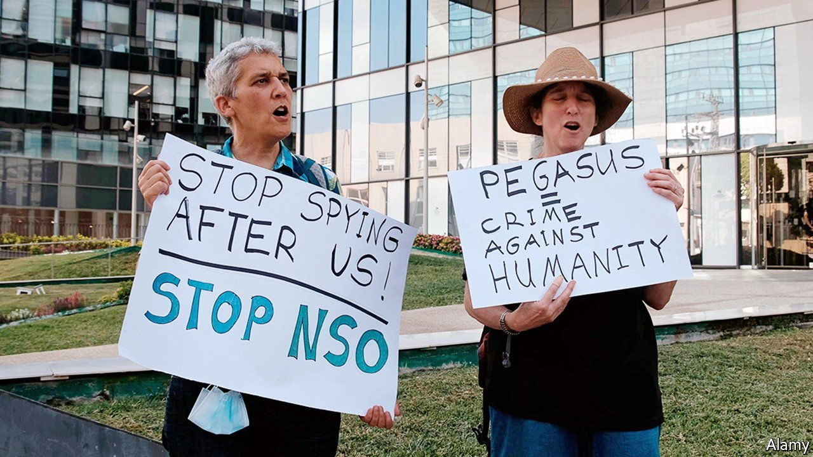

###### Let Pegasus fly

# Israel is loth to regulate its spyware exports 

##### It may like to help its friends to snoop 

 

> Jul 31st 2021 

WHEN INTERNATIONAL news organisations revealed that at least ten governments had used Pegasus, a powerful software tool created by Israel’s NSO Group, to hack into the smartphones of thousands of people around the world, including politicians, human-rights activists and journalists, the Israeli government shrugged. None of its ministers has publicly commented. A humdrum official statement insisted that all Israeli cyber-exports were regulated by the government in “adherence to international arrangements”. Export licences were granted “exclusively to governmental entities, for lawful use, and only for the purpose of preventing and investigating crime and counter-terrorism”.

Israeli defence exporters privately expressed ridicule. “Arms companies can’t keep track of every rifle and bullet they sell to legitimate customers,” said one. “Why should we have higher expectations when it comes to software?...Israeli spying is a sexy subject and these reports are the price for doing business.”


In any case, the  correlates neatly with many of the governments courted by Israel’s former prime minister, Binyamin Netanyahu, who lost his job in June. These include like-minded populists such as the rulers of Brazil, Hungary and India, along with Sunni Arab regimes with whom Israel recently established diplomatic relations: Bahrain, Morocco and the United Arab Emirates. Saudi Arabia, a fellow enemy of Iran, is listed, too. “Deals on cyber-surveillance are the kind of sweetener you can throw into a diplomatic package with a foreign leader,” says a former NSO consultant.

Israel’s new government, too, has close ties to the cyber-industry. The prime minister, Naftali Bennett, made a fortune as a founder of an online-banking security company and is a cyber-defence aficionado. His interior minister and right-hand woman, Ayeled Shaked, is a former tech executive with friends at NSO; she supported awarding the firm government contracts. The new defence minister, Benny Gantz, chaired a company that specialised in data-mining for policing and counter-terror purposes. The head of that (now defunct) company, Ram Ben Barak, a former Mossad bigwig, currently chairs the foreign-affairs and defence committee, which monitors cyber-exports. A hearing on the NSO affair is scheduled, but only in a secretive subcommittee behind closed doors.

Israel’s Defence Export Control Law of 2007 requires companies to undergo a rigorous licensing process. It was passed after America, Israel’s chief patron, complained about Israel selling arms to China. But defence officials and human-rights campaigners admit that once a licence has been obtained, the Israeli government prefers not to know how the tools are used.

Some firms have set up in-house ethics committees, fearing that otherwise they might become tainted, making it harder to do business in the West. “The more progressive-minded workforce coming to the fore in America’s tech giants could treat Israel as a pariah, object to having research centres in Israel and collaborating with Israeli companies,” says a veteran dealmaker. Stung by the Pegasus revelations, investors in Novalpina Capital, a private-equity firm that owns NSO, are thinking of liquidating the fund. But Israel’s rulers, old and new, have fewer qualms. ■

