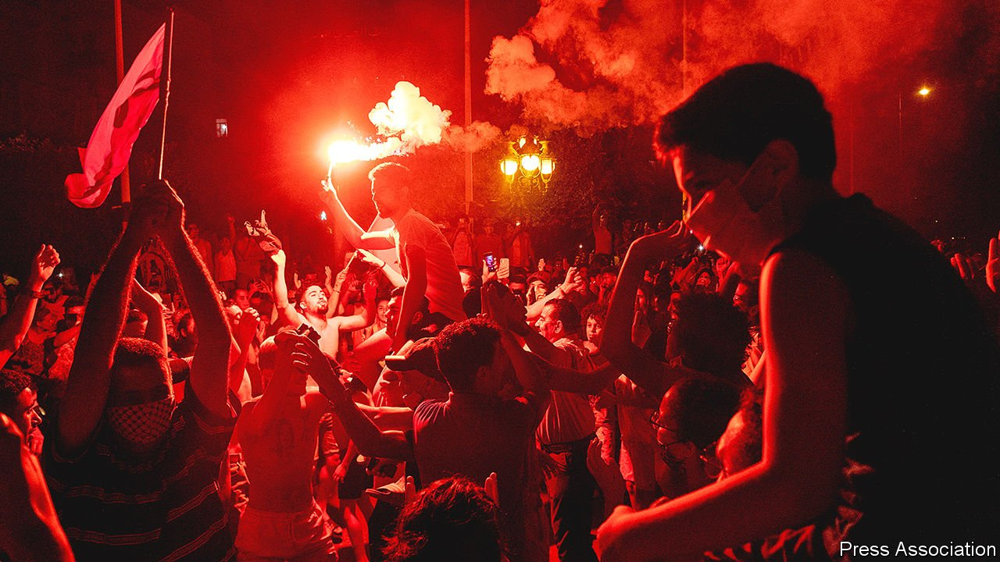
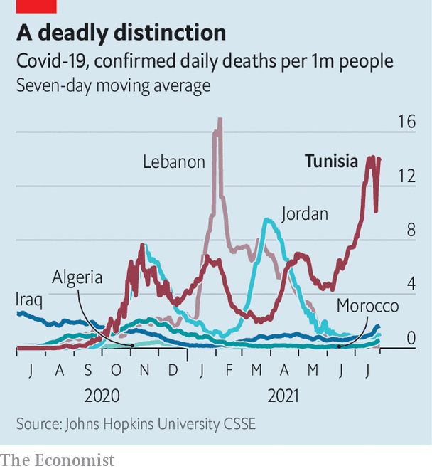

###### Arab democracy’s fading star

# Tunisia’s democracy totters as the president suspends parliament 

##### The future of the Arab world’s only full democracy is uncertain after Kais Saied seizes power, cheered on by crowds 

 

> Jul 26th 2021 

SOME CHEERED it as a necessary intervention into a broken political system. Others called it a “coup”, the possible end of Tunisian democracy. No one is playing down the significance of President Kais Saied’s decision to enact Article 80 of the constitution, under which he suspended parliament for 30 days and dismissed the prime minister, Hichem Mechichi.

The president’s decision, delivered late on July 25th in his customarily awkward style, came after a day of widespread protests. Tens of thousands of Tunisians, defying a covid-19 lockdown, called for the downfall of the government. Some attacked the offices of Ennahda, the biggest party in parliament. After Mr Saied’s announcement many of the protesters again took to the streets—to celebrate (pictured).


Tunisia is the one true democracy to emerge from the Arab spring protests of 2010-11 that toppled dictators in a handful of countries. But it has struggled in the decade since. Ten governments in ten years have failed to stem corruption or revitalise the economy, which shrunk by 8.6% last year. Covid-19 has added to the strain. The government declared victory over the virus a year ago. Now Tunisia is suffering a new spike in cases. The health service has collapsed. Oxygen supplies are at a premium. About 200 people (out of a population of 12m) are dying each day from the disease (see chart).

 


Earlier this month the government opened dozens of centres offering covid-19 vaccines. Large crowds showed up expecting to be jabbed, only to find chaos, confusion and rumours of vaccine shortages. The dismissal of the health minister did little to appease an angry public—nor did the prime minister’s claim of ignorance over the operation. In a harbinger of things to come, Mr Saied stepped in, asking the army to assume management of the country’s pandemic response.


The president’s power grab was condemned by the largest parties in parliament. But Mr Saied seems unswayed. He has since fired the defence minister and acting justice minister, while lengthening an existing curfew and banning public gatherings of more than three people. The police raided the office of Al Jazeera, a media outlet seen as sympathetic to Ennahda.

Mr Saied was elected two years ago as a protest against the political class. A former constitutional-law professor with no previous political experience, he won with 73% of the vote, drawing support from young Tunisians and others who viewed him as incorruptible. The same election produced a fractious parliament, with no party or coalition claiming a majority. Mr Saied has thus attempted to play a larger role in domestic policy, previously the preserve of the prime minister and government. Since January the president has refused to swear in 11 new ministers.

It is no secret that Mr Saied, who helped to write Tunisia’s constitution (but later criticised it), wants to upend the political system. He would like the president to have more power and to do away with political parties and some elections. Instead, he suggests that Tunisians should elect local delegates, based on their merit, not their ideology. These delegates would appoint regional representatives, who would then appoint members of a national assembly. According to the constitution, two-thirds of parliament would need to approve any revision of the charter.

What Mr Saied has planned for the near term is unclear. He has claimed the power to extend the 30-day suspension of parliament “until the situation settles down”. For now he says he will assume executive authority with the help of a new prime minister, whom he will appoint. Mr Mechichi released a statement saying he would not be a "disruptive element" and would hand over power to whomever Mr Saied selected.

Ennahda, a party with roots in the Muslim Brotherhood (a regional Islamist movement) which now styles itself “Muslim democratic”, has also tried to calm things down. It has been a political force ever since the revolution, and many Tunisians blame it for the country’s woes. But its leader, Rachid Ghannouchi, who is also speaker of parliament, helped get Tunisia through its last big political crisis, in 2013-14, by joining a national dialogue. His party has suggested holding another one and withdrew calls for protest.

America and European democracies have expressed concern over Mr Saied’s move. But Tunisians say they have not done enough to support their country over the past decade. The president faces an immediate challenge in managing Tunisia’s relationship with the IMF. The government had been negotiating a much-needed loan from the fund, which may now think twice about making any commitment.

Tunisia is also caught up in a regional rivalry that pits countries such as Turkey and Qatar, which supported the Arab spring and the Islamist groups that benefited, against those such as Saudi Arabia and the United Arab Emirates, which opposed the uprisings. Saudi and Emirati commentators were quick to hail Mr Saied’s actions as a blow to political Islam.

In meetings with civil-society groups Mr Saied has promised to protect Tunisian democracy. Yet he seems likely to try to reshape it in a way that gives him more power. Tunisia will not emerge from the crisis looking like Saudi Arabia. But it will probably be a little less democratic. ■

