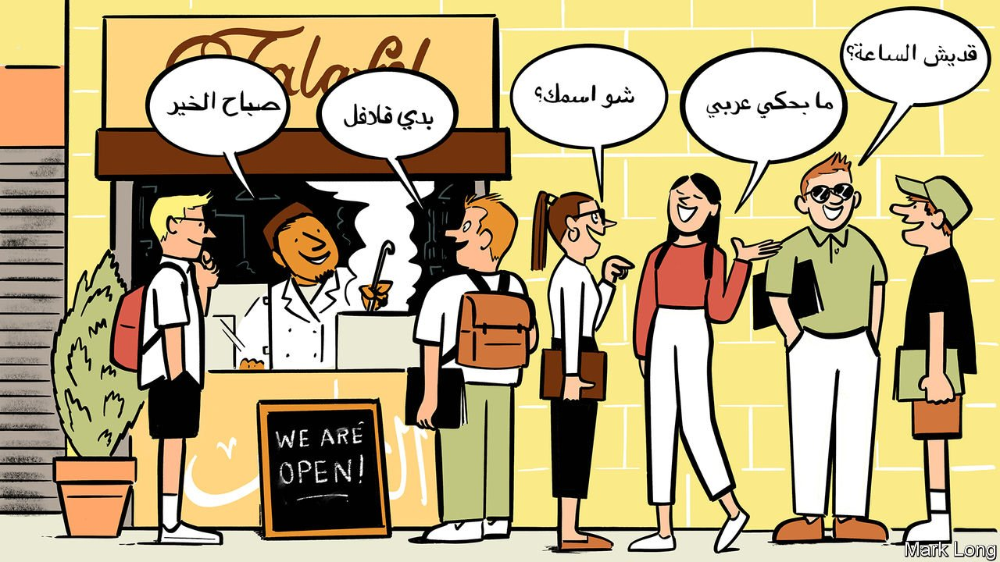

###### Being boring has its advantages

# Why Jordan leads the way in Arabic-language training 

##### Western students want to learn in peace 

 

> Jul 31st 2021 

THE COUNTER of Fahad Subeihi’s falafel stand is stacked with piles of sliced tomatoes, onions and pickled turnips dyed pink. “The students love it,” he says. Mr Subeihi’s stand is located in the Jabal Amman neighbourhood of Jordan’s capital, Amman, amid a bevy of Arabic-language schools. Mr Subeihi estimates that, before the pandemic, half of his customers were foreigners, mostly Western students.

Jordan has cornered the market in Arabic-language training in the region. Unlike many of its neighbours, it is relatively stable and at peace. Its nickname, the “Hashemite Kingdom of Boredom”, may turn off thrill-seekers. But it attracts Western universities and grant programmes, which have largely stopped sending students to more volatile countries.


“Amman has become our largest centre,” says Pauline Koetschet of the French Institute of the Near East (IFPO), which teaches mainly European students. IFPO used to have centres in Aleppo and Damascus, but closed them because of Syria’s civil war. It still has a centre in Beirut, Lebanon’s unruly capital, but schools are increasingly worried about sending students there. “We have universities that tend to prefer Amman for security,” she says.

Oman and Morocco also offer stability, but Jordan has other advantages. Unlike Oman, at the tip of the Arabian peninsula, Jordan is in the heart of the Arab world. And although Morocco is still a popular destination, its dialect, called darija, is difficult to understand. Jordan’s, on the other hand, is close to the Modern Standard Arabic taught in most Western classrooms.

“I feel like Amman has a monopoly on Arabic-language students from America,” says Patrick, who studied Arabic on a grant from Boren, a language programme funded by America’s Defence Department. In normal times Jordan is Boren’s second-most popular destination for grant recipients after Taiwan. (Arabic and Mandarin are languages the programme deems crucial to national security.) Students on Boren grants cannot train in countries for which the State Department has issued high-level travel advisories, which have become common during the pandemic. Even before, though, the rule meant nearly all of Jordan’s neighbours were out of luck.

The pandemic has cut into the number of Arabic-language students travelling to the region, so Jordan has been hit particularly hard. Katy Whiting of the Sijal Institute, an Arabic-language school in Jabal Amman, says that normally over 200 students would be enrolled at Sijal during the summer. As it is, 30 are attending classes in person and another 30 are studying online.

The absence of students has hurt neighbourhoods like Jabal Amman, which is eerily quiet. Muhammad Zuher says his restaurant, Kmajeh, near the popular Rainbow Street, used to draw a steady crowd of Western students. Now it is largely empty. Still, he is confident the students will return. “They want security, safety and to practise Arabic with locals,” he says. “Welcome to Jordan.” ■

