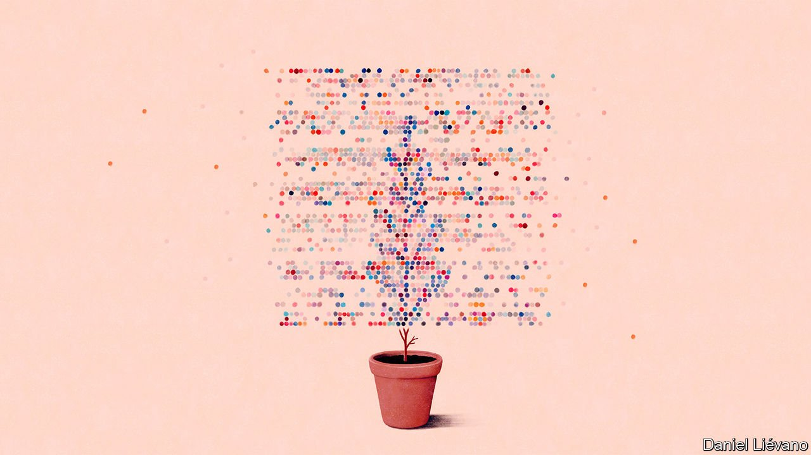
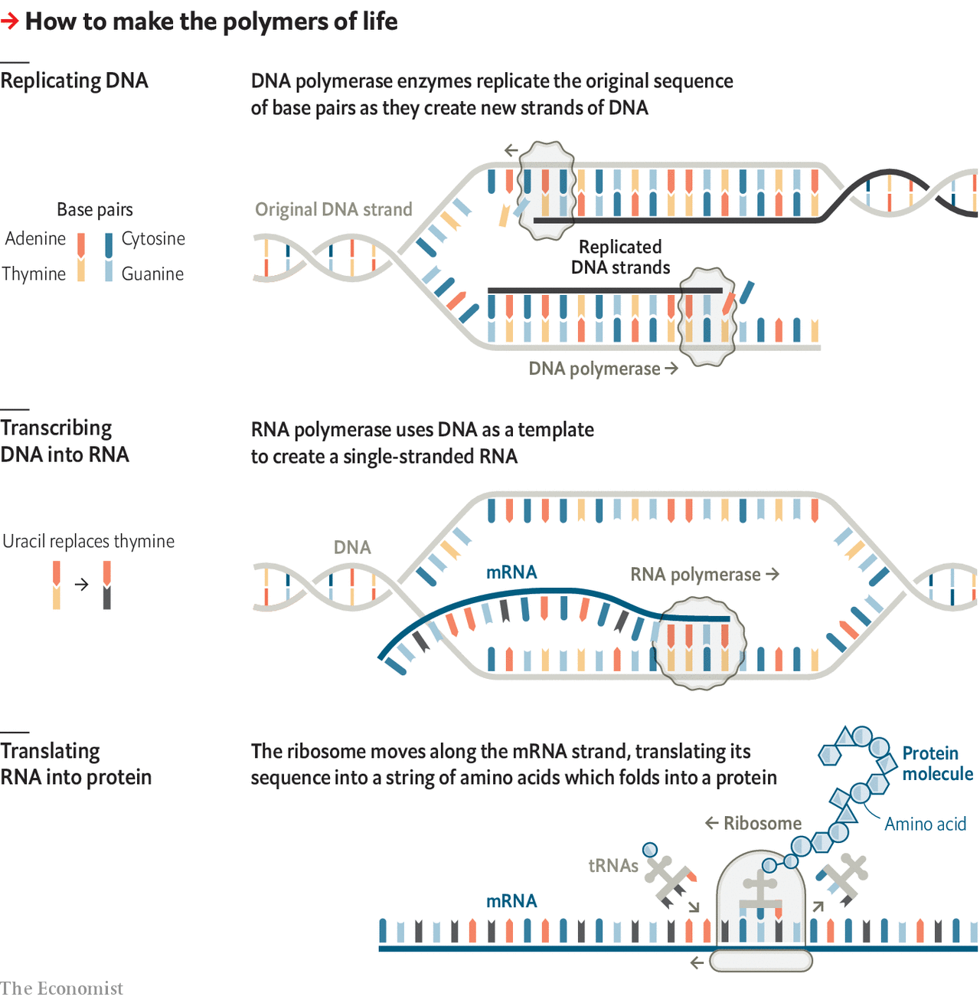

###### Life is born in chains

# Biology brief: How DNA and proteins work 

##### Life can make extraordinary variety by following quite simple strategies 

 

> Jul 31st 2021 

EVERYTHING ON Earth is made of atoms, most of which are closely packed together in the form of minerals. Life has its uses for minerals—ask a coral reef—but its essence lies in atoms arranged as distinct molecules and the way they interact.


Biological molecules are distinctive in various ways. One is that they can be very large indeed. The simple inorganic molecules that make up the air and the oceans typically contain only a few atoms, and often just two or three. Many biological molecules contain thousands. A few contain billions. These molecules are not just large, they are also precisely structured. Furthermore, those structures can be recreated with atom-by-atom accuracy.

These distinctly lifelike qualities stem from the fact that biological molecules have purposes bestowed on them by evolution. For example, life needs molecules which can catalyse chemical reactions and molecules which can store and transmit the genetic information needed to make those catalysts. Those requirements are met by two sorts of large molecule: proteins, which do most of the catalysis, as well as much else, and nucleic acids, which mostly store and transmit information.

Nucleic acids and proteins are both linear polymers; long, unbranched strings of similar-looking components, like paper chains at a child’s party or beads on a necklace. In both cases the range of component “monomers”—the paper-chain links, or the beads—is limited. Nucleic acids are made from just five different monomers, known as nucleotides; proteins are typically made from 20 different varieties of amino acid. In both cases the assembly of the chains takes place one link at a time using a specific type of chemical reaction. Nucleotides are strung together using what are called ester bonds; proteins using what are called peptide bonds.

This linear, modular approach means that the same machinery can make lots of different molecules. All that is required is a system which can catalyse the addition of a new monomer to the lengthening chain, a way of telling that system which sort of monomer to add next, and a certain dogged persistence. A typical human protein is about 400 amino acids long; some are a lot longer. Molecules of DNA, one of life’s two types of nucleic acid, are far longer still. The shortest DNA molecules found in humans are about 17,000 nucleotides long; the longest consist of over 100m.

The order in which those nucleotides appear determines what information is stored in the DNA. The order of the various amino acids determines the shape of the protein created from them by controlling the way in which the chain folds itself up. The process can create a remarkable number of shapes and capabilities, all of which are dependent on just the order of the amino acids.

The fact that both proteins and DNA are ordered modular chains does not just reflect the ease with which such molecules can be made. It is also what makes possible the single most important thing anyone needs to know about molecular biology. The order of nucleotides in specific DNA sequences—genes—determines the order of amino acids in specific proteins.

In DNA the system which catalyses the creation of a new polymer is a mechanism called a DNA polymerase which is made of a number of protein subunits. It gets its instructions as to which sort of nucleotide to add next from a pre-existing piece of DNA used as a template.

The four different nucleotides used in DNA differ in the chemical “base” that they carry; the bases are adenine (A), cytosine (C), guanine (G) and thymine (T). One of the findings which led Francis Crick and James Watson to their double-helix model of DNA in 1953 was that DNA always contains the same number of Cs as Gs, and As as Ts.

A nucleotide carrying guanine can loosely pair itself to one on another DNA strand carrying cytosine; nucleotides carrying adenine and thymine can do likewise. This is the basis of the double helix, which consists of two DNA molecules wrapped around each other. Where one has a thymine the other has an adenine, and where one has a guanine the other has a cytosine; the attraction between these paired bases holds the two strands together. It also explains why there are the same number of Gs as there are Cs and As as Ts.

The end of the paper in which that structure was unveiled boasts one of the greatest understated asides of all time: “It has not escaped our notice that the specific pairing we have postulated immediately suggests a possible copying mechanism for the genetic material.” Unzip the double helix and each of the two strands provides a template for remaking the other. When a polymerase comes across a T on the existing strand it adds an A, and vice versa; it swaps Gs for Cs in a similar way.

Copying DNA this way produces two double helices both containing the same sequence of base pairs—that is, the same information. When one of the new double helices goes into an egg or sperm cell all the information recorded on it, the Watson-and-Crick “genetic material”, gets passed on to the next generation.

 


What is more, if the message changes—perhaps because of a mutation in which a stray bit of cosmic radiation turns an A into a G—the new sequence can normally be copied just as well as the old one could. The fact that how reproducible a bit of DNA is does not depend on what it says allows mutations to persist long enough for evolution to find those which confer benefits. Steven Benner, a biochemist, sums this fundamental and vital property of DNA up with the natty acronym COSMIC LOPER: “Capable Of Searching Mutation-space Independent of Concern over Loss of Properties Essential for Replication.” Without a COSMIC-LOPER way of storing a genome, life in anything like its Earthly form could not exist.

Bulking up

The manufacture of proteins also requires a system to catalyse the addition of the next monomer to the lengthening chain and a way of knowing which monomer to add next. This time the catalyst is a complex piece of molecular machinery called a ribosome and the what-monomer-next cheat-sheet is an edited copy of some of the sequence information stored in the genome’s nucleotides.

This process requires an intermediary: RNA, a nucleic acid very closely related to DNA but which does not form double helices and has a fifth base, called uracil (U), instead of DNA’s thymine. First a system called an RNA polymerase uses a DNA sequence as a template for making a piece of RNA in the same way as a DNA polymerase makes a new strand in replication. That transcript is then tidied up into what is called a messenger RNA (mRNA).

This message is then read by the ribosome. Every triplet of letters in the mRNA tells the translation mechanism which of the different varieties of amino acid to add next. The relationship between these various nucleotide triplets and the amino acids they refer to is the genetic code, which is why the triplets are called codons.

Decoding an mRNA to make a protein is a lot more complex than just matching a new nucleotide to an existing one, as DNA and RNA polymerases do. As a result the ribosome is a much larger and more complex piece of molecular machinery. While the DNA polymerase is made just of proteins, the ribosome has some RNA mixed into it too, and uses other little bits of the stuff, tRNAs, to recognise the codons and add the appropriate amino acids. As the chain lengthens, the attractions and repulsions between its various amino acids lead it to fold into the shape required (though other proteins, called chaperonins, sometimes help).

In humans the genome has more than 21,000 DNA sequences which describe proteins, and human cells have the ability to edit the RNA made from some of those sequences to produced a number of different mRNAs, allowing them to make at least four times that many proteins and maybe ten times as many. In Escherichia coli, the bacterium most studied in laboratories, the genome describes just 4,285 different proteins. But that is still enough to provide all the proteins used in the ribosomes and the various polymerases, to catalyse all the reactions that build up the other molecules the bacterium needs—such as those which make up its outer surface—and to break down the food it uses to provide the energy which drives everything else.

In a happily growing E. coli there are some 3m individual protein molecules, making up 55% of the organism’s dry mass. There are just 300,000 RNA molecules—mostly tRNAs by number and mostly ribosomal RNA by weight—which make up 20% of the dry mass. The millions of molecules involved in making the membranes and the cell wall which define the outer surface of the cell account for 15% of the dry mass. Everything else—the pool of molecules involved in generating energy from food and storing it, the components needed to build the bigger molecules, various other gubbins and the DNA itself—together make up the last 10%.

It is worth remembering, though, that there is one last vital molecule, and that is the one present in the greatest quantity. The dry mass of a cell as measured in the lab is just a third of the total mass it has when alive. The remaining two-thirds is good old HO, the solvent in which everything else sits and which allows most of the necessary chemistry to take place. Big complex molecules are the unique and wonderful stuff of life. But life needs its water, too. ■

