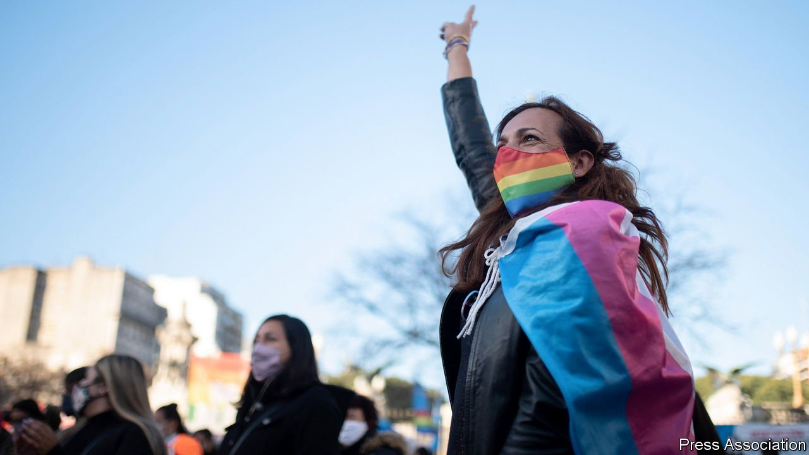

###### Gender-setters

# Argentina passes an affirmative-action law for trans people 

##### It secures the country’s unlikely place as a global leader in trans rights 

 

> Jul 31st 2021 

PAMELA ROCCHI was born a boy, but felt from an early age she was a girl. At 16 she was kicked out of school for responding angrily when a teacher called her by her birth name. She moved to a city far from her home town of Alcorta in central Argentina and worked for two years as a prostitute. Now, aged 35, she is back in Alcorta, where she works in local government and is running to be the town’s president.

Although trans people are often poor and occasionally the victims of hate crimes, life has lately become much easier for them. In 2012 Argentina became the first country in the world to allow individuals to change their gender on legal documents without permission from a doctor or judge—a process known as gender self-identification. Argentina’s law is “still considered the gold standard among activists around the world”, says Maria Sjödin of OutRight Action International, an advocacy group. Gender-reassignment surgery and hormone therapy are paid for by medical insurance.


Now Argentina’s president, Alberto Fernández, is going further. On June 25th Congress approved an earlier decree that established a quota for trans people in the public sector. One per cent of newly hired bureaucrats must be transgender. They need not have changed their appearance or their names in official documents. The same measure provides tax incentives for private firms that hire trans people and gives them preference in public procurement. On July 21st Mr Fernández announced the issuing of the first ID cards that give holders the option to tick X, meaning they are “non-binary”.

It is not clear how Argentina arrived at the quota of 1%. No one knows how many trans people there are. Rosario, a city in central Argentina, has tried to hire 25 trans people (five a year) since 2016. So far it has recruited 15. Uruguay, which also has a hiring quota, has failed to fill it.

Some feminists fear that Argentina’s rush to expand rights for trans people will undermine hard-won rights for people who were born women. Maria Binetti, an academic, says the accumulation of trans-rights laws aims to “erase women and the category of sex”. Yet it has encountered little of the opposition from feminist groups that has sprung up in other countries, such as Britain. Popular resistance has been mild. Indeed, polls suggest that Argentines are especially keen to let people change their gender, perhaps without realising how easy the government has made it. In a survey in 2016 by BuzzFeed News, Ipsos, a polling firm, and the Williams Institute at UCLA Law School, almost half of Argentine respondents supported self-identification without restrictions, compared with 27% of Brits and 23% of Americans.

Such nonchalance seems surprising in a macho land of gauchos and red meat. One explanation seems to be that Argentina’s brutal military dictatorship, which ruled from 1976 to 1983, led to the rise of an unusually strong human-rights movement. After democratisation it championed the rights of all sorts of disadvantaged groups, including trans people.

Another factor is religion’s weak role in politics. Although much of the countryside remains God-fearing, religion has lost clout in the cities. Argentina does not have strong political parties that cater to socially conservative evangelical churchgoers. So it differs from Brazil and the countries of Central America, where many more people resist the idea of expanding trans people’s rights.

As a result of all this, Argentine politicians think they have something to gain by promoting socially liberal policies of all sorts. In 2010 under then-President Cristina Fernández de Kirchner, who is now vice-president, Argentina became the first country in the Americas to legalise same-sex marriage and adoption by same-sex couples. Mr Fernández, whose son identifies as non-binary, says he wants “to beat Cristina” by being more liberal than she was. His government legalised abortion.

Some trans activists are now urging schools to teach about sexual diversity and the government to pay reparations to trans people who were persecuted by the dictatorship. In trans-friendly Argentina, that may well happen. ■

