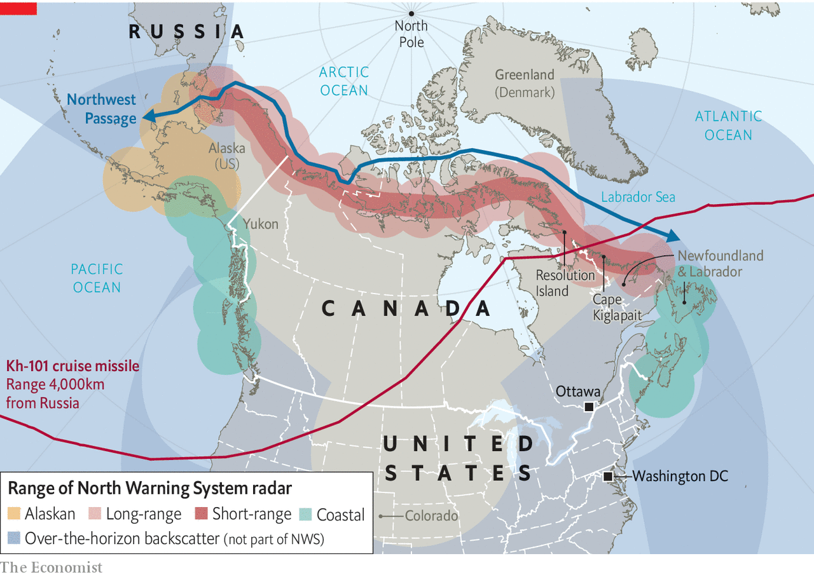

###### Eyes in the ice

# North America’s Arctic radar shield is due for an upgrade 

##### Canada and the United States have not yet worked out how to modernise the missile-defence system 

 

> Jul 31st 2021 

THE VAST spheres rest on a desolate ridge at Cape Kiglapait in Labrador, one atop a tower and two others on the ground like a toppled snowman abandoned by giants. Each is a radome enclosing radar antennae that spew invisible waves across the Labrador sea. They are the electromechanical sentries of the Arctic. Strung across the northern fringes of Canadian territory from Labrador to Yukon, then into Alaska, the Kiglapait station and its many siblings form a picket line known as the North Warning System, or NWS (see map).

Since the early days of the cold war, Canada has served as North America’s first line of defence from Russian bombers and, later, intercontinental ballistic missiles (ICBMs), whose quickest path to North America lies over the poles. To detect such threats, the United States and Canada jointly built a line of radar stations in the 1950s that stretched 5,000km (3,100 miles), known as the Distant Early Warning (DEW) line, and established a North American Aerospace Defence Command (Norad) in Colorado. The DEW line was replaced with new radars in the late 1980s, creating the NWS. Now the two countries are contemplating its renewal. That is far from simple.


One issue is that the radars’ targets are changing. The shift from DEW line to NWS reflected a shift from ICBMS, which loop high into space, and can thus be spotted easily, to cruise missiles, which fly slower but lower. Now Russian air-launched cruise missiles fly faster and farther, which means that the bombers which carry them must be spotted at greater distance.

 


In March the commander of Norad warned that missiles could probably strike America from “launch sites on Russian soil”. The collapse of the Intermediate-Range Nuclear Forces treaty in 2019 means that Russia could also deploy ground-based cruise missiles in the Arctic. New hypersonic gliders, with the speed of ballistic missiles and the manoeuvrability of cruise missiles, could fly around the NWS.

Updating the picket to cope with such threats poses a challenge. The Canadian Arctic is a forbidding place. The radar stations are uninhabited, with contractors visiting occasionally for maintenance. When entrances freeze up crews smash their way in with sledgehammers, says Colonel Walter Norquay, director of the North Warning System Office in Ottawa. Inquisitive polar bears are not uncommon.

Another challenge is that the radar stations are built on land populated by the Inuit and other indigenous peoples. The federal government has ceded powers to the Arctic region and is a signatory to a UN declaration that requires it to consult indigenous groups before using their land for military purposes. “We don't want to make the past mistakes that we did,” says Andrea Charron of the University of Manitoba. One was leaving five tonnes of PCBs, toxic chemicals, at Resolution island.

Today, the Inuit are closely involved. The Canadian Rangers, an army unit whose recruits are largely indigenous people, inspect many of the most desolate sites. “We are the ears and the eyes of the military,” says Harry Flaherty of the Qikiqtaaluk Corporation, the for-profit development agency of the 15,500 Qikitani people.

America and Canada split the costs of the NWS in a 60-40 ratio, but would need to negotiate how to pay for any successor. Canada’s latest budget allocated C$163m ($131m) over five years for Norad modernisation, though some experts reckon the total bill may eventually run to $11bn. Successive American governments have been irked by Canada’s low spending on defence, which at 1.39% of GDP is well below NATO’s 2% target.

More broadly, the two countries do not always agree on Arctic matters. One dispute is over the status of the Northwest passage, which Canada maintains are “historic internal waters”. America insists that the passage is an “international strait”. Differences like these are managed amicably. But American officials view the Arctic as a zone of competition with Russia and, to an increasing extent, China. Canada prefers a softer approach. Though happy to track nuclear threats, it has been wary of joining American plans to parry them with interceptors in Alaska and California, fearing that would upset nuclear stability.

Part of modernising the NWS is making better use of what is there now. Its radars collect “a whole bunch of data that previously has just not been used”, says Whitney Lackenbauer of Trent University. In Colorado, Norad is using a system called Pathfinder, which uses machine learning to analyse data not just from military sensors, like the NWS, but also commercial ones to spot threats amid the flow of civilian air traffic and the clutter of weather.

The biggest question is whether a network of ground-based radars is still the best way to shield the continent. In “Norad: beyond modernisation”, a report published in 2019, Dr Charron and Jim Fergusson, a colleague, argue that even longer-ranged radars deployed farther north would struggle against the new Russian missiles. Building new radars in melting permafrost and cleaning up old sites would also be expensive.

Canada thus hopes to eke out the life of the NWS for as long as possible. One way of doing so is to augment ground-based radar with radar aboard ships, planes, blimps and satellites. In 2019 Canada launched a trio of radar satellites in polar orbit that can provide excellent coverage of the Arctic. More may need to follow. North America’s tripwire may steadily migrate to space, and into the virtual cloud. ■

