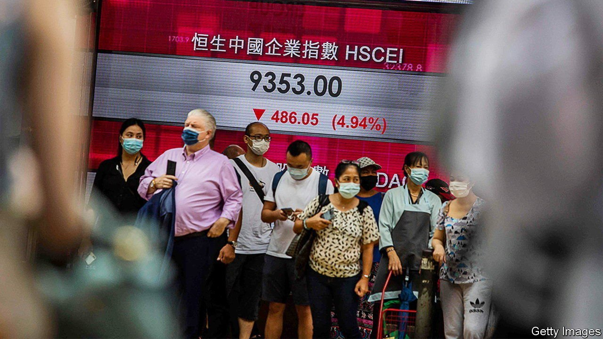
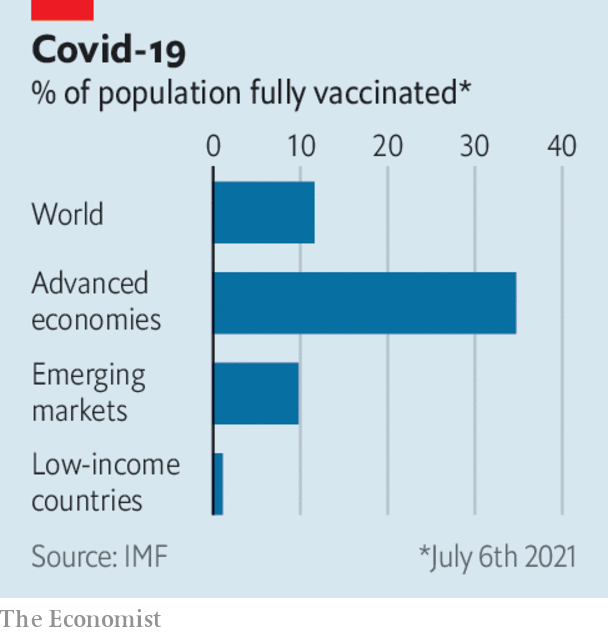

###### 

# Business this week 

#####  

 

> Jul 31st 2021 

The  widened its crackdown on businesses that don’t toe the Communist Party’s line, targeting private tutoring, an industry worth $100bn in revenue, which it decreed can now only operate without profit. Foreign investment will be restricted, no new licences issued, and curbs on teaching hours introduced. The constraints are harsher in tone than those imposed on the tech industry, but Chinese tech stocks swooned as investors wondered whether a broader clampdown was on the cards.

Tencent’s share-price fall was among the steepest; it shed a sixth of its value. The  giant has suspended new registrations on its WeChat social network while it upgrades the platform to comply with the government’s latest edicts for the industry.


SoftBank is reportedly selling about a quarter of the stake it holds in Uber to offset the heavy losses from its holding in Didi Global, China’s biggest ride-hailing company. Didi’s market value slumped when Chinese regulators targeted it for investigation recently.

Meanwhile, China’s securities regulator approved a secondary listing of shares by state-owned China Telecom on the Shanghai stockmarket, which could raise $8.4bn.

Zomato’s IPO was a roaring success in Mumbai. The food-delivery app is the first of several tech firms in India to whet investors’ appetite with a market flotation. Paytm, a fintech firm, is next. Both it and Zomato count Jack Ma’s Ant Group among their backers.

 used by hordes of small investors to buy and sell stocks, not least the “meme” variety, priced its shares at the lower end of its target range ahead of its debut on the Nasdaq stockmarket. The unconventional broker has taken an unconventional approach to an IPO, eschewing the usual boardroom presentations to institutional investors and selling a third of its shares to its customers.

The jabbed and jabbed-nots

 


In its latest outlook, the IMF said that access to vaccines had become the “principal fault line” for the world economy, separating emerging markets and low-income countries, which are grappling with surging infections, from advanced economies. The fund increased its projections of growth for the rich world this year, but shaved its estimate for less-developed regions. It does expect all countries to have gained broad access to vaccines by the end of 2022.

Pfizer said it now thinks revenue from the vaccine it developed with BioNTech will reach $33.5bn this year. The drug company is selling its doses for profit (as is Moderna). AstraZeneca and Johnson &amp; Johnson have said they will not make a profit from their vaccines until the pandemic ends.

South Korea’s economy was 5.9% larger in the second quarter than it was a year earlier, during the depths of the pandemic. On that measure exports also rebounded, as they have in other countries. But by comparison with the first quarter of this year GDP expanded by just 0.7%, the slowest pace since the middle of last year.

Facebook doubled its net profit in the second quarter, year on year, to $10.4bn. Its revenue from ads soared, suggesting that Apple’s new privacy policy, under which iPhone users must give their clear consent for ad data to be collected, has had little impact on  so far.

America’s other tech stars also reported stellar earnings. Apple’s quarterly net income of $21.7bn was driven by iPhone sales; it is on track for a record profit for its fiscal year. Alphabet reported its best-ever quarter for revenue and profit, of $18.5bn, boosted by online advertising as economies reopen. And Microsoft had another bumper three months as the pandemic boon to its cloud-computing and Team communications businesses helped generate a profit of $16.5bn.

A report by a law firm into Credit Suisse’s dealings with Archegos Capital Management delivered a damning verdict on its risk management. The Swiss bank lost billions when Archegos went bust in March. The report highlighted how it had focused on short-term profits, and failed to see the hazard in Archegos’s “voracious” hedging of stocks. Credit Suisse said the incident had been a “turning point” and it was now taking a more “conservative” approach to risk.

Laying out the welcome mat

All visitors from America and the European Union who are fully vaccinated will no longer have to quarantine upon arrival in most of Britain (they will still have to take covid-19 tests). That is good news for the airline and tourism industries, which have been pleading with governments to ease travel restrictions. The Biden administration, however, has no current plans to lift its measures on visitors from Britain and the EU to the United States.

