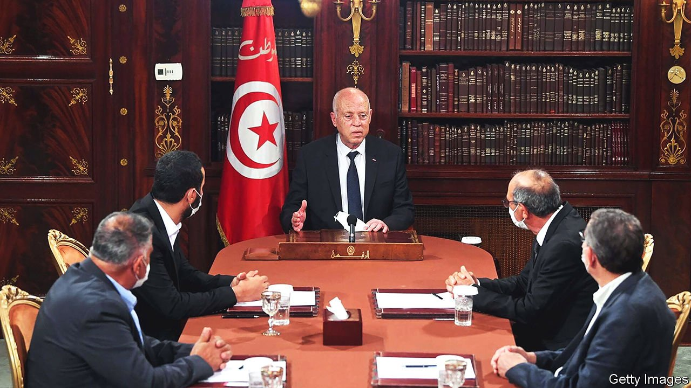
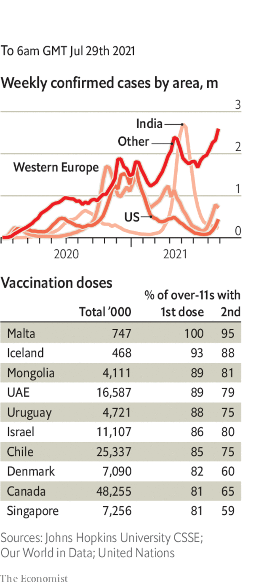

###### 

# Politics this week 

#####  

 

> Jul 31st 2021 

’s president, Kais Saied, fired the prime minister, suspended parliament for 30 days and assumed executive authority. The power grab, he said, was justified by the constitution and necessary to quell unrest over a sputtering economy and one of Africa’s worst outbreaks of covid-19. Many Tunisians cheered the move, which came after a day of protests aimed at the government. But international watchdogs raised concern over Mr Saied’s actions to suppress dissent, such as banning public gatherings of more than three people. Ennahda, the largest party in parliament, accused him of a “coup”.

A court in Tanzania charged Freeman Mbowe, leader of the main opposition party, with “terrorist-related” crimes. Mr Mbowe had been campaigning for changes to the constitution. Critics accused the new president, Samia Suluhu Hassan, of continuing the authoritarian practices of her late predecessor, John Magufuli.


The UN’s food programme said it would soon run out of food in , leaving hundreds of thousands of people at risk of starvation. More than 100 lorries carrying emergency supplies have been halted in the neighbouring Afar region.

Soldiers from Botswana and South Africa arrived in Mozambique, where they will help the government battle jihadists who have overrun parts of the northern-most province of Cabo Delgado. They join 1,000 troops from Rwanda, who have already been involved in several firefights with the insurgents.

Eighteen track-and-field athletes, including ten from the 23-strong Nigerian delegation, were banned from the Olympic games in Tokyo over worries that they had not been sufficiently tested for performance-enhancing drugs.

South Korea and North Korea restored a key communication line, suggesting a tentative thaw in diplomatic relations between the two countries. The North had disconnected the hotline in spectacular fashion in June 2020 when it blew up the liaison office in the border town of Kaesong.

Civilian  Afghanistan rose by nearly 50% during the first half of the year compared with the same six months last year, according to the UN. By early September, the last American soldier will have left Afghanistan (except for a few hundred to guard the airport and American embassy).

Joe Biden confirmed that  by the end of the year. The mission will instead switch to one of training and advice. Most of the 2,500 American troops in the country will remain there.

The American Senate voted to proceed with a compromise bill to increase spending on i. The bill picked up the support of 17 Republicans.

America’s deputy secretary of state, Wendy Sherman, met counterparts from China’s foreign ministry in the northern Chinese city of Tianjin. Ms Sherman was the highest-ranking American visitor to China since Joe Biden became president in January. The mood was gloomy: a Chinese official said Sino-American relations were at a “stalemate”.

In China Sun Dawu, an outspoken businessman, was sentenced to 18 years in prison. Mr Sun was convicted of several crimes, including provoking quarrels, assembling people to attack state agencies and illegal occupation of agricultural land. He has long been a critic of government policies.

A court in Hong Kong found Tong Ying-kit, a 24-year-old waiter, guilty of terrorism and inciting secession. Mr Tong had ridden a motorcycle while displaying a flag with the words “Liberate Hong Kong, Revolution of our Times” and had collided with several police officers. He was , which China imposed on Hong Kong last year.

, a leftist former schoolteacher, was inaugurated as Peru’s president. He said he would not govern from the presidential palace, which is on the site of the house of Peru’s Spanish conquistador, and would go ahead with a plan to rewrite the constitution. But he promised “responsible change”.

Guatemala’s chief anti-corruption prosecutor, Juan Francisco Sandoval, fled to El Salvador after the attorney-general removed him from office. Hundreds of people protested at the presidential palace against Mr Sandoval’s removal.

Armenia said three of its soldiers were killed in a border clash with Azerbaijan. Both sides accepted Russian mediation to ease tensions. There have been sporadic skirmishes between the two since the end of their brief war last year over the Nagorno-Karabakh region.

The French parliament approved a sweeping bill that obliges people to show a covid-19 health pass when entering a restaurant or bar, or boarding a train or plane. Emmanuel Macron hopes the measures will prod people to get vaccinated; millions have signed up for a jab since he announced the legislation. More than 160,000 protesters took to the streets of Paris and other cities, decrying the bill as infringing on basic liberties.

Coronavirus briefs

 


America’s Centres for Disease Control reversed its earlier advice and said that people living in areas with a high prevalence of covid-19 should wear masks again in public indoor spaces. Meanwhile, the governors of California and New York said that state employees will be required either to take a vaccine or submit to weekly testing. Joe Biden prepared similar measures for federal-government workers.

Lockdown measures were extended by another four weeks in Sydney.

Tokyo reported a record number of new cases, though there was no big outbreak among participants in the Olympics.

In Malaysia someone reportedly broke pandemic restrictions by flying a helicopter 180km (112 miles) from Kuala Lumpur to pick up 36 portions of rice from a restaurant. Police are searching for any grains of evidence.

