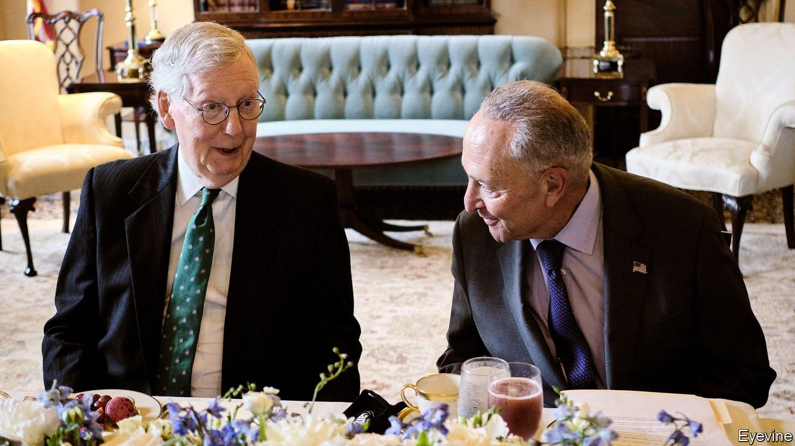

###### The infrastructure bill

# Joe Biden’s bipartisan dream lives on, for now 

##### The Senate crafts a compromise on a $1.2trn infrastructure bill 

 

> Jul 31st 2021 

EVEN BEFORE the Senate voted overwhelmingly to advance a bipartisan $1.2trn infrastructure agreement, President Joe Biden hailed it as proof “that our democracy can function, deliver and do big things”. In fact, given the legislative hurdles ahead, the deal supplied evidence—tentative at that—for just the first claim. Yet for a country aghast at its own toxic partisanship, that is significant progress.

In a procedural step required to prevent a filibuster, all 50 Senate Democrats were joined by 17 Republicans, including their leader, Mitch McConnell, who has called himself the Grim Reaper for his opposition to Democratic policymaking. During the presidency of Donald Trump, Mr McConnell resisted Mr Trump’s own hopes of investing in infrastructure.


But Mr Trump’s infrastructure initiative was so inchoate it became a national punchline. This time, months of painstaking negotiation among a small group of Democrats and Republicans, coaxed with compromises from Mr Biden, resulted in a package likely to be broadly popular with the public, if not with activists of either party. In contrast to the dysfunctional policymaking under Mr Trump, “in this case you had the Biden White House, the Senate Republicans and the Senate Democrats,” says Scott Jennings, a Republican consultant and longtime adviser to Mr McConnell, “they all had the appetite and the attention span to work things out.” This is, he adds, how the Senate is meant to work, patiently shaping consensus.

In all, the bill would add some $550bn in spending across eight years on top of other projected infrastructure investments. There would be $110bn for roads, bridges and other such projects, $73bn for the electric grid, $65bn for universal broadband access, $55bn for clean drinking water, $42bn for ports and airports, and $7.5bn for a national network of charging stations for electric vehicles. The deal also includes $39bn for public transit. Democrats and Republicans say the spending would be paid for with a mix of sources including unused pandemic-relief money, unspent unemployment benefits and changes to prescription-drug rules.

Yet legislation encoding this deal has yet to be written, much less passed. Chuck Schumer, the Senate majority leader, said after the filibuster was evaded that he wanted the infrastructure bill and a budget resolution to pass before the August recess. The budget resolution is necessary for the Democrats to begin the filibuster-proof process known as reconciliation, by which they want to enact a $3.5trn bill to finance child care and education and to confront climate change.

Republican senators do not want to be seen as enabling the budget bill by supporting the infrastructure one. Yet for many Democrats, including the House speaker, Nancy Pelosi, the two are yoked together. Ms Pelosi has said she will not consider the bipartisan bill until the Senate passes the reconciliation package.

For Mr Biden, the challenge ahead within his party is formidable. Alexandria Ocasio-Cortez, a progressive force in the House, reacted with fury on Twitter, threatening to torpedo the infrastructure deal and noting the Senate negotiators were all white: “Good luck tanking your own party’s investment on childcare, climate action, and infrastructure while presuming you’ll survive a 3 vote House margin—especially after choosing to exclude members of colour from negotiations and calling that a ‘bipartisan accomplishment’,” she wrote.

Now, Mr Jennings notes, “Joe Biden is going to Alexandria Ocasio-Cortez and saying, ‘I need you to vote for this thing that Mitch McConnell is for.’” If the infrastructure bill then fails, it will be the progressives, not Mr McConnell and his Republicans, who will have crushed Mr Biden’s bipartisan dream. ■

For more coverage of Joe Biden’s presidency, visit our dedicated 

