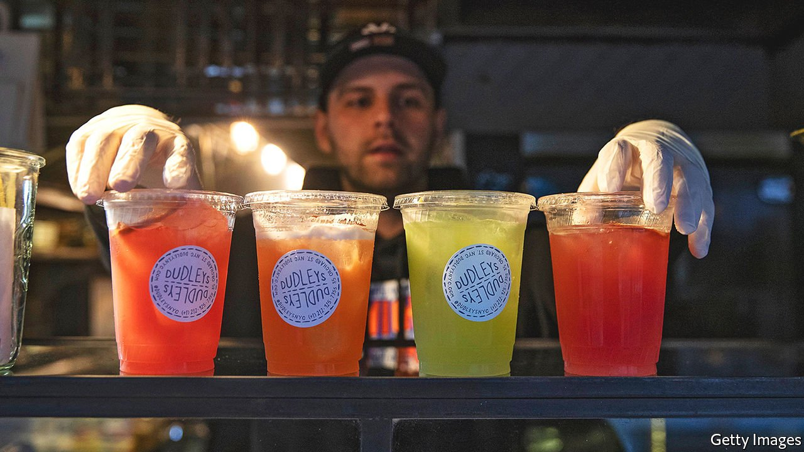

###### Cocktails-to-go

# Looser rules for takeaway tipples 

##### The age of the Fauci Pouchy 

 

> Jul 31st 2021 

A MONG THE many emergency measures introduced by state governments when the covid-19 pandemic hit, one stood out for the jollity it heralded: a change in the law to allow bars and restaurants to sell cocktails-to-go. Within weeks, Americans were walking out of empty bars with drinks that reminded them of lost pleasures—Daniel Barreto, head bartender at Barmini in Washington, DC, says his greatest hit was the Polynesian Vacation, a blend of citrus vodka, fruit and yellow chartreuse. Despite open-container laws that prohibit drinking outside, many people developed an evening “walktail” (strolling and drinking) habit.

The change in states’ alcohol laws, which Mike Whatley of the National Restaurant Association, an industry lobby, describes as “arguably the biggest since the end of Prohibition” in 1933, looks set to stay. At least 35 states legalised takeaway (some of them also allowed for the takeout and delivery of glass-size portions of wine), and 16 have passed laws making the change permanent. Another 12 have extended it for at least a year. Without the pandemic, Mr Whatley reckons this liberalisation would have taken at least a decade.


As the Delta variant of the virus spreads and many people continue to avoid bars, takeout cocktails remain an important source of revenue. Cocktails have higher profit margins than food and other drinks. Freshly “crafted” mixed drinks elude the price-check comparisons customers make between restaurant- and shop-sold wine and beer. Whipping up big batches is quick and easy. Rohit Malhotra, beverage director of Capo Italian Deli, a bar hidden behind a sandwich shop in Washington (thus mimicking the illicit speakeasy joints of the Prohibition era), says healthy sales of his Fauci Pouchy, cocktails sold in plastic bags stamped with an image of the White House’s coronavirus expert, meant “not just the difference between keeping a skeletal staff and a full staff but also being able to survive”.

Not everyone is a fan. A handful of states never allowed cocktails-to-go and in a couple that did—New York and Pennsylvania—the old ban came back into force this summer. Opposition has come from liquor retailers, which have increased their own sales of (cheaper, less tasty) canned and bottled cocktails. And public-health groups have warned that making it easier to buy alcohol will increase under-age drinking. It is hard to ensure that delivery drivers, in particular, check customers’ ID.

Yet the higher price of cocktails makes them less of a public-health hazard than shop-bought booze. Many bars and restaurants continue to struggle. Linden Pride, the owner of Dante, a bar in Manhattan, says businesses in New York had invested in weeks’ worth of bottling kit and labels when they learned cocktails-to-go were gone. He hopes the state, one of the first to allow them, will soon pass a law bringing them back.

