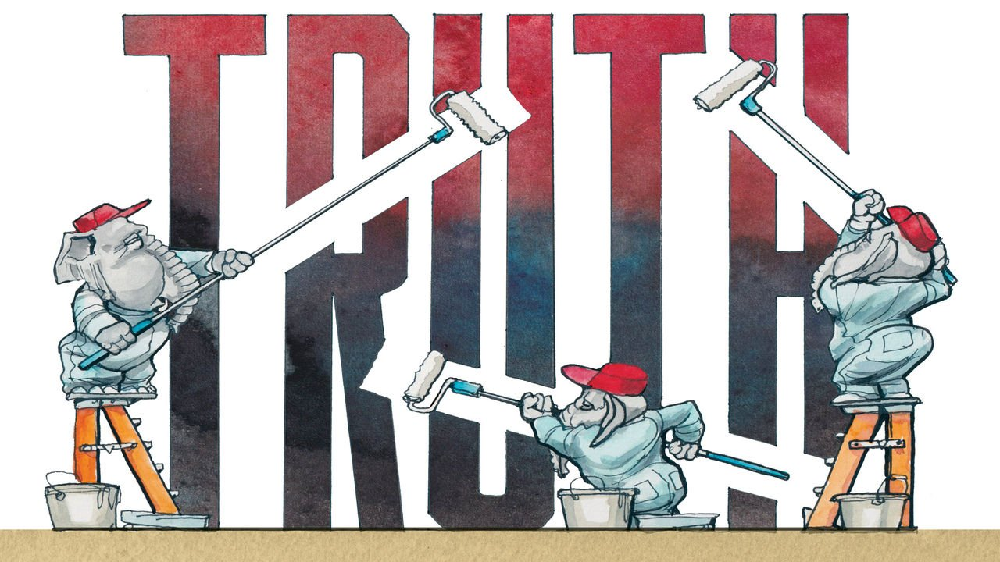

###### Lexington

# Republican delusion about the Capitol riot hits a dangerous new low 

##### The party’s January 6th revisionism is a big step down a dark road 

 

> Jul 28th 2021 

A WEEK AFTER a mob of Donald Trump supporters attacked the Capitol, Kevin McCarthy was still sufficiently shocked by the experience to represent it accurately. “The president bears responsibility for Wednesday’s attack on Congress by mob rioters,” said the Californian leader of House Republicans, who was reported to have screamed expletives down his phone at Mr Trump on January 6th even as MAGA thugs clambered through his office windows. “A fact-finding mission would be prudent.”

But after a trip to see Mr Trump in Florida Mr McCarthy recanted. He suggested the former president had done all he could to stop the riot and, on reflection, felt the only fact-finding necessary was to establish why the Capitol was not better prepared for an invasion of 10,000 insurrectionists. He opposed a Democratic proposal for a bipartisan investigation, modelled on the 9/11 commission. After his Democratic counterpart, Nancy Pelosi, invited him last week to nominate five Republicans to a lesser House inquiry, Mr McCarthy’s picks included two Trump conspiracy theorists who had helped spread the stolen-election lie on which the insurrection was based, and who promptly lambasted the inquiry as a stunt. When Ms Pelosi rejected them, Mr McCarthy pulled his other three nominees, condemned the inquiry and denounced two Republican House members who were independently willing to take part in it—Liz Cheney and Adam Kinzinger, both staunch conservatives—as “Pelosi Republicans”. On the inquiry’s opening day this week Mr McCarthy’s third-in-command, Elise Stefanik, said the insurrection was Ms Pelosi’s fault.


Though it includes elements of past partisan games, this is ground-breaking. It recalls, for example, a previous conservative effort to delegitimise a Democratic president: millions believed Barack Obama was a foreign-born Muslim. Yet that lie was not embraced by Republican leaders. By contrast, the fantasy that Joe Biden stole the election from Mr Trump has been actively promoted or quietly acquiesced to by most of them. Only a handful, including Ms Cheney and Mr Kinzinger, have firmly repudiated it.

Similarly, Mr McCarthy and his House colleagues once hounded Hillary Clinton over a mendacious claim that she was responsible for an attack on American officials, just as they are now hounding Ms Pelosi. Yet few Americans knew or cared about the earlier incident in faraway Benghazi, in Libya. The violence that Mr McCarthy and most House Republicans are now misrepresenting or wishing away in an effort to minimise Mr Trump’s hand in it could not have been more conspicuous or significant. Nor could it have been more graphically documented, as was underlined by the inquiry’s opening testimonies, given by four police officers who battled the rioters.

Hollywood action flicks have been less dramatic than the scenes they described. Aquilino Gonell, an Iraq veteran, described a “medieval battle” in which, blood pouring from two lacerated hands, he fought for survival. Harry Dunn recalled the rioters advancing on him, chanting “Boo fucking nigger”, close by US democracy’s holy of holies, the Capitol’s Rotunda. Michael Fanone described, with recourse to his body camera to fill in the blanks, being dragged through the mob, electrocuted until he suffered a heart attack, then beaten unconscious. All the officers—black, white and brown—stated or implied that Mr Trump was responsible; “Trump sent us,” one recalled the rioters telling him.

More harrowing testimony is rarely heard on Capitol Hill—and the events described took place there. Yet most Republican voters believe there has already been too much focus on the insurrection, that Mr Biden was chiefly to blame for it and, as Mr McCarthy knows, the inquiry has little chance of changing that. Denialism of this kind is again familiar—it got Mr Trump through two impeachment trials—yet, on this scale and issue, also unprecedented. It is evidence for what Jonathan Rauch describes in a new book, “The Constitution of Knowledge”, as an “epistemological crisis” to which the future of American democracy is now hostage.

Mr Rauch (once of this newspaper, now with the Brookings Institution) acknowledges that the crisis has many causes, from the decline of deference to the anarchy of the internet, and that it is to some degree also evident in left-wing cancel culture. Yet he diagnoses it mainly on the right, where he attributes it to a deliberate five-year assault by Mr Trump on Republicans’ perception of reality. The former president’s daily barrage of small or ludicrous lies, from the numbers who attend his rallies to the path of a hurricane off the coast of Alabama, wore away at his supporters’ attachment to truth. He also rubbished all experts and institutions—cogs in the process of cross-checking and corroboration by which shared facts are produced—that might try to repudiate him.

By the time Mr Trump began predicting—fully seven months before the election—that his opponents would steal it, the Republican base had become vulnerable to whatever delusion he proposed. The fact that many liberals did not take his truth-bending as seriously as they should have done was further testament to his genius for scrambling America’s senses. Writing even before the success of Mr Trump’s stolen-election lie had become clear, Mr Rauch cites the most dreadful sentences George Orwell ever wrote to describe its effect: “The party told you to reject the evidence of your eyes and ears. It was their final, most essential command.”

Vandals at the gate

It is possible that matters will improve. Next year’s mid-terms may show that moderate Republicans find Mr Trump’s distortions and violence, in the end, intolerable. That could create space for stronger leaders than Mr McCarthy to redirect the party to reality. Yet it must be acknowledged, in the week that four visibly traumatised police officers described a mortal fight against Mr Trump’s supporters, and his party shrugged, that most of the evidence is pointing the other way.■

For coverage of Joe Biden’s presidency, visit our dedicated 

