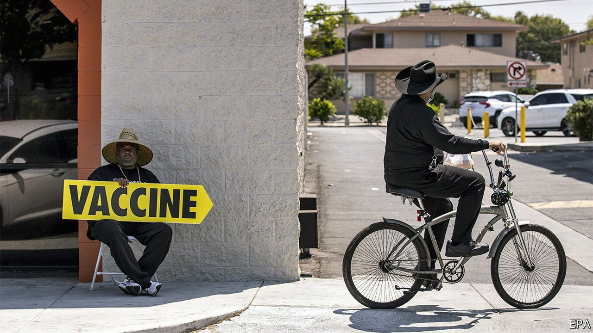
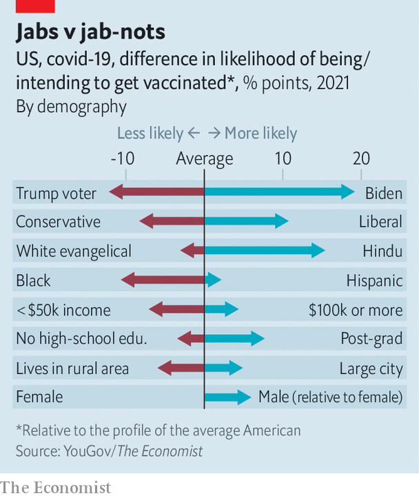

###### Attitudes to covid-19 inoculation

# Who’s against the jab 

##### Our statistical model throws light on America’s vaccine hesitancy 

 

> Jul 31st 2021 

A  FOURTH WAVE of covid-19 infections is sweeping across America. It is strongest in the heartland and southern states: cases per 100,000 people are highest in Louisiana, Florida and Arkansas; Missouri has the highest hospitalisations. But the rapidly spreading Delta variant threatens other places, too. Since vaccinations have stalled at around 155m adults, or 60% of the population aged 18 or over, few if any parts of the country have reached herd immunity. The new wave is likely to crash everywhere.

Identifying the causes of vaccine hesitancy can help policymakers decide where to target their efforts. The Economist has collaborated with YouGov, a pollster, to collect weekly surveys on Americans’ intent to get vaccinated for covid-19. Using the demographic profiles of some 24,000 Americans, we have built a statistical model to estimate how likely each respondent is to say they have received, or will get, their jab—and to reveal the biggest causes of hesitancy.


According to our modelling, the single greatest predictor of whether an American has been vaccinated is whether they voted for Joe Biden or Donald Trump last November. Relative to the profile for the average American—a white, 49-year-old female with some college education who earns a middle-class income, lives in a Midwestern suburb and did not vote in 2020—the impact of voting for Mr Trump is a 13 percentage-point reduction in vaccine probability. Holding everything else equal, Mr Biden’s supporters were 18 points likelier to get their jabs. Whether someone was a self-proclaimed conservative or liberal ranked second.

 


But many other factors also matter. African-Americans were disproportionately less likely than other racial and ethnic groups to receive their shots; Hispanics and Hindus were more likely to do so. Geographic factors mostly cut along expected lines: people in blue-state cities were likelier to get a vaccine, those in rural, redder regions were disproportionately hesitant.

Prominent conservative television hosts, such as Fox News’s Sean Hannity, made a spectacle of endorsing the covid-19 vaccine last week. Yet according to YouGov’s most recent poll, conducted on July 24th-27th, the share of Republican adults who say they will not get the jab has held steady at 30%. The phase of the pandemic where Americans would listen to such messaging might well be over. After all, they have been seeing adverts about jabs for months. Instead of focusing on partisans, public-health policy could be designed to increase access for poor and rural Americans, and focus on outreach and information-dissemination for the uneducated.

Dig deeper

All our stories relating to the pandemic and the vaccines can be found on our . You can also find trackers showing ,  and the virus’s spread across  and .

