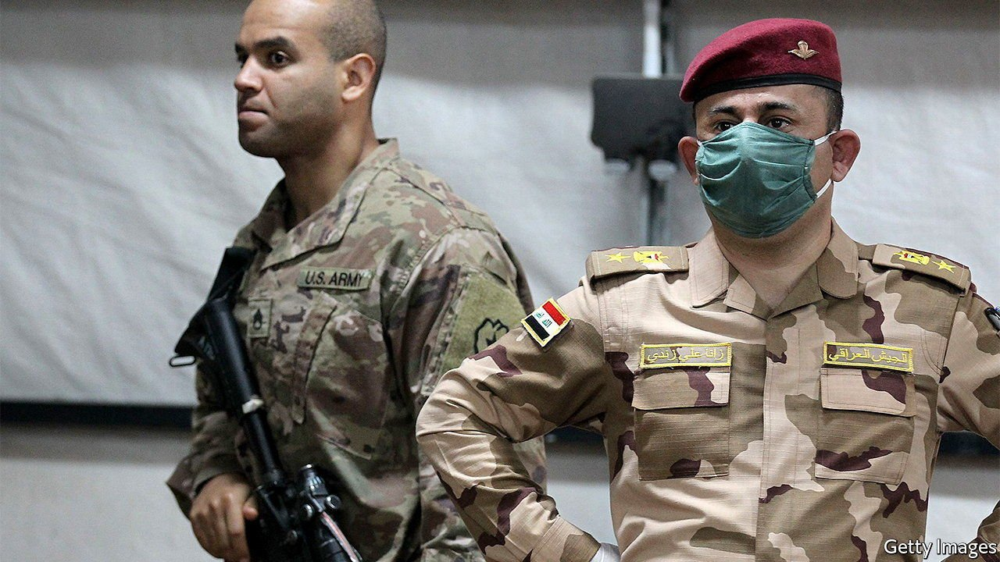
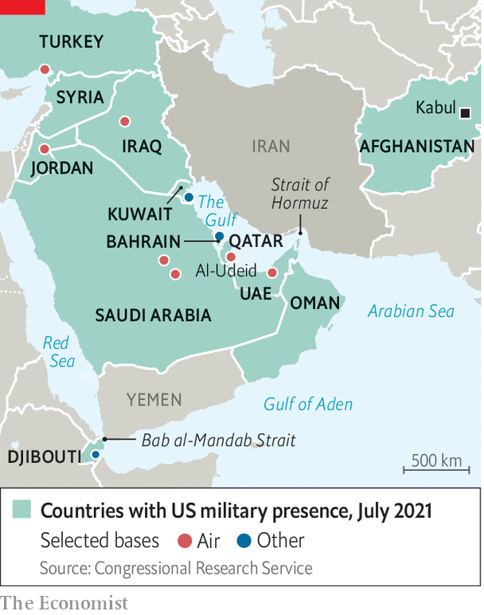

###### Eyeing the exits

# Why Joe Biden is ending America’s combat mission in Iraq 

##### Though largely symbolic, the move is part of a transformation of America’s posture in the wider Middle East 

 

> Jul 27th 2021 

WHEN THE first American bombs began falling on Iraq on March 19th 2003, President George W. Bush predicted a hard slog, requiring “sustained commitment”. Yet even he might not have imagined that American combat soldiers would remain in Iraq 18 years later, fathers and sons serving in the same war.

That era is now drawing to a symbolic close. On July 26th President Joe Biden said that the American combat mission in Iraq would conclude by the end of the year. The wind-down—just as America is also withdrawing from Afghanistan—comes nearly a decade after Barack Obama withdrew troops from Iraq, only to rush them back in 2014 after Islamic State (IS, also known as ISIS) blitzed through Iraqi cities.


The jihadists are down, but not out. A UN report published on July 21st warned of an “entrenched insurgency”. Yet Iraqi politicians were outraged last year by American air strikes ordered by Donald Trump against Qassem Suleimani, a senior Iranian general visiting Iraq. Iraq’s parliament called for the departure of foreign troops.

In fact, America is not really leaving. Mr Biden says that Americans will continue to train and advise Iraqi troops, and “to deal with ISIS as it arises”. Most of the 2,500 American troops in Iraq will thus stay there, their mission largely unchanged—few, apart from special forces, have seen real action in the past year anyway.

The contrast with Afghanistan is stark. Mr Biden announced a withdrawal from that country in April, barring a few hundred troops to guard the embassy in Kabul. That process is nearly complete, and has been accompanied by Taliban advances. The difference in approach reflects the distinct threats posed by the two groups. The Taliban’s ambitions lie within Afghanistan; IS loyalists have mounted attacks and built franchises around the world.

Mr Biden’s moves represent the start of a larger transformation in America’s posture. “There’s a working hypothesis…that we’re probably overinvested in the Middle East,” says Michèle Flournoy, a former Pentagon official. “Despite discussions of prioritising the Asia-Pacific, we haven’t actually shifted all that much of our weight in that direction,” she adds. The vast Al-Udeid air base in southern Qatar actually expanded in the Trump years. It is thought still to house more than 10,000 American troops, part of a presence amounting to some 60,000 troops in the Middle East.

Now, as part of its first Global Posture Review in over a decade, the Pentagon is taking stock of its forces around the world. There are signs of pruning across the region. In June the Biden administration withdrew eight Patriot missile-defence batteries from Iraq, Kuwait, Jordan and Saudi Arabia, and a separate missile shield from Saudi Arabia. One question, says Ms Flournoy, is whether America still wants to maintain an aircraft-carrier in the Middle East permanently, a commitment that has put a huge strain on the navy.

Yet the point is not simply to free up military forces, but also to change the nature of America’s presence. “There’s a push away from larger bases,” says Becca Wasser of the Centre for a New American Security, a think-tank in Washington, “because larger isn’t needed any more.” Instead, the Pentagon wants to shift to what it calls a distributed posture: smaller bases spread out over a larger area, and thus better able to withstand missile attacks—like the Iranian barrage on American troops in Iraq that followed Suleimani’s assassination.

 


Ms Wasser points to the example of the Western Sustainment Network, a set of new logistics routes running from the Red Sea and Mediterranean to Persian Gulf ports, making it easier for America to supply forces and project power if Iran closes the Bab al-Mandab or Hormuz straits (see map), or attacks existing bases in Kuwait and Qatar. As part of that effort, America has expanded the use of ports and airfields in western Saudi Arabia, out of reach of most Iranian missiles. It has also shut three facilities in Qatar, moving equipment farther west to Jordan.

“For a couple of decades, our presence in the Middle East has been guided by large standing task-forces, in some cases with hundreds of thousands of troops devoted to a mission,” says Joseph Votel, a retired general who headed the Pentagon’s Central Command and is now at the Middle East Institute, another think-tank. The future, he says, will involve advising and assisting regional partners to do the heavy lifting, with American troops surging only when required. “And that doesn’t take thousands and thousands of troops.”■

For more coverage of Joe Biden’s presidency, visit our dedicated 

