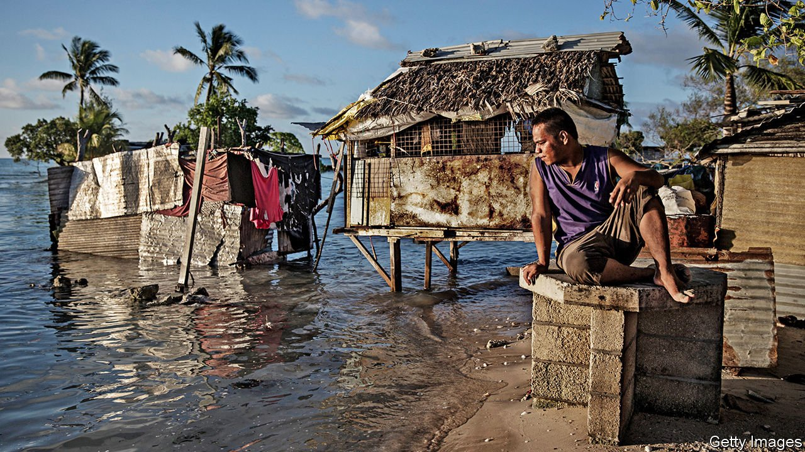
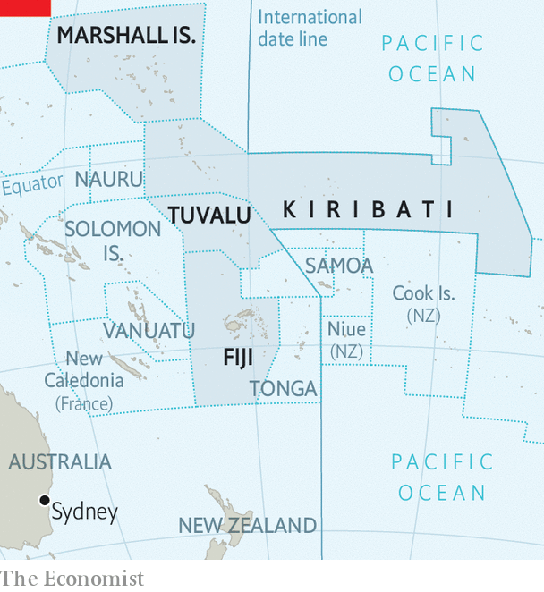

###### Moving story

# Pacific countries face more complex problems than sinking 

##### Other effects of climate change are more urgent, more varied and more unpredictable 

 

> Aug 7th 2021 

“HOW DOES a nation survive being swallowed by the sea?” So went the tagline for “Anote’s Ark”, a documentary film following Anote Tong, then president of Kiribati, as he toured the world warning that his islands were drowning. In 2014, he bought 20 square kilometres of land in Fiji, for Kiribati’s 120,000-odd people to move to as a “last resort”.

“Anote’s Ark” came out in 2018, two years after Mr Tong retired. The government that succeeded his was unimpressed. “It’s a drama, like a Star Wars film,” says Teburoro Tito, Kiribati’s ambassador to the UN. “The story is very convincing, but I must say, it’s not true.” The land in Fiji is being turned into a commercial farm.


Mr Tito has a point. In research published in 2010, Paul Kench, now at the Simon Fraser University in Canada, measured the size of 27 atolls over a period of decades and found that while 14% had shrunk and a couple had disappeared, 43% stayed the same size and another 43% became bigger. Many of the ring-shaped coral reefs have been able to adapt to sea-level rise, changing shape as sediment is eroded and pushed around. Tuvalu’s land surface, for instance, increased by 3% between 1971 and 2014 despite a rise in the local sea level of 4mm a year, twice the global average for that period. Mr Kench describes Mr Tong’s tale of sinking islands as “largely an emotional narrative”.

Such narratives have their uses. Kiribati, Tuvalu and the Marshall Islands, low-lying archipelagoes deep in the South Pacific (see map), are among the first countries to face the full onslaught of climate change. Stories like Mr Tong’s help capture international attention and much-needed funding—seven of the world’s 15 most aid-dependent countries are islands in the Pacific. But there are other, more immediate effects of climate change that threaten the lives and livelihoods of the citizens of these countries. They are less arresting, harder to explain and, as in the changing shape and size of islands, sometimes counterintuitive. But the upshot is the same: the countries may soon become uninhabitable.

 


Start with the phenomenon of shape-shifting islands. The Intergovernmental Panel on Climate Change, a consensus-building body on climate science, warns that the natural adaptation of coastal ecosystems may be only temporary: faster rates of sea-level rise, stronger waves and a growing human population may reduce their capacity to adapt.

That is one risk. Another, more urgent one stems from even small rises in the sea level. These can cause exceptionally high tides to briefly but entirely inundate the narrow strips of low-lying land that comprise most atolls. Such “king tides”, as they are known, are becoming more frequent. The saltwater can kill crops such as banana and papaya and seeps into groundwater, making it unfit to drink. Desalination plants are pricey and, like all machines, can fail. “The islands are not drowning,” says Michael Walsh, a former economic adviser to Kiribati. “But, humans and plants alike, they may well die of thirst.”

Changing weather patterns are another factor that could make low-lying islands uninhabitable long before most of them disappear. Last year, Cyclone Harold damaged 21,000 houses in Vanuatu. Cyclone Pam in 2015 was one of the strongest ever to hit the South Pacific. Cyclones and tsunamis in the region are predicted to become ever more intense.

Many islanders have picked up and moved. Some 30,000 Marshallese, or more than a third of the country’s people, have migrated to America, many in the past two decades. Yet few cite climate change as the reason for their move. The Marshall Islands Climate and Migration Project, a research outfit, notes that the main reasons given are “education, health care, work, and family connections”.

Already poor and dependant on aid, Pacific island countries have been particularly hard hit by covid-19. Travel restrictions have decimated the tourism industry and curbed seasonal migration to Australia and New Zealand.

Pacific leaders have ideas to revive their economies. Tuvalu makes lots of money from licensing its .tv internet domain (along with Vanuatu, it also sells passports to rich people). It now wants to set up an internet banking system and offer more services online. There are also ways to keep islands habitable: Kiribati plans to dredge its lagoons and use the sand to raise the surrounding islands higher above the sea. Tuvalu has embarked on a land-reclamation project. But the spectre of climate change makes it harder to drum up investment for such schemes. “I am trying to change the minds of the many people who say, ‘We cannot invest in your country, you’re finished’,” says Kiribati’s Mr Tito.

The depressing long-term solution, as in Mr Tong’s last resort, may be to move. The Marshall Islands hopes to renegotiate its post-colonial “Compact of Free Association” with America, which expires in 2023, to ensure a permanent right of residence in the United States for all Marshallese. Tuvalu has no such option. Maina Talia, a climate activist, thinks that the government should take Fiji up on its offer of a home where Tuvaluans could practise the same culture rather than “be dumped somewhere in Sydney’‘.

Earlier this year, the government of Tuvalu, which until recently insisted that there would be no Plan B, established a new UN initiative. Its aim is to work with “like-minded countries” to figure out how and where such countries could be relocated, how they could continue to function ex-situ, and whether they could still lay claim to vast exclusive economic zones if their land disappeared under water.

Relocating a country would raise other big questions, too, for both the international system and the way in which people think about statehood. “How to prepare to move a nation in dignity, that has never been done before,” says Kamal Amakrane, a migration expert whose ideas helped spark the UN initiative. He is confident that countries would be able to retain all the elements of statehood, but says that the world needs to start planning now. “This is happening,” Mr Amakrane warns. “We have 10-15 years to prepare for it.” ■

For more coverage of climate change, register for The Climate Issue, our fortnightly , or visit our 

