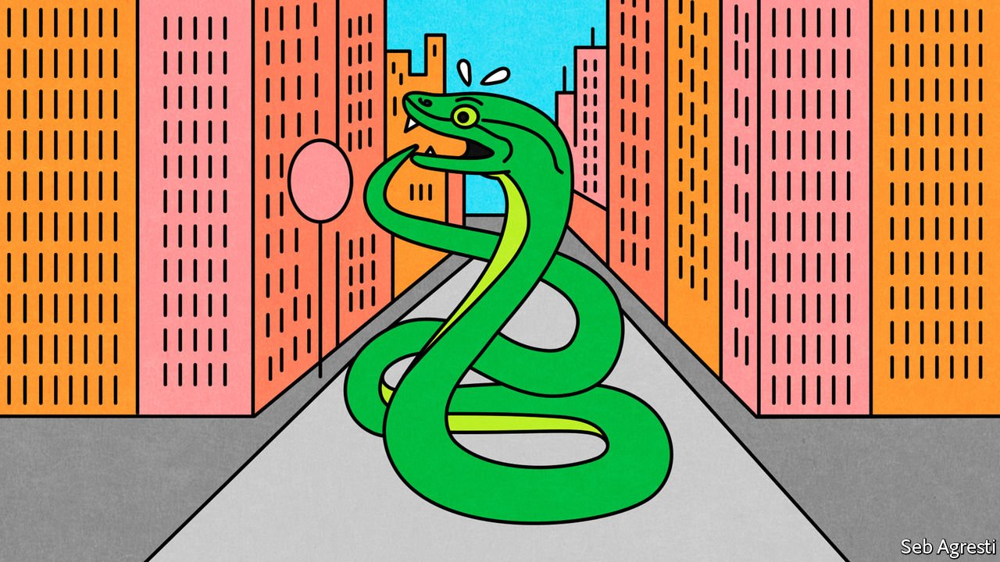

###### The urban jungle

# Snake sightings are becoming increasingly common in Mumbai 

##### The creatures are being displaced by extreme rainfall and the development of forest land 

 

> Aug 7th 2021 

“IT’S BEEN raining snakes amid the recent heavy downpour,” reported the Mumbai edition of the Times of India on July 26th, in a news piece about a rock python which “refused to be evicted” from an autorickshaw. The same paper contained reports of three other pythons rescued from a shipping container, and yet another that was found trapped in a fisherman’s net. A lost python spotted on a city beach made the papers the next day. Later that week a 28-year-old man found a snake in the distant suburbs, wrapped it around his neck and walked through a nearby market area as his friends made videos for social media. He died after it bit him three times.

It is not literally raining snakes. But a week of torrential downpours has had the same effect, driving snakes and other reptiles out of their burrows and into the city, where they seek warmth, shelter and gastronomic delights.


There are plenty to be found. Mumbai is highly built up and densely populated. But it is also full of ground-level foliage, warm nooks such as car engines, and lots of rubbish, the last of which attracts rats that make New York’s rodents look malnourished. The rats, in turn, attract hungry snakes.

“Rock pythons are rarely found in cities,” says Santosh Shinde of Spreading Awareness on Reptiles &amp; Rehabilitation Programme (or SARRP, Sanskrit for snake), the outfit that rescued the reptile in the rickshaw. Nonetheless, he says, “Last year we found 25 pythons in one month.” As for venomous snakes, it would be easier to list the parts of Mumbai they are not found. SARRP rescued 130 reptiles in June, when the monsoon starts, up 14% from last year.

“In the summer we get a lot of snakes that are dehydrated and in the monsoon displacement is very common,” says Madhurita Gupta of the Snake Conservation Trust, another serpent-saving society. “But this year it has become too much.” She attributes the increasing number of snake-sightings to three factors: extreme rainfall driven by climate change, development encroaching on Mumbai’s forests and the piles of festering garbage that blight the city.

When people see a snake, they “immediately go to pray or throw [an auspicious] red cloth”, says Dr Gupta. Or they “try to kill or attack it, and then they get bitten”. Her staff are trying to teach the public to distinguish venomous snakes from others. So is Mr Shinde, who argues that, just as people know the difference between a Doberman and a Pomeranian, they should be able to tell a harmless rat snake from the deadly “big four”: cobras, kraits and two types of viper. The WHO reckons 58,000 Indians die every year of snake bites. Official estimates are lower, but still high enough to give India the highest snakebite-mortality rate in the world. On August 13th this year, Hindus mark Naag Panchami, a day on which snakes are worshipped. The best way to honour the creatures may be to learn a little more about them.

