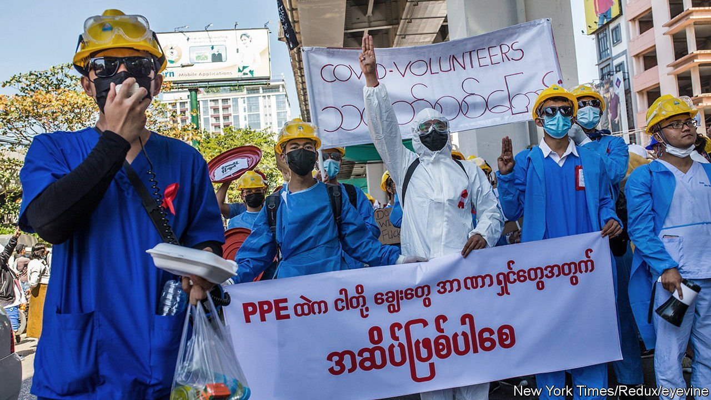
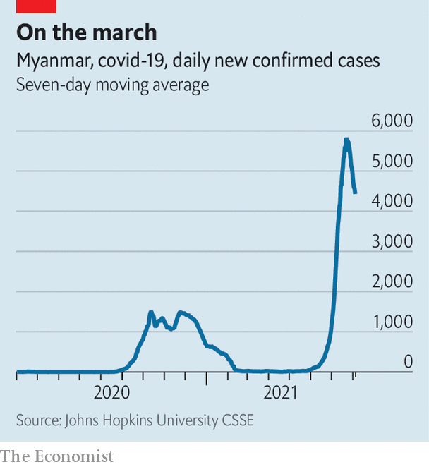

###### The second horseman

# The Burmese army is making a bad pandemic worse 

##### The covid-19 death rate is one of the highest in the world 

 

> Aug 7th 2021 

THAN THAN SOE has not had a day off since covid-19 began charging through Myanmar at the end of May. She runs a charity in Yangon, Myanmar’s biggest city, which transports covid patients to hospitals and corpses to cemeteries. Her organisation collects as many as 60 bodies a day. “We are very tired but we keep going,” says Ms Than Than Soe. Two volunteers recently got infected and died.

Covid is ravaging Myanmar. Daily cases, taken as an average over seven days, have hovered around 5,000 since mid-July, but limited testing means that this is probably an underestimate (see chart). The share of tests that return positive results has exceeded 35% since mid-July, which suggests widespread, uncontrolled transmission. Only Iran and Mexico have higher positivity rates. Myanmar, which borders countries that are home to about a third of the world’s population, risks becoming a “super-spreader state”, according to Tom Andrews, the UN’ S expert on the country.

 


Almost every South-East Asian country is experiencing its worst outbreak yet, and for many of the same reasons: low rates of testing and vaccination, weak or overwhelmed health-care systems and the presence of more transmissible variants such as Delta. But Myanmar offers the virus particularly hospitable conditions, thanks to the army. After a coup in February, testing, contact-tracing and treatment of covid ground to a halt. Public hospitals emptied of medical workers, thousands of whom joined protests against the coup. When a state bordering India reported an outbreak in June, the junta was too busy quelling resistance to do much about it.


In any case, lockdowns are impossible to enforce when people believe their lives are in danger. Violence unleashed by the coup has spurred many Burmese to take flight. Some 230,000 people fled their homes between February and June, bringing the total number of displaced people in Myanmar to 680,000. The camps where some have found refuge often have limited health care. The jungles where others flee have none.

But the struggle to find medical assistance has become a national problem, shared by refugees and city folk alike. Myanmar had few doctors to begin with. In 2018 there were just 0.7 for every 1,000 people—fewer even than in India, which had 0.9. Their number has been depleted by the junta. The regime has arrested top health officials, including the former head of the national vaccination programme. Hundreds, perhaps thousands, of health workers have gone underground. The security services have attacked medical personnel and facilities, killing at least 18. Junta officials reportedly entrapped, and later arrested, three doctors by posing as covid patients seeking treatment. Many hospitals have closed their doors; the UN believes that just 40% of health-care facilities are still functioning. Almost all those that are open are full, according to the Myanmar Red Cross Society.

Many people who are ill are treating themselves at home. They are keeping doctors like Moe Oo (not his real name) busy. Through his telemedicine service, which he offers free of charge, he is teaching patients how to check their vital signs and oxygen levels, and inject antibiotics or insulin. Many find it tricky to perform such tasks, he says. But they are the lucky ones. Drugs and other medical supplies are in short supply. Shortages of oxygen have been exacerbated by a rule banning the sale of the life-saving gas to residents of Yangon unless they get permission from local officials appointed by the junta. Dr Moe Oo has watched, helpless, as four of his patients, gasping for air, have succumbed to the virus.

Myanmar is counting around 360 deaths from covid each day. This is one of the world’s highest fatality rates, relative to population. Yet it is probably an undercount, something which the junta has implicitly acknowledged: it is building ten crematoriums in Yangon, which will be capable of dispatching more than 3,000 bodies a day.■

Dig deeper

All our stories relating to the pandemic and the vaccines can be found on our . You can also find trackers showing ,  and the virus’s spread across  and .

