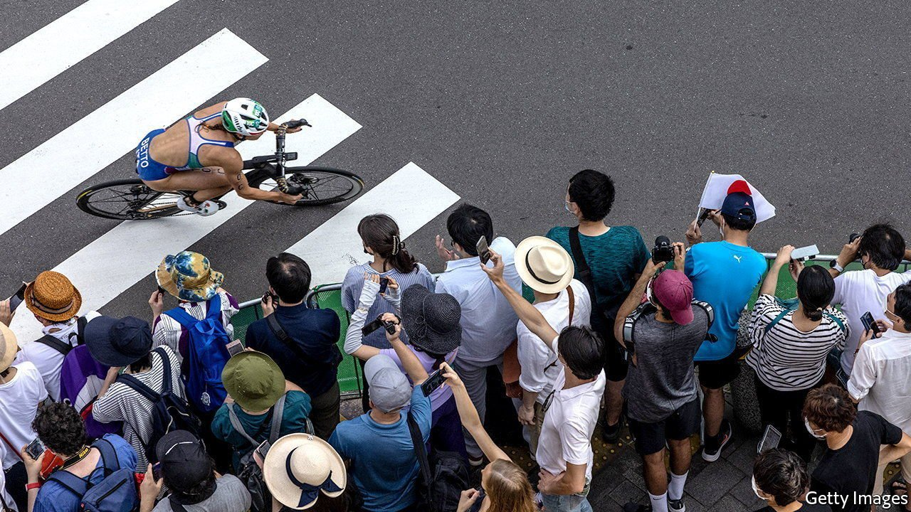

###### That 2021 feeling

# The Tokyo Olympics are not a flop. Nor are they a success 

##### Opposition to the games has declined. But it has not been replaced by wild enthusiasm either 

 

> Aug 5th 2021 

JAPAN HAS set several records in recent weeks. Its Olympic team has racked up 21 gold medals, the most in its history. It has a new youngest-ever gold medallist, a 13-year-old skateboarder, Nishiya Momiji. And it has achieved new heights in its daily covid-19 caseload, now exceeding 14,000.

The combination has generated mixed feelings about the Olympics. Many Japanese have celebrated the athletic triumphs, despite misgivings about the games before they started. Barred from attending most events in person, sports enthusiasts have gathered at outdoor venues to try to catch glimpses of cyclists or skateboarders. Television viewing figures have also been strong. But enthusiasm for sports has not rubbed off on the event as a whole or on its organisers, as Japanese leaders had hoped. The approval ratings for Suga Yoshihide, the prime minister, and his cabinet have dipped below 35%—another new record.


These games are likely to be remembered not as a symbol of how humankind overcame the pandemic, but as an example of how strange life became because of it. The oddity has been on display from the start. On opening night, a long column of protesters marched through central Tokyo to the new Olympic stadium. During quiet moments in the ceremony, their chants—”Stop the Olympics”—could be heard inside the mostly empty venue. Farther up the same street, fans gathered, streaming the ceremony on their smartphones and glancing up to catch fireworks and drone shows rising above the stadium’s rafters.

With the events under way, Olympians have shuttled between hotels and venues, where they compete in front of scatterings of volunteers, officials and journalists. Around the host cities, reminders of the games are muted. Absent are the big crowds and good cheer that usually accompany such events.

“It’s a little lonely,” laments Iizuka Masaki, a collector of sports pins waiting outside the heavily guarded gates to the Tokyo stadium in the hope of finding partners from abroad to trade with. When the Japanese and American baseball teams faced off on August 3rd in Yokohama, the loudest noises near the stadium came from the buzzing of cicadas.

Mr Suga has alternated between calling medal-winners to congratulate them and calling press conferences to announce new covid countermeasures. With the Delta variant dominant and hospitals under strain, the government decreed this week that only critically ill or high-risk patients would be admitted to hospitals. Others must recover at home. (Deaths have remained relatively low, thanks in part to high vaccination rates among the elderly.) The state of emergency in Tokyo and Okinawa was expanded on August 2nd to include four more prefectures.

Officials insist that the rising case numbers in Japan have nothing to do with the games. Strictly speaking, that may be true. Some 500,000 covid tests have been conducted on Olympic participants, of which just 0.02% have come back positive. Although a few athletes—and the entire Greek artistic swimming team (yes, that is an Olympic sport)—have had to drop out because of positive tests, the competitions have unfolded smoothly. A handful of athletes and support staff have had their credentials revoked for breaking protocol and wandering around, but as yet no evidence has emerged linking reckless Olympians to viral clusters among the wider population.

Since the start of the pandemic, however, Japan’s ability to contain it has relied on co-operation from the public. The government lacks the legal authority to impose strict lockdowns; its emergency declarations are, in essence, requests for people to limit their movements and for businesses to close early and stop serving alcohol. The current state of emergency is the fourth. Fatigue is setting in.

Holding the Olympics has reinforced the complacency. Foot traffic, for instance, has fallen far less during the current state of emergency than it did during past ones. “Since the Olympics are being held, it makes people think it’s okay to go out,” says Onishi Moeri, who joined a crowd taking pictures beside the Olympic rings early this week. It has been, muses Mr Iizuka, “a very unusual Olympics”.■

