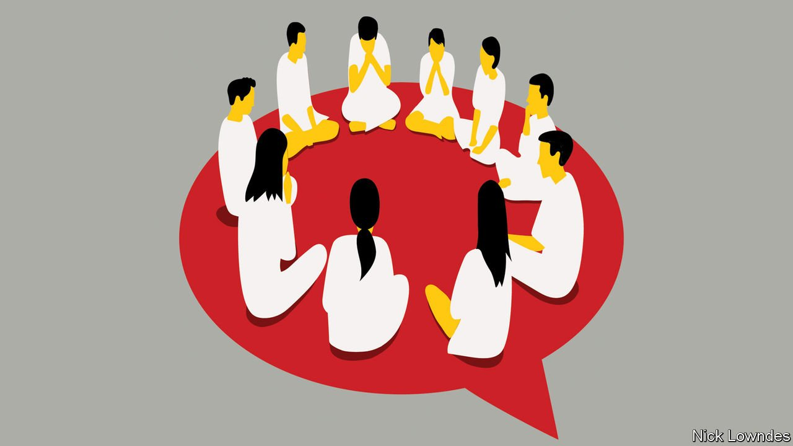

###### Johnson

# A new book explores “cultish” language 

##### Amanda Montell argues that a shared vocabulary can give members of an organisation a powerful sense of belonging 

 

> Aug 7th 2021 

“DRINKING THE Kool-Aid”, meaning to unquestioningly adhere to a belief or system, is often used jokingly by people unaware of its awful origin in Peoples Temple, a 20th-century religious community. (Jim Jones’s followers in Guyana in fact committed suicide by putting cyanide into Flavor Aid, a different drink.) The cult had its own internal lexicon, too. The Temple’s acolytes celebrated the birthday of one man, Jones himself, on “Father’s Day”. “Churchianity” was a term for the Christianity observed by America’s middle class. “Revolutionary suicide” was the group’s final act. Heaven’s Gate, another cult that ended with a mass suicide in 1997, used similarly bizarre jargon.

A new book, “Cultish” by Amanda Montell, examines the role of language in binding people to organisations of all kinds. The group may be an ordinary workplace, a fan club or a circle of friends, but it can also include institutions that make it hard to escape their orbit and, at worst, that inflict grievous harm on members. What the organisations have in common is passionate adherents, charismatic leaders and a unique use of language that helps join everyone together. The vocabulary of tight-knit organisations gives people a powerful sense of belonging.


Ms Montell briefly addresses a core question: whether being made to use a certain lexicon subsequently makes people manipulable. The much-debated Sapir-Whorf hypothesis in linguistics posits a causal connection between language and thought. In its strongest form it suggests that ideas that lack a linguistic label are unthinkable—much as the very concept of being “free” is destroyed in George Orwell’s “Nineteen Eighty-Four”—while the regular use of other labels forces people’s thinking into approved patterns.

But, like most modern scholars of the hypothesis, Ms Montell dismisses such notions. After years of being steeped in insular language, some people do muster the thought that they should leave a group or a job. A weaker and more plausible form of the idea is that constant repetition of cultish vocabulary merely pushes thoughts in certain directions and away from others. This makes it harder, though far from impossible, to flee.

More interesting is her discussion of “thought-terminating clichés” in cults and religious groups. These are circular or distracting mantras designed to head off doubt. Believers in QAnon, a conspiracy theory, constantly told doubters to “trust the plan” that President Donald Trump would apprehend a global ring of Satanic paedophiles. Shambhala, a controversial Tibetan Buddhist offshoot, would tell people with concerns, “Why don’t you sit with that?” rather than talk about it. “You pulled it in” is Scientology’s response to a bad event in someone’s life. Such calamities shouldn’t happen to adherents, so if misfortune arises, you are doing Scientology wrong.

“Cultish” will raise eyebrows as it moves through modern belief systems to multilevel marketing (MLM) organisations, whose members are often put under pressure not only to sell products but to recruit new associates. Amway, the biggest and most powerful MLM, once called its members “independent business owners”; its own thought-terminating cliché is, “A good system always works.” Modern beauty schemes often target young women, as Ms Montell says, using the “faux-spirational lingo of commodified fourth-wave feminism”. These “boss babes” are motivated with rhetoric associated with independence.

Ms Montell also scrutinises fitness trends such as CrossFit, a kind of high-intensity training, where gyms are “boxes” and trainers are “coaches”. “Uncle Rhabdo” is the nickname for rhabdomyolysis, a potentially life-threatening result of over-exercising, and nearly everything else is given an acronym. She examines online wellness gurus spouting pseudoscientific terminology such as “quantum transformation” and “upgrading your DNA”. Most of these ministrations are harmless, but some of them suggest deleterious treatments.

In the end Ms Montell’s net is so broad that it may leave many readers wondering if a group they belong to is manipulating them somehow. It may not be a cult (though it would certainly deny being one if it were). But being aware of how language is used to reroute or shut down thought within organisations is a powerful tool in itself. There is nothing wrong with joining a team and gladly adopting its lingo—so long as it remains freely chosen.

