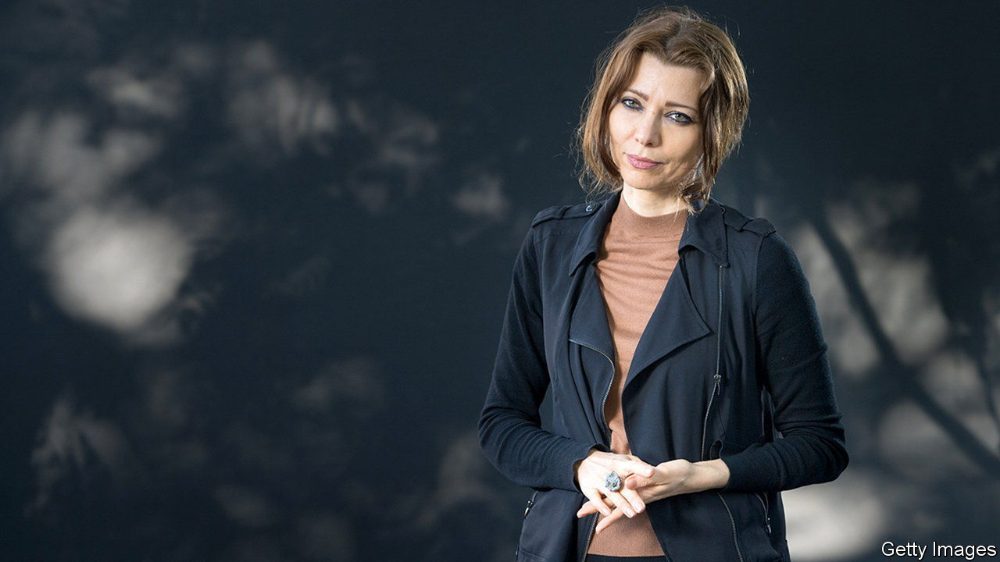

###### Star-crossed lovers

# Elif Shafak’s new novel captures Cyprus’s tumultuous history 

##### It is partly narrated by a fig tree 

 

> Aug 7th 2021 

The Island of Missing Trees. By Elif Shafak. Viking; 368 pages; £14.99. To be published in America in September by Bloomsbury; $27

ELIF SHAFAK’S novels are read and celebrated around the world, yet she remains controversial in Turkey, where her parents were born. In 2006 she faced trial in Ankara, accused of “insulting Turkishness” on the grounds that characters in “The Bastard of Istanbul” discuss the Armenian genocide, which the Turkish government denies (Ms Shafak was acquitted of the charges before the trial began). The saga did not deter her from using fiction for social criticism. Published in 2019, and also set in Istanbul, “10 Minutes and 38 Seconds in this Strange World” is narrated by a murdered sex worker. The harrowing story draws attention to the ills of misogyny and religious hypocrisy in the country.


If Ms Shafak’s subjects are sombre, her magical-realist style is anything but. Her new novel, which addresses the turbulent history of Cyprus, is partly narrated by a fig tree. The story opens in London, where the teenage Ada is mourning the death of her mother Defne, a Muslim Turkish-Cypriot who had become prone to drink. Ada suspects that Defne’s decision to emigrate and to marry her father, Kostas—a Christian Greek-Cypriot—was a difficult one. She learns just how incendiary it was only after talking to Defne’s sister Meryem, who vowed never again to speak to Defne as long as their own parents were alive.

Cutting between past and present, the novel tells the story of Defne’s and Kostas’s romance. Teenagers in Cyprus in the 1970s, their courtship takes place against a backdrop of rising violence between Turkish and Greek paramilitaries in the wake of Cyprus’s independence from Britain (Turkey would invade the island in 1974). When Kostas’s mother sends him to London for safety, having already lost one son to the bloodshed, his estrangement from Defne has grave consequences—not least for a Turkish-Greek couple who had sympathetically provided them with a haven.

The transformative role played by the fig tree is unlikely to surprise readers of Ms Shafak’s previous novels, or Ovid’s “Metamorphoses”. Its presence affords bittersweet relief, not to mention an outlet for digressions on a range of subjects, from Cyprus’s illegal trade in songbirds to its eradication of malaria in the 1940s. The overlapping timelines produce a busy and fast-moving narrative focused on healing as well as grief. Ms Shafak does not shrink from the reality of violence, but she salvages tenderness—even joy—from the wreckage of 20th-century history. ■

