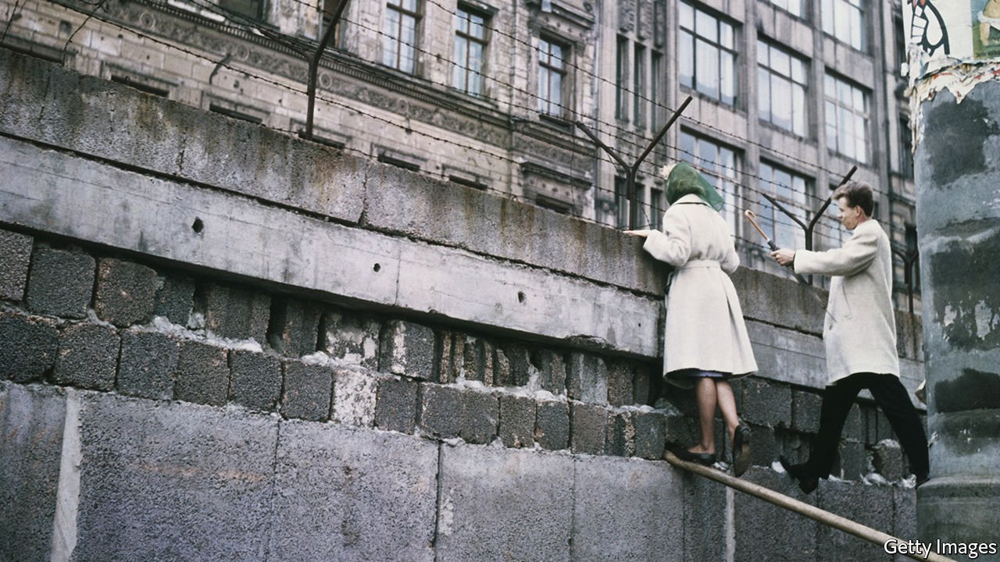

###### An underground operation

# The remarkable tale of the tunnel under the Berlin Wall 

##### In September 1962 East Berliners found a path to freedom under the earth 

 

> Aug 7th 2021 

Tunnel 29. By Helena Merriman. PublicAffairs; 352 pages; $28. Hodder &amp; Stoughton; £20

THE PLAQUE at 7 Schönholzer Strasse, in the trendy Prenzlauer Berg district of east Berlin, is easy to miss. Yet it marks one of the most astonishing episodes in the grim history of communist East Germany. For it was from here, in September 1962, that 29 East Berliners escaped to freedom via a narrow, 120-metre tunnel underneath the wall that had cleaved their city in two a year earlier. “Tunnel 29”, by Helena Merriman, a British journalist and broadcaster, began as a popular podcast, aired by the BBC in 2019 to mark the 30th anniversary of the fall of the wall. Happily, the written account is no less captivating.


The hero of the tale is Joachim Rudolph, whom Ms Merriman interviewed extensively in 2018. A young engineering student with a tragic family history, Mr Rudolph flees East Berlin less than two months after the wall’s construction—before concrete reinforcements, trigger-happy guards and wide strips of no-man’s-land were to render it almost unbreachable (at least 140 people were killed trying to escape from East Berlin before the wall came down in 1989). Safely ensconced at West Berlin’s Technical University, Mr Rudolph joins forces with a network of students and other activists aiming to smuggle out East Berliners. Yet unlike most of them, he is not seeking to bring loved ones over to the West. The motivations for his courage are hard to discern; he is not sure he understands them himself.

The narrative focuses on the escapades of the gang of young men who sought to burrow into the east from a plastic-straw factory in West Berlin’s Bernauer Strasse, which ran adjacent to the wall. Early enthusiasm soon yields to sagging spirits and abandoned attempts as the group confront a battery of obstacles, from water leakage and equipment shortages to the ever-present threat of Stasi infiltration. Well-justified paranoia drives them to rough up a well-meaning Ossi escapee who offers to help. A secret cash-for-footage deal with NBC, an American television network hungry for verité tales of cold-war Berlin, pays for vehicles and tools, though this later causes ructions within the team.

Politics hums in the background. John F. Kennedy, who became obsessed with the divided city, makes an appearance; so do Nikita Khrushchev, who enjoyed squeezing West Berlin, the “testicles” of the West, and Erich Mielke, the sadistic Stasi chief. The East German workers’ uprising of 1953—the first crack in the German Democratic Republic’s edifice—is also evoked, as is the Soviet-sanctioned construction of the wall itself, characterised by Walter Ulbricht’s communist regime as an “anti-fascist protection barrier”.

Ms Merriman weaves these strands together skilfully, offering enough context to explain her characters’ actions without distracting from their adventures. Smells, sounds and tastes give texture to the story. The ecstasy that Mr Rudolph, brought up on flavourless eastern swill, finds in the pineapple jam he is served on reaching the West is a particular delight. The dusty claustrophobia of the dig, conducted in night-time shifts over months, is palpable.

The supporting cast is richly drawn, ranging from Siegfried Uhse, a gay, closeted hairdresser in West Berlin blackmailed by the Stasi into collaboration, to Reuven Frank, an NBC executive who threatens to resign when the Kennedy administration blocks the network from airing the film. (The politicians relent, and the documentary, available today on YouTube, is a triumph.) Most of the players find some sort of redemption in the happy denouement; the family reunions described in a late scene are moving. Ms Merriman’s well-crafted book does justice to the extraordinary bravery of her characters. ■

