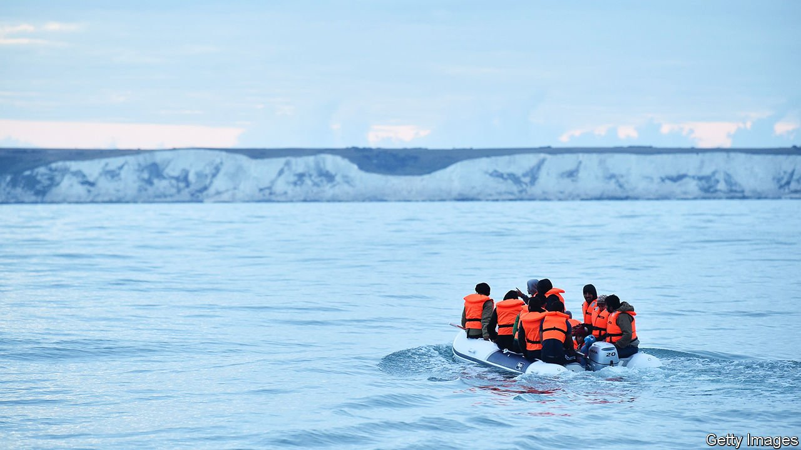
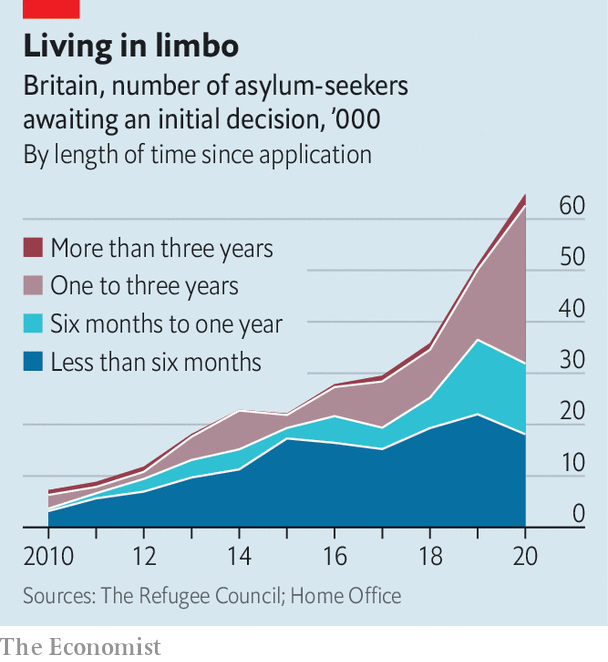

###### Britain’s boat people

# A country with few asylum-seekers wants even fewer 

##### Draconian laws are unlikely to have the desired effect 

 

> Aug 7th 2021 

STILL, SUNNY weather in southern England brings the smell of sausages from barbecues, the off-key tinkling of ice-cream vans—and inflatable boats filled with asylum-seekers. According to the BBC, more have already crossed the English Channel this year than in all of 2019 or 2020. A new one-day record was set on July 19th, when 430 turned up.

By some yardsticks, this is trivial. Britain received 32,411 applications for asylum in the year to March. That is a third of the peak in the early 2000s and low by global standards. Britain ranked fifth among European countries for asylum claims in 2020, and 17th adjusting for population. Many poorer countries .


But the impact on domestic politics is out of all proportion to the number. As Maria Sobolewska and Robert Ford show in their book “Brexitland”, Britons voted for Brexit largely because they wanted more control over immigration. The sight of asylum-seekers floating across the Channel is a highly visible indication that the government might not be doing what many Britons sorely want it to, says Will Tanner of Onward, a right-leaning think-tank.

The government is therefore pulling a variety of policy levers to try to keep asylum-seekers out. But its proposals are largely misguided. Some will harm them; some, though they sound tough, will not reduce their numbers. A few are even likely to encourage more economic migrants—the sort natives feel least sympathetic to.

One approach is to make it harder to set out for Britain. On July 20th Priti Patel, the home secretary, agreed to pay the French government €62.7m ($75m) for more patrols of the northern French coast. Another is to try to deter asylum-seekers by passing tough laws. A bill now before Parliament would criminalise those who arrive illegally, as most do. It would also make it easier to detain and deport asylum-seekers, and grant those eventually permitted to stay—roughly half the total, once appeals are heard—a shorter sojourn. People resettled directly from refugee camps would be treated more generously. But there were never very many of these, and since covid-19 struck, there have been almost none.

Making it harder to leave France will probably have an effect. Asylum-seekers first took to boats in large numbers because it became hard to reach Britain by boarding lorries. That, in turn, was partly because Britain agreed in 2018 to pay for more fencing and cameras around Calais port. Crossings will probably continue despite additional patrols, but from quieter sections of the coast that are farther from Britain. The cost, in money to smugglers and deaths at sea, could well rise.

Tough laws, by contrast, may make little difference even if judges do not eviscerate them, as they may well do. Some asylum-seekers are drawn to Britain because they have relatives there, a pull that no law can change. That includes almost all those who camp in northern France before trying to make it to Britain, says Frances Timberlake of Refugee Rights Europe, a charity.

More broadly, behind the proposals lies a notion that, as Ms Patel puts it, Britain is “a destination of choice”. That flatters the country. Heaven Crawley of Coventry University, who has interviewed many asylum-seekers, says they are commonly ill-informed. Many express a vague desire to go to “Europe”. Others base their preference for Britain on startlingly naive reasons, such as familiarity with English football. “It’s not like people are going to read in a paper that British policy is horrible and decide not to come,” she says.

Tim Hatton of the University of Essex has studied why asylum-seekers choose the countries they do. Distance matters—the longer the journey, the fewer will make it. Policing borders more stringently or refusing to issue visas also reduces asylum claims. People are drawn to countries where many fellow-countrymen live. By contrast, attempts to immiserate asylum-seekers by detaining them, cutting their tiny stipends or restricting their ability to work have no effect.

Asylum-seekers have endured so much by the time they reach Britain that a bit more is scant deterrent. Last September inspectors found dire conditions at several detention and processing centres. One was strewn with rubble and resembled a building site. Detainees had to wear wet clothes because there were too few dry ones. Medical treatment was carried out in the open air. The asylum-seekers nonetheless said they had been treated very well.

 


Britain’s asylum system has changed in one more way in the past few years: case-processing has slowed down drastically (see chart). Less than 30% are heard within six months, down from more than 70% in 2015. The proposed law may slow things down even more. Immigration officials have begun to put off hearing cases while they engage in largely futile attempts to return asylum-seekers to transit countries, and the law would allow that to continue.

Simone Bertoli of the University of Clermont Auvergne and others have studied the effect of processing speed on asylum claims. Countries that hear claims quickly tend to get more applications from those likely to be granted asylum, such as Syrians, and fewer from those who aren’t. Conversely, migrants using the asylum system as a back door into the labour market seem to be drawn to sluggish countries. By going slow, Britain could end up enticing more of the sort of asylum-seeker most likely to infuriate the public. ■

