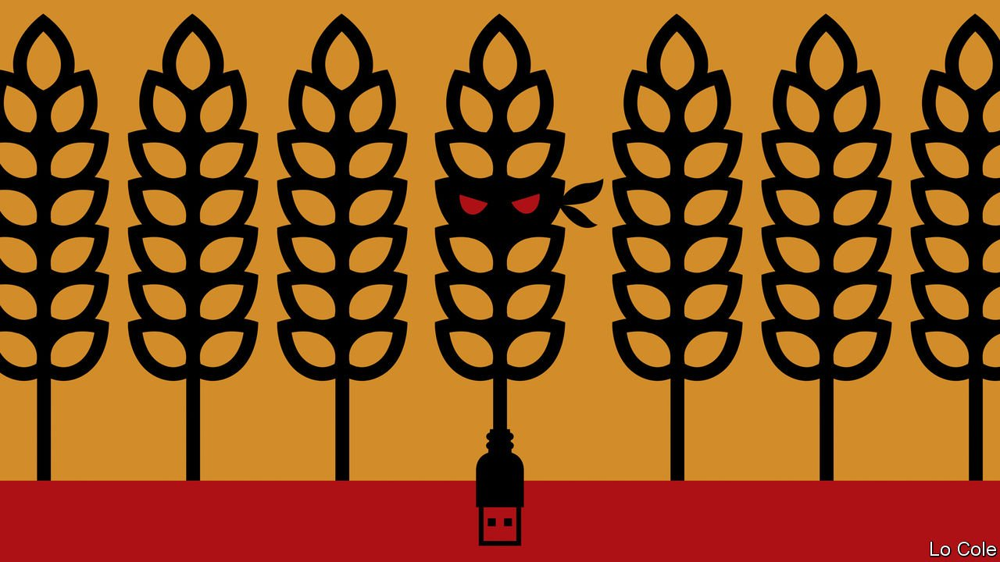

###### Farms and cybersecurity

# Farmers are being targeted by cyber-criminals 

##### Online fraud is coming to the countryside 

 

> Aug 5th 2021 

AT THE TOP of farmers’ concerns about crime are fly-tipping, sheep-rustling and livestock-worrying. Cybersecurity ranks low. “We’re all fully clued up,” says one. Among those charged with disabusing farmers of such complacency is Mark Moore of Devon and Cornwall Police, who leads the South West Cyber Resilience Centre, one of eight non-profit companies set up by the Home Office in the past couple of years to advise small businesses. When dishing out advice, he keeps it simple (change passwords frequently), rather than worrying them about “the whole Putin and China thing”.

On August 3rd NFU Mutual, Britain’s largest farm insurer, released its annual report on rural crime. Covid-19 crimped criminals’ style: the cost of rural theft fell by 20%, to £43.3m ($60.1m), the lowest for five years. But some unwelcome longer-term trends were visible behind that reprieve. Crime in the countryside, as in cities, is increasingly focused on high-tech goods, and much of it is moving online.


Studying rural crime is difficult, in part because some police forces count any crime in a rural spot, while others count only those specific to such areas, such as poaching or the theft of farm equipment. Most is committed by organised gangs, often with international reach, says Kreseda Smith, a criminologist at Harper Adams University, which specialises in rural matters. NFU Mutual found that tractor GPSs, quad bikes and all-terrain vehicles are popular with thieves. Cyber-criminals are also targeting farmers, it warned. Phishing emails about farming-subsidy payments are becoming more common, it says, and farmers are falling for scams advertising expensive tractors.

One reason rural crime is going virtual is that farming is increasingly automated, from gate-opening and tractor-driving to cow-milking. Farm vehicles have been fitted with telematic units that send data to manufacturers. Pigs must be electronically tagged so their movement can be tracked by a government-run scheme. But farmers—average age 60—do not always keep their computers and software up to date. A tablet guiding a tractor driver’s work, says Mr Moore, is “probably operating off Windows 7 on a computer back at home”.

Cyber-crooks who tampered remotely with a combine-harvester’s settings could interfere with harvest, says Lawrence Baker of NCC Group, a security firm; a ransomware attack could immobilise high-tech farming equipment. And as in other sectors, cyber-criminals sometimes target big companies. JBS, a Brazilian company, suffered a ransomware attack in June that officials believe was carried out by a Russian crime ring. Animal slaughter stopped for several days, and thousands of abattoir workers in Australia, Canada and America were stood down.

Farmers are not alone in neglecting cyber-risks. One recent government survey found that just 14% of firms had given their staff training in cybersecurity; another, that 39% of businesses had suffered online breaches or attacks in the past year. Fraud and cyber-offences now make up over half of reported crimes. Between May 2020 and March 2021, the official crime survey for England and Wales found 268,000 reported burglaries, a figure that is dwarfed by 1.7m for offences involving the misuse of computers.

Compared with these trends, government plans for a crime crackdown trailed late last month seemed oddly retro. They included tough talk on anti-social behaviour, but less on cybercrime, though organisations that handle online offences will be beefed up and get a bit more funding.

The emphasis will remain on prevention, rather than detection or punishment. “That’s where we get the biggest bang for our buck,” says Mr Moore. In part that is because too few British police have the skills for specialised cyber-investigations (“I can’t tell you how to reconfigure a firewall,” says Mr Moore, though he does know people who can). Other barriers include social-media firms that will not share evidence, and limits to international co-operation. The growing number of cyber-victims, both rural and urban, may not be satisfied with that response much longer. ■

