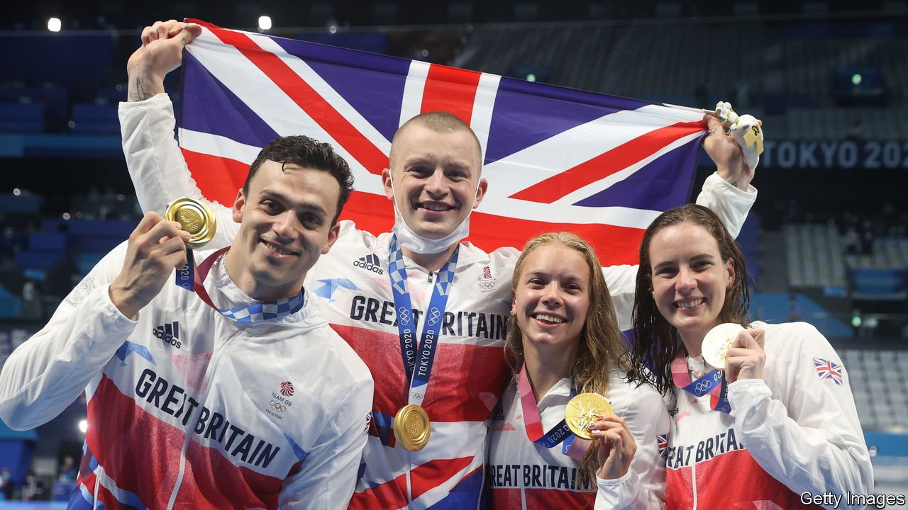
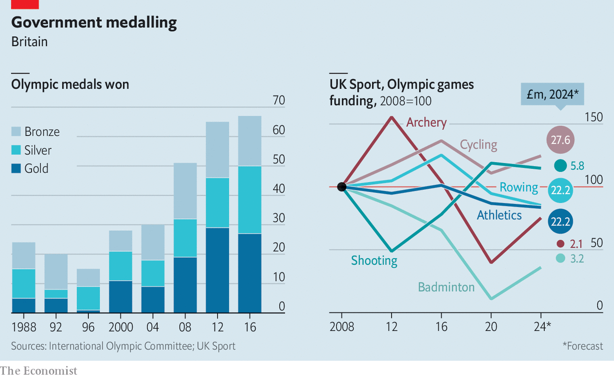

###### Britain’s Olympic success

# How Britain became an Olympic power 

##### Lottery money and ruthlessness were key 

 

> Aug 5th 2021 

THE MODERN Olympic Games were founded to celebrate amateur sporting ideals. But times change. These days, success takes money and a hard-nosed attitude to doling it out. Few countries prove this as well as Britain, which has spent 25 years shaping up from an Olympic also-ran to a medal-winning power.

In 2008 in Beijing, Britain came fourth, ahead of countries of roughly similar size such as Italy (9th), France (10th) and Spain (14th). In 2012 in London, it came third. In 2016 in Rio de Janeiro, only America did better. Britain has spent £345m ($480m) on the Tokyo games. As The Economist went to press it was vying with Australia for fourth place in the medal rankings, behind America, China and Russia.


The transformation began after the 1996 Atlanta Olympics, in which Britain won just a single gold. The government decided to use cash from the recently launched National Lottery to fund top-level sport, with the express goal of winning more medals. From 1997 the effort gained impetus under New Labour, which was enamoured of performance targets, says Borja Garcia, who studies sports policy at Loughborough University. More came in 2005, with the decision to award London the 2012 games.

The result was what UK Sport, a government body charged with medal-chasing, called its “no-compromise” approach. Sports management was professionalised. Coaches, nutritionists and sports scientists were heaped upon the most promising athletes. Funding became calculating and unsentimental. Team sports often offer poor returns, points out Mr Garcia, since it takes several athletes to win a single medal. In medal-rich sports such as swimming or athletics, by contrast, a single one can win in several events. The result has been largesse for a few favoured sports, and crumbs for the rest. Funding fluctuates wildly depending on how a sport does at the Olympics, and what officials think of its prospects (see chart).

 


Such ruthlessness has been effective. But Stefan Szymanski, a sports-policy expert at the University of Michigan, says that targeting money on sports that are doing well risks entrenching the status quo by starving less successful ones of the cash that might help them to improve. Others worry that chasing after medals has had grimmer consequences. Dozens of gymnasts are suing the sport’s authorities, complaining of negligence and abuse. Jennifer Pinches, an Olympic gymnast in 2012, says officials prioritised “podiums over people”. A report in 2017 criticised a “culture of fear” within British cycling, the reputation of which has been further tarnished by a doping scandal involving its all-conquering 2012 Olympic team.

These days, UK Sport’s approach has become at least a little gentler. A new funding formula provides a dribble of development cash for less-loved sports. Officials hope elite sport will promote the grassroots sort, as well as create national glory. As other countries, such as France and the Netherlands, become more hard-headed, Britain’s advantage may narrow.

And even the best-laid plans of funding bodies and bureaucrats can go awry. Bethany Shriever, who won gold in Tokyo in BMX racing, failed to impress officials before the Games and had to crowdfund to pay for her training. Meanwhile Britain’s rowers, a reliable (and lushly funded) source of medals in past games, are mired in recriminations after a string of fourth places. ■

