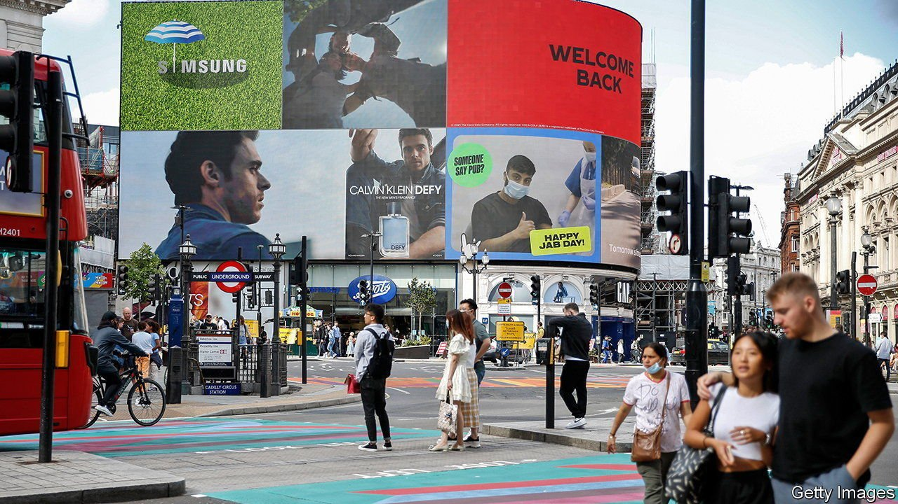

###### Farewell to furlough

# Paying workers to stay home during the pandemic protected jobs 

##### But some will be lost as the scheme is wound up 

 

> Aug 5th 2021 

IN MARCH LAST year, as covid-19 spread and countries locked down, governments all over the world faced the prospect of an unprecedented rise in unemployment. Some, like America’s, rolled out income-protection schemes; in Britain, as in continental Europe, the focus was on keeping workers attached to their employers. The Coronavirus Jobs Retention Scheme saw the state covering 80% of the wage bill for furloughed employees, up to a maximum of £2,500 ($3,485) a month.

It was supposed to last for 12 weeks, but is still going. By mid-July the government had paid out £67.4bn, around 3.3% of GDP in 2020, with 1.3m employers and 11.6m employees participating at some point. Now, finally, it is being wound down. From July 1st employers have had to contribute 10% of wages for furloughed workers, with the state’s share falling to 70%. On August 1st the employer’s share rose to 20%. The scheme is due to end on September 30th. Other European countries, which will continue making payments for longer, are eyeing Britain curiously to see what might happen when they stop.


Measured against its main objective—preventing a leap in joblessness—Britain’s scheme was a great success. Unemployment rose by just over a percentage point and now stands at around 5%. In America, for comparison, unemployment peaked at almost 15% and is still around 6%.

But some of those who drew it up now privately admit that they would have designed it differently, had they foreseen how long it would last. They had envisaged putting the economy in stasis for three months and re-opening with everything roughly as it had been. As the pandemic dragged on, furlough instead may have prevented labour and other resources from being reallocated efficiently in response to economic change, as in normal times.

The most recent official data cover the period to the end of June, just before employer contributions were due to start. At that point, 971,200 workers were on full furlough and 880,500 on partial furlough, working for their employer some of the time. The sectoral pattern is in some respects puzzling. It is easy to see why more than half of employees working in air transport are still furloughed, but what about the 8% of those in manufacturing, or 10% in construction? Manufacturing output is nearly back to the level before the pandemic, and construction output is higher. That suggests some claims were fraudulent and a share of those workers will be “let go” when the scheme closes.

In February younger workers were more likely to be furloughed: they are over-represented in hospitality and retail sectors, which were still largely shut. But now it is older workers who are more likely to remain in the scheme. Of those aged between 55 and 64 who had been working for at least a year before the pandemic, and were thus eligible, 7% were furloughed at the end of June, as were 10% of over-65s. The likeliest explanation is that, had the past 16 months been normal, many would have retired during them. Instead some will have persuaded employers to put them on furlough, which paid out more than most pensions. They may move into the economically inactive category rather than go back to work.

A recent survey from the British Chambers of Commerce suggests that one in five employers still using the scheme are considering redundancies. Some are in hard-hit sectors, such as travel. But other furloughed workers may find that, in their absence, their employer has figured out how to do without them. Firms that became more productive will be reluctant to lose those gains by bringing everyone back, says Samuel Tombs of Pantheon Macro, a consultancy. Some of the job losses seemingly prevented by furlough may merely have been postponed. ■

Dig deeper

All our stories relating to the pandemic and the vaccines can be found on our . You can also find trackers showing ,  and the virus’s spread across  and .

