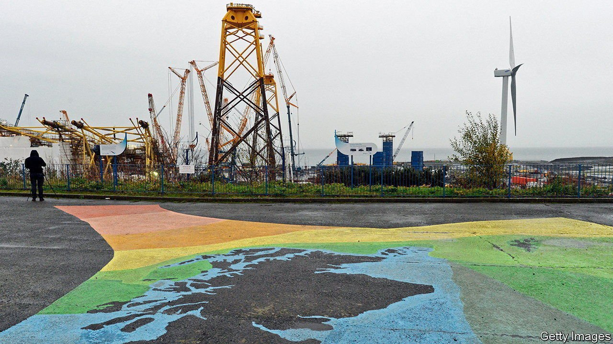
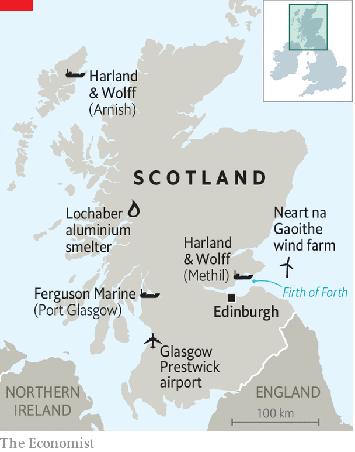

###### Guid money after bad

# Scotland counts the cost of industrial bail-outs 

##### The forces behind a string of bad bets 

 

> Aug 7th 2021 

IN ONE SHED a worker tests welding guns, alone but for the radio. In the next a crew admires a machine fresh in from the Netherlands, which cuts steel pipes to elegant curves. By mid-August the air will be thick with fumes and sparks. Some 400 workers will assemble steel into latticed tripods, 20 storeys high. In the spring these will be towed out in the Firth of Forth and dropped to the seabed. A wind turbine will be fixed atop, sweeping 200m above the waves. They will form part of the Neart Na Gaoithe array, built by the state-owned electricity firms of France and Ireland, EDF and ESB.

The work is a boon for Methil, a poor former mining town. It may turn out to be a bargain for InfraStrata, the engineering firm that now owns Harland &amp; Wolff, the shipbuilder of the Titanic. It bought the fabrication yard, plus a second on the Isle of Lewis, in February in a deal worth £850,000 ($1.2m), after BiFab, its previous owner, went into administration. But it is a bad deal for Scottish taxpayers, whose government had pumped loans totalling £51m into BiFab as it struggled to survive.


It was the latest in a streak of losing bets for the Scottish government. In 2013 it bought Prestwick Airport, near Glasgow, for £1, citing its strategic value. But it has made little profit since; £43m in state loans have been written down to £10m. The government is now trying to sell it.

In 2015 Ferguson Marine, a shipyard, was commissioned to build two vessels for the state-owned ferry line. After consuming £45m in government loans, it went into administration in 2019 and was nationalised. The boats are now expected to be four years late, and to cost twice as much as originally budgeted. A lawmakers’ report concluded that the loans had been dispensed heedless of warnings and without proper oversight. And in 2016 the Scottish government agreed to provide guarantees to the Lochaber aluminium smelter in Fort William, in exchange for annual fees valued at £21.4m. These have since been marked down to nil; the government’s potential exposure has risen to £37m.

 


Such sums are small when set against an annual budget of £34bn. But they have dented the reputation of the ruling Scottish National Party, and frustrated its supporters. They reflect an absence of strategic planning, coupled with a readiness to write cheques without a clear idea of the gains the money can be expected to bring.

Both are visible in Scotland’s failure to turn a boom in green energy into manufacturing jobs, as promised a decade ago by Alex Salmond, then the first minister. Renewable electricity output has tripled since 2009 to 12GW, equivalent to Scotland’s entire domestic consumption, and planned projects will see that double again. But the kit has largely been imported. The Methil yard, rusty and potholed before InfraStrata took over, lost contracts for Scottish wind farms to more productive rivals overseas. Arup, a structural-engineering firm, says Scotland lacks the deep ports needed for the newest, floating turbines.

Without a proper industrial strategy, Scotland was left with “clapped-out yards that can’t win the work”, says Brian Wilson, a former Labour MP and energy minister. The resulting bail-outs were badly handled. Audit Scotland, an official watchdog, concluded in 2019 that the country had no “clear framework” for state interventions that took account of probable outcomes and the government’s appetite for risk. The government admits that it lacked commercial expertise, and promises reforms.

Scotland’s independence movement was forged in the Thatcher era, which hit Scottish manufacturing hard. In the referendum of 2014, which Nicola Sturgeon, the first minister, hopes to re-run, it promised to “reindustrialise”. Some blame its weak performance since on its limited ability to borrow to invest, a power constrained by Westminster. John Wood, InfraStrata’s boss, says the nationalists’ focus on Scotland alone has been a major weakness, and that the firm will be able to compete for larger contracts by splitting work with its yards in Belfast and Devon. The independence campaign has increased pressure for bail-outs, argues Murdo Fraser, a local Conservative lawmaker. “We’re living with the consequences of decisions taken in haste for political reasons without the hard-headed economic analysis.”

Boris Johnson, the prime minister, now promises to make Britain a “Saudi Arabia” of wind energy, borrowing a slogan first used by Mr Salmond, and to bring new jobs to old towns through hydrogen and carbon-capture. He is keener on bail-outs than his predecessors were. On July 28th he nationalised Sheffield Forgemasters, a steel mill; last year £400m went to OneWeb, a satellite firm, against civil-service advice. Only state-aid restrictions imposed by the EU stopped the Scottish government pouring more money into BiFab. Mr Johnson plans to loosen these, giving public bodies greater discretion. He visited Scotland on August 4th; on the flight he could usefully have pondered the perils of grand ambitions and weak controls. ■

