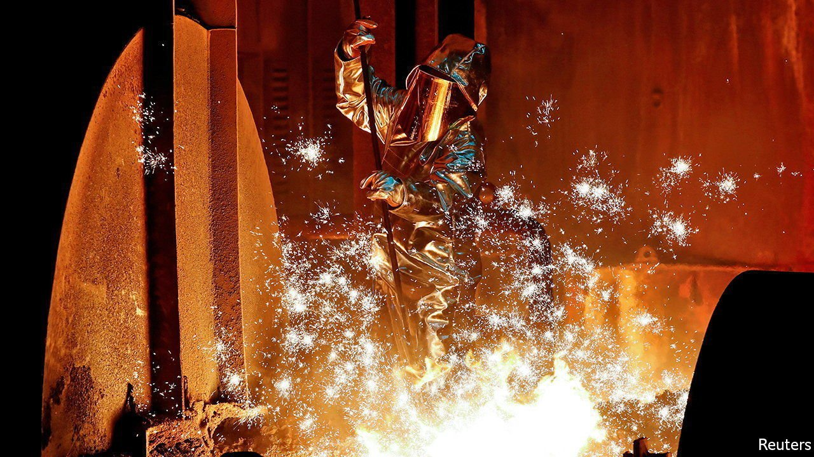

###### A green and level field

# The EU’s proposed carbon tariff gets a mixed reaction from industry 

##### Firms want more financial support to decarbonise 

 

> Aug 7th 2021 

SINCE THE EU launched its emissions trading system in 2005, industries have followed divergent greenhouse-gas trajectories. The power sector has cut them by half. Among cement- and steelmakers, which got free allowances for four-fifths of their exhausts to stop the shift of production abroad, they have barely budged.

The European Commission wants to end this handout. Last month the EU’s executive arm proposed new rules to help the bloc meet its goal of cutting emissions by 55% from levels in 1990 by 2030. One proposal would withdraw free allowances for producers of aluminium, cement, fertiliser, iron and steel, and levy import tariffs on these products based on their carbon content. This “carbon border adjustment mechanism” (CBAM) aims to level the playing field. If Europe’s steel mills must pay for the carbon they spew, so will their Chinese rivals selling to the EU.


The EU plan is just that for now. It needs the nod from the European Parliament and member states. China says it violates World Trade Organisation rules; others may challenge it. If enacted, CBAM would not start until 2026 and take a decade to roll out. Still, it is a test case that governments and firms elsewhere will study.

ICIS, a research firm, predicts that by 2030 CBAM-covered companies will receive 145m fewer tonnes of annual allowances than they would have done. That adds up to about €12bn ($14.2bn) a year, or 2% of the newly covered sectors’ sales, according to the commission’s forecasts. Four-fifths of the burden will fall on steel and cement.

Heavy industry may pass the costs of CBAM to EU firms that use the carbon-intensive inputs. The commission estimates this impact to be modest, with a slight dip in employment. Not everyone agrees. Farmers and unions are furious. Pekka Pesonen, head of Copa Cogeca, a farmers’ lobby, says that fertilisers account for about 35% of the cost of crops such as wheat. The CBAM would thus make it harder to compete with cheaper foreign grain. And the costs will be hard to pass on, because consumers are reluctant to pay more for low-carbon products, says Mr Pesonen.

Firms’ reaction has been mixed. Many profess to support the energy transition but gripe about the rules. Others, including LafargeHolcim, a Swiss cement giant, say they welcome them. Still, Cédric de Meeûs of LafargeHolcim notes that although cement-makers do not now pay for all their pollution, the rising price of carbon in Europe makes EU-made cement pricier than foreign stuff. As a result, the bloc imported 25% more cement in 2020 than in 2019.

Some trade groups are responding by lobbying lawmakers. With some success: in March the European Parliament passed a non-binding vote to keep the free allowances. Others will hedge by buying extra allowances when carbon prices are low, as power companies now do routinely.

A few are reacting as the plan intended: by trying to decarbonise. In May Thyssenkrupp of Germany teamed up with the Port of Rotterdam to import renewable hydrogen to make green steel. Antoine Vagneur-Jones of BloombergNEF, a research firm, identifies 24 small-scale hydrogen projects in the CBAMed sectors.

Decarbonisation is costly. Mr de Meeûs says that making cement with a third less carbon adds some 15% to the cost. ArcelorMittal, the world’s biggest steelmaker and one of Europe’s largest emitters, expects to invest an extra $10bn to cut carbon by 2030. That could raise its capital spending by a third. But the firm also expects governments to cough up a similar amount. Its boss, Aditya Mittal, noted recently that renewable-energy firms enjoyed support from politicians. Other executives call for infrastructure, such as pipelines to funnel captured carbon dioxide from factories, as well as financial aid. The EU may need more carrots to go with its new stick. ■

