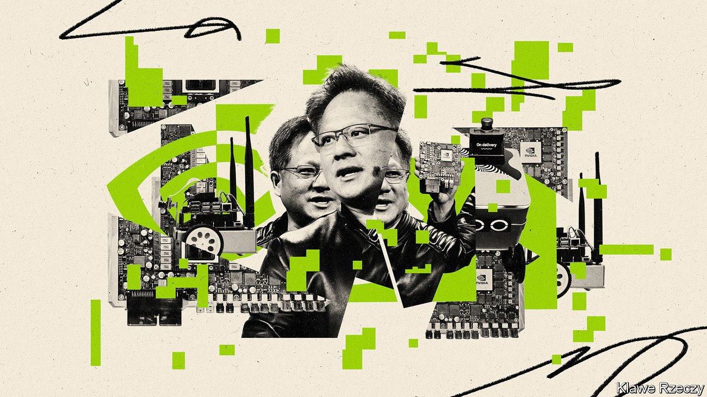
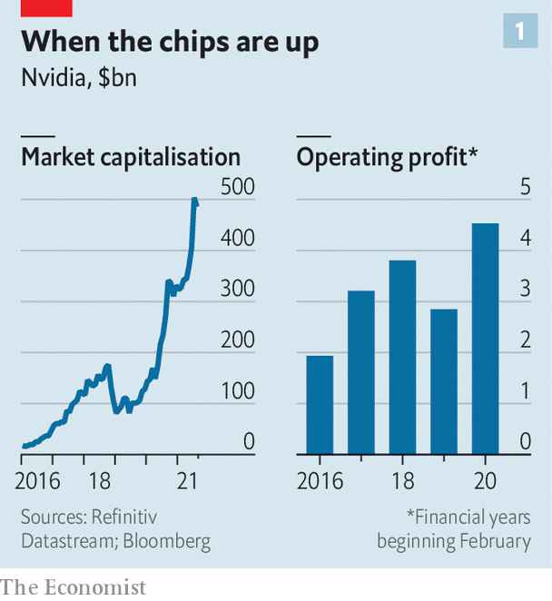
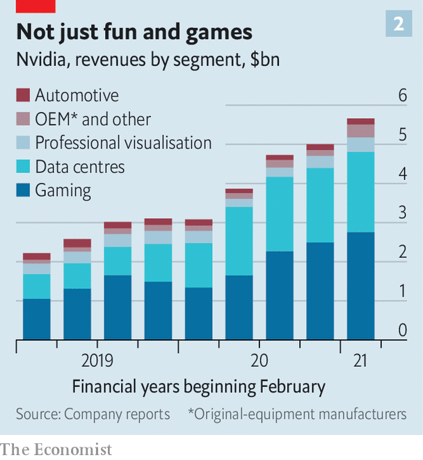

###### Veni, Nvidia, vici

# Will Nvidia’s huge bet on artificial-intelligence chips pay off? 

##### The unassuming chipmaking giant was early to the AI revolution—and remains ahead of rivals 

 

> Aug 5th 2021 

“WE’RE ALWAYS 30 days away from going out of business,” is a mantra of Jen-Hsun Huang, co-founder of Nvidia. That may be a little hyperbolic coming from the boss of a company whose market value has increased from $31bn to $505bn in five years and which has eclipsed Intel, once the world’s mightiest chipmaker, by selling high-performance semiconductors for gaming and artificial intelligence (AI). But only a little. As Mr Huang observes, Nvidia is surrounded by “giant companies pursuing the same giant opportunity”. To borrow a phrase from Intel’s co-founder, Andy Grove, in this fast-moving market “only the paranoid survive”.

 


Constant vigilance has served Nvidia well. Between 2016 and 2021 revenues grew by 233%. Operating profit more than doubled in the past five years, to $4.5bn (see chart 1). In the three months to May sales shot up by 84%, year on year; gross margin reached 64%. Although Intel’s revenues are four times as large and it fabricates chips as well as designing them, investors value Nvidia’s design-only business more highly (twice as much in terms of market capitalisation). The data centres that make up the computing clouds of Amazon, Google, Microsoft and China’s Alibaba all use its products. So do all big information-technology (IT) firms, as well as countless scientific-research teams in fields from drug discovery to climate modelling. It has created a broad, deep “moat” that protects its competitive advantage.


Now Mr Huang wants to make the moat broader and deeper still. In September Nvidia said it would buy Arm, a Britain-based firm that designs zippy, energy-efficient chips used in most smartphones, for $40bn. The idea is to use Arm’s design prowess to engineer central processing units (CPUs) for data centres and AI uses that would complement Nvidia’s existing strength in specialised chips known as graphics-processing units (GPUs). Regulators in America, Britain, China and the EU must all approve the deal. If they do—a considerable “if”, given both firms’ market power in their respective domains—Nvidia’s position in one of computing’s hottest fields would look near-unassailable.


Mr Huang, whose family immigrated to America from Taiwan when he was a child, founded Nvidia in 1993. For its first 20 years or so the firm made GPUs that helped video games look lifelike. In the past decade, though, it turned out that GPUs also excel in another futuristic, but less frivolous, area of computing: they dramatically speed up how fast machine-learning algorithms can be trained to perform tasks by feeding them oodles of data. Four years ago Mr Huang startled Wall Street with a blunt assessment of Nvidia’s prospects in what has become known as accelerated computing. It could “work out great”, he said, “or terribly”. Regardless, the firm was “all in”.

 


Around half of Nvidia’s revenues of $17bn a year still come from gaming chips (see chart 2). These are also adept at solving the mathematical puzzles that underpin ethereum, a popular cryptocurrency. This has at times injected crypto-like volatility into GPU sales, which partly caused a near-50% fall in Nvidia’s share price in 2018. Another slug of sales comes from selling chips that speed up features other than graphics or AI to hardware-makers.

But the AI business is growing fast. It includes specialised chips and software that lets programmers fine-tune them—itself made possible by Mr Huang’s earlier bet, which some investors criticised at the time as a costly distraction. In 2004 he started investing in “Cuda”, a base software layer that enables such fine-tuning, and implanting it in all Nvidia chips.

A lot of these systems end up in servers, the powerful computers behind data centres’ processing oomph. Sales to data centres contribute 36% of total revenues, up from 25% in early 2019 and nearly as much as gaming GPUs. As companies across industries adopt AI, the share of Nvidia’s data-centre sales going to the big cloud providers has declined from 100% to half.

Today its AI hardware-software combo is designed to work seamlessly with the machine-learning algorithms collected in libraries such as TensorFlow, kept by Google, and Facebook’s PyTorch. The firm has created programs to hook its hardware and software up to the IT systems of big business clients with AI projects of their own. This makes the job of AI developers immeasurably easier, says a former Nvidia executive. Nvidia is also getting into “inference”: running AI models, hitherto the preserve of CPUs, not merely training them. Huge, real-time models like those used for speech recognition or content recommendation increasingly need specialised GPUs to perform well, says Ian Buck, head of Nvidia’s accelerated-computing business.

Armed and dangerous

This is where Arm comes in. Owning it would give Nvidia the CPU chops to complement those in GPUs, as well as its new abilities in network-interface cards needed in server farms (in 2019 it bought Mellanox, a specialist in the field). In April Nvidia unveiled plans for its first data-centre CPU, Grace, a high-end chip based on an Arm design. Arm’s energy-efficient chips may go into AI wares for “edge computing”—in self-driving cars, factory robots and other uses far from data centres, where power-hungry GPUs may not be ideal.

Transistors in microprocessors are already the size of a few atoms, so have little room to shrink. Tricks such as outsourcing computing to the cloud or using software to split a physical computer into several virtual machines may run their course. So businesses are expected to turn to accelerated computing as a way to gain processing power without splurging on ever more CPUs. Over the next 5-10 years, as AI becomes more common, up to half of the $80bn-90bn that is spent annually on servers could shift to Nvidia’s accelerated-computing model, reckons Stacy Rasgon of Bernstein, a broker. Of that, half could go on accelerated chips, a market which Nvidia’s GPUs dominate, he says. Nvidia thinks the global market for accelerated computing, including data centres and the edge, will be more than $100bn a year.

Nvidia is not the only one to spy an opportunity. Competitors are proliferating, from startups to other chipmakers and the tech giants. Firms such as Tenstorrent, Untether AI, Cerebras and Groq are all trying to make chips even better suited to AI than Nvidia’s GPUs, which for all their virtues can use lots of power and be fiddly to program. Graphcore, a British firm, is promoting its “intelligence-processing unit”.

__________


__________

In 2019 Intel bought an Israeli AI-chip startup called Habana Labs. Amazon Web Services (AWS), the e-emporium’s cloud division, will soon start offering Habana’s Gaudi accelerators to its customers. It claims that the Gaudi chips, though slower than Nvidia’s GPUs, are nevertheless 40% cheaper relative to performance. Advanced Micro Devices (AMD), a veteran chipmaker that is Nvidia’s main rival in the gaming market and Intel’s in CPUs, is finalising a $35bn purchase of Xilinx, which makes another kind of accelerator chip called field programmable gate arrays (FPGAs).

A bigger threat comes from Nvidia’s biggest clients. The cloud giants are all designing their own custom silicon. Google was the first, with its “tensor-processing unit”. Microsoft’s Azure cloud division opted for FPGAs. Baidu, China’s search giant, has “Kunlun” chips for AI and Alibaba, its e-commerce titan, has Hanguang 800. AWS already has a chip designed for inference, called Inferentia, and one coming for training. “The risk is that in ten years’ time AWS will offer a cheap AI box with all AWS-made components,” says the former Nvidia executive. Mark Lipacis at Jefferies, an investment bank, notes that since mid-2020 AWS has put Inferentia into an ever-greater share of its offering to customers, potentially at Nvidia’s expense.

As for the Arm acquisition, it is far from a done deal. Arm’s customers include all the world’s chipmakers as well as AWS and Apple, which uses Arm chips in iPhones. Some have complained that Nvidia could restrict access to the chip designer’s blueprints. The Graviton2, AWS’s tailor-made server chip, is based on an Arm design. Nvidia says it has no plans to change Arm’s business model. Western regulators have yet to decide whether to approve the deal. Britain’s competition authority, which had until July 30th to scrutinise it, is expected to be among the first to issue a ruling. China is unlikely to welcome an American takeover of an important supplier to its own tech firms, which is currently owned by SoftBank, a Japanese tech group.

Even if one of the antitrust watchdogs puts paid to the deal, however, Nvidia’s prospects look bright. Intel has overpromised many things, including accelerated computing, for years, and has mostly not delivered. Venture capitalists have become markedly less enthusiastic about backing startups that are taking on Nvidia and its software, and the tech giants investing in accelerated computing, observes Paul Teich of Equinix, an American data-centre operator. As for AWS and the rest of big tech, they have other things on their plates and lack Nvidia’s clear focus on accelerated computing. Nvidia says that, measured by actual use by businesses, it has not ceded market share to AWS’s Inferentia.

Mr Huang says that it is the expense of training and running AI applications that matters, not the cost of hardware components. And on that measure, he insists, “we are unrivalled on price-for-performance.” None of Nvidia’s rivals possesses its software ecosystem. And it has a proven ability to switch gears and capitalise on good luck. “They’re always looking around at what’s out there,” enthuses another former executive. And with an entrenched position, Mr Lipacis says, it also benefits from inertia.

Investors have not forgotten the plunge in Nvidia’s share price in 2018. It may still be partly tied to the fortunes of the crypto market. Holding Nvidia stock requires a strong stomach, says Mr Rasgon of Bernstein. Nvidia may present itself as a pillar of the computing industry, but it remains an aggressive, founder-led firm that behaves like a startup. Sprinkle in some paranoia, and it will be hard to disrupt. ■

An early version of this article was published online on August 1st 2021

