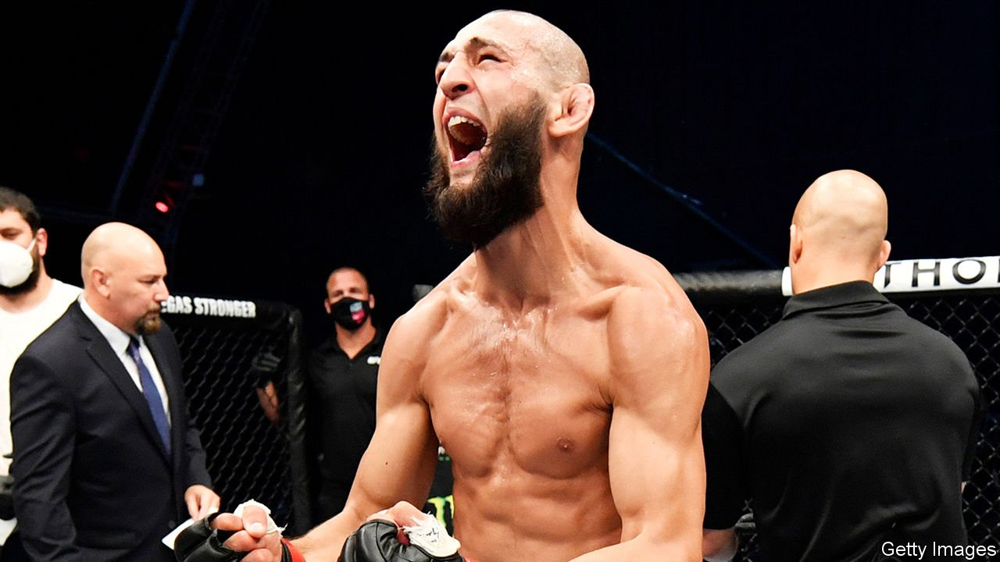

###### The wolf’s return

# A martial-arts star’s comeback is a boost for Chechnya’s dictator 

##### Ramzan Kadyrov lures “the wolf” out of the lair where he retreated from covid-19 

 

> Aug 5th 2021 

HE VOWS TO “smash the faces” of his “chicken” foes and floored his last victim with one punch. Chechen-born Khamzat Chimaev, known as the borz (“wolf”), fights as ferociously as his nickname suggests. He was one of the world’s hottest mixed-martial arts (MMA) stars in 2020, before being laid low by a tough opponent: a brutal bout of covid-19. He considered retiring, but was dissuaded—not by his coach or sponsors, but reportedly by Ramzan Kadyrov, Chechnya’s ruler. In July Mr Chimaev announced that, after a year-long break, he is training for a fight in October.

Mr Kadyrov controls everything in the Russian republic, from dress codes to religious practices. He crushes dissenters, but loves combat sports and builds gyms for his subjects to punch and grapple. At bouts in his MMA arena in Grozny, the capital, he hollers, whoops and embraces the winners.


Many young Chechens dream of becoming famous fighters. Some are treated like heroes, plastered on billboards and housed in luxury flats. A few of Mr Kadyrov’s prospects have battled in America’s money-spinning Ultimate Fighting Championship. But before the borz, Chechnya lacked a true superstar.

The borz’s return was important to Mr Kadyrov—and not just because of his love for MMA. Mr Kadryov knows that Mr Chimaev will inspire more young Chechens to join fight clubs, where they will develop into highly trained, loyal warriors. Many will later join his private army. Some reckon that Mr Kadyrov’s gyms, called the “Akhmat Fight Club”, are recruiting pools for the Chechen special forces. (Both organisations have the same boss, Abuzayed Vismuradov, Mr Kadyrov’s right-hand man.)

Mr Chimaev’s comeback will bolster Mr Kadyrov’s image. Star fighters provide a distraction from his purges of those he deems weak, such as gay people. Blood sports also do well on Instagram. Mr Kadyrov presents himself as a strong, athletic ruler, like his patron, Vladimir Putin, Russia’s president. He recently sparred with the borz on camera, and in May the two holidayed together. They took selfies and met a lion cub.

