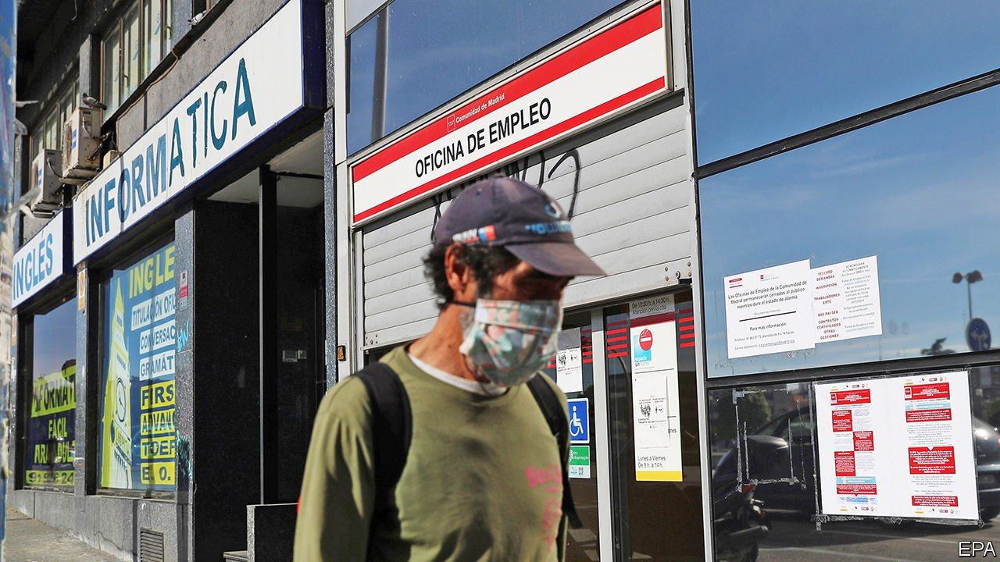
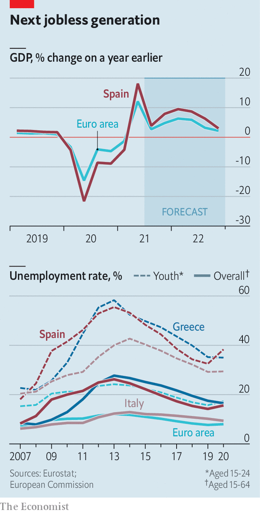

###### Not working

# Spain has a two-speed economy with high unemployment 

##### Will European aid help the parts that need it? 

 

> Aug 5th 2021 

A DENSE, COMPACT town of 58,000 people near the gateway to Andalucía from Spain’s central plateau, Linares has been successively a centre of lead mining, a railway hub and the site of a large factory making Santana jeeps. Today it is known for having the highest unemployment rate in Spain, at 33%. The Santana factory, with more than 2,000 jobs in its heyday, closed in 2011. A large Corte Inglés department store shut in March and stands in the main square, decaying like a rotten tooth. “I’ve been looking for work for months,” says Carlos Márquez, aged 21, who lost his pre-pandemic job selling mobile phones in a hypermarket. “There’s nothing in Linares. I would have to go somewhere else.”

The town’s reputation is overdone, insists Raúl Caro-Accino, the mayor. He points to technology businesses in industrial estates on the outskirts, with more to come. Unemployment is in line with elsewhere in southern and western Spain, the mayor insists. “We have a problem of unqualified labour,” he admits. That goes for much of the country.

 


Spain has long stood out in Europe for its chronic high unemployment, especially among young people, and for the high percentage of workers on temporary contracts (currently 25% of all those with jobs). The slump occasioned by the financial crisis of 2007-09 saw millions join the jobless, though it was followed by a strong recovery (see chart). Once again, the pandemic has hit Spain’s economy harder than those of its European neighbours—mainly because of its heavy dependence on tourism and vulnerable small businesses. A recovery is now under way. But only around half of the number of foreign tourists who visited in 2019 are likely to come this summer.


There are two bright spots. In contrast to 2007-09, the government has been providing emergency support: credit guarantees for firms and a state-financed furlough scheme which at its peak last year paid most of the salaries of 3.4m workers. Only 360,000 still need this help; the rest are back at their jobs. “This is the first recession in which employment and tax revenues have fallen less than the fall in GDP,” says Nadia Calviño, the economy minister.

The second boost is that over the next three years Spain is due to receive €70bn ($83bn) in grants from the EU’s Next Generation recovery scheme, along with a similar amount of soft loans. Much of this will go on big projects aimed at creating a greener, more digital economy, such as one for electric cars and a battery factory. But there will be plenty of money, too, for overhauling public administration and vocational training, and for active labour-market policies to help the unemployed find jobs. It is a peerless opportunity to tackle Spain’s chronic joblessness.

The aid is tied to reforms, especially of the labour market and pensions. And on these matters the left-wing coalition government of Pedro Sánchez is divided. The European Commission reckons Spain needs to make its labour market more flexible while tackling the abuse of temporary contracts. But Yolanda Díaz, the labour minister chosen by Podemos, the coalition’s junior, far-left partner, wants to repeal a 2012 reform which introduced some flexibility, giving firm-level agreements on wages priority over industry-wide ones and cutting severance pay, though to levels that are still generous. This commitment is backed by the trade unions and is in the coalition agreement between Mr Sánchez’s Socialists and Podemos. Ms Díaz also wants to abolish temporary contracts. “These proposals would lead to the most restrictive and rigid labour-market regime” in Europe, says Marcel Jansen of Fedea, a think-tank. They risk destroying jobs rather than creating them.

Ms Calviño, a former budget director at the European Commission, leads the government’s reformist wing. She says Spain needs a bundle of measures that strike a balance between flexibility and curbing temporary contracts. She hopes to agree on these by the end of this year in talks with the unions and business. In a reshuffle in July she became first deputy prime minister. Since the EU can cut off funds if constructive reforms are not approved, she is likely to prevail over Ms Díaz, though not totally. The unions have influence, too. It is a strength of the Socialists that, unlike some other social-democratic parties, they have retained a working-class base. “It’s very hard for a government with a feeble majority to agree on reforms that comply with the European agenda,” notes Mr Jansen.

Training and education need a radical shake-up too. A third of young Spaniards leave school without any qualification, while only a quarter of school-leavers enter vocational training, compared with half in Germany, points out Manuel Pérez-Sala of the Círculo de Empresarios, a business think-tank. Much of the €6bn a year Spain spends helping people find jobs is wasted. Under European pressure the government recently reinstated a policy of linking the funding of training to results. New laws on education and training may help, if fully implemented.

Another doubt is over how the EU money is administered. The opposition complains that control is centralised in the Moncloa, the prime-ministerial complex. Regional governments want their share. “I think they have understood that this is a co-ordinated national plan,” says Ms Calviño. It has usually taken Spain a long time to spend EU structural funds. In Linares, the mayor is sceptical. “We need a more flexible administrative structure,” he says. “The province is frustrated because it was promised things that didn’t happen.” In the end the proof of the EU’s efforts will be measured not just in a greener economy but in whether places like Linares have a more productive workforce. ■

An early version of this article was published online on August 1st 2021

