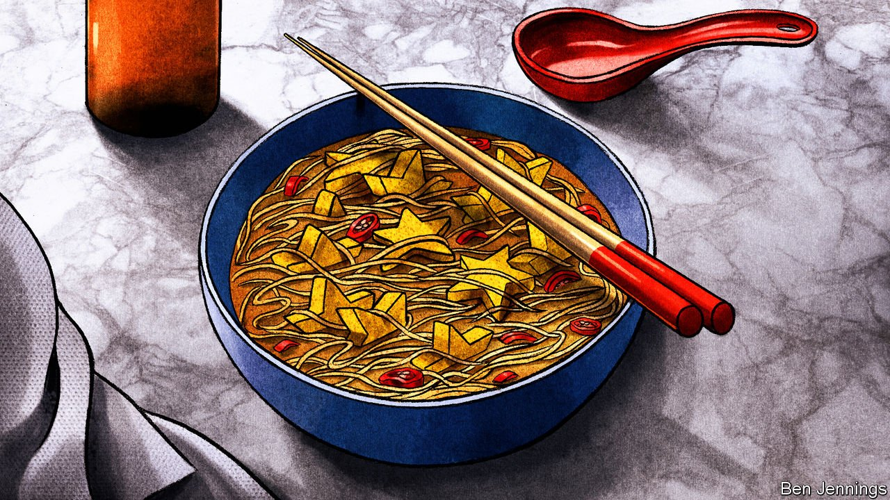

###### Charlemagne

# The black-cod theory of European integration 

##### Warsaw’s restaurants show EU convergence is about more than just capital 

 

> Aug 7th 2021 

FROM MONTE CARLO to Marbella to Milan, no glamorous destination is complete without a Nobu. The chain of gourmand-luring Japanese-Peruvian restaurants has become a staple in practically every tourist hotspot. In each location, a well-off clientele stuff themselves with chunks of black cod soaked in miso and yellowfin-tuna tartare while a DJ in expensive-looking spectacles plays unobtrusive house music.

Last summer Warsaw became the latest and, at first appearances, least likely addition to the list. Varsovians took to it well. With dishes from 25 zloty (€5.50 or $6.50) for edamame beans to 170 zloty for the signature black-cod dish, the place was crammed most nights, lockdowns permitting. Nobu’s stash of sake was designed to last for 18 months; it was downed in three. The average spend on opening was higher than in the branch in Monte Carlo.


Rich Poles devouring sashimi reveal more than just a latent love of raw fish. Ultimately they tell a story of European convergence. At the EU’s heart is a simple bet: thanks to the magic of the free movement of goods, capital, services and people, its 27 divergent economies will move together, until a life lived in, say, France is of a comparable standard to one lived in Poland. Normally, convergence is shown by a line marked Poland on a GDP chart grinding its way towards ones marked Italy, France and (still quite far out of reach) Germany. But convergence is about more than just capital. To understand it better, look at a city’s restaurants.

Nobu is the top end of Warsaw’s booming restaurant scene, which has turned from a stodgy affair into one of Europe’s most vibrant. Nolita, a fancy restaurant, allows patrons to feast on wasabi- and teriyaki-covered octopus. A glut of vegan restaurants has made the city an unlikely mecca for those who spurn animal products. Venues serving Polish fare have flipped a once joyless culinary culture into one that is varied and, at times, excellent.

This helps convergence in a few ways. Playing catch-up with neighbours is difficult to do if a country’s brightest are tempted to leave. Wages are still about three times higher in Germany and the Netherlands. But ambitious young Poles head to places like Berlin or Amsterdam not just so they can earn more, but because they are fun places to live. There is less incentive to leave when there is a throbbing city at home.

There is also a greater push to return. After working in Michelin-starred restaurants in Britain and Denmark in the first half of his career, Robert Trzópek returned to Poland a decade ago. At that time, it was still tricky to find a market for fine dining. Now, however, his restaurant, Bez Gwiazdek, which each month serves food exclusively from a different region of Poland, is packed on a Tuesday night in August. Varsovians tuck into small plates of tomatoes with fermented strawberries along with potatoes, cottage cheese and caviar.

Better nosh also offers an incentive to potential new arrivals, rather than returnees. If places such as Warsaw are to attract well-paid commodities traders as well as back-office staff, then they must become better places to live. It is a way of solving the footballers’-wives conundrum. Roy Keane, a former manager of Sunderland AFC, a football club in an unfashionable city in north-east England, complained that players were reluctant to sign as their spouses would rather live in London or Manchester. Nicer grub is one part of the solution.

Restaurants provide the starkest example of Poland’s demographic convergence with the rest of the EU. Poland has, like its Western neighbours, become a country of mass immigration. Before the pandemic, in 2019, Poland issued 724,000 residency permits to people from outside the EU—around 260,000 more than Germany, the second-highest. To see the inflow’s effect, head to a bar or a restaurant in Warsaw, where the staff will usually be Belarusian or Ukrainian. Order a takeaway and the rider delivering it will often hail from South Asia.

Convergence can also be a question of changing social mores. Again, restaurants demonstrate it best. Poland’s ruling right-wing Law and Justice party are enthusiastic homophobes, while local politicians bait gay people with “LGBT-free zones”. Eateries in Warsaw are leading the riposte. At Youmiko, a vegan sushi restaurant, a pride flag on the door is captioned “You’re at home here”. Politics even lurks behind the rise of vegetarian and vegan restaurants, argues Alex Webber, who edits Warsaw Insider, a city guide. In 2016 Poland’s then foreign minister spelled out a vision of a nightmarish future with a “mix of cultures and races, a world of bicyclists and vegetarians”. Eating vegan ramen is a small but delicious act of resistance.

Europe will be forged in ceviche

The drawback of convergence is homogenisation. Eating in Warsaw is sometimes a disorienting experience. In some venues one could be in Berlin, or Madrid or Amsterdam: the food would be the same, as would the furniture and the font on the menu. Even the waiter would sport the same tattoos and beard. Some in Warsaw worry the city is losing its sense of self. Ironically, that fear of homogenisation is shared by the right-wing government. If liberals worry about restaurants becoming samey, conservatives fear being dragged into the European mainstream when it comes to gay rights or abortion, which is almost completely illegal in Poland.

Convergence via consumption can go only so far. It will take higher wages, better schools and bigger prospects for those who stay before Poland can catch up with its neighbours. Would a high-flying Polish woman want to stay in a country where the government sees her as little more than a baby-machine? Would a gay person be content in a society determined to deprive him of certain rights? Still, Warsaw can be a cosmopolitan dream, even if the Polish government is, at times, a nightmare. A plate of black cod and a bowl of vegan ramen is not much. But it is a start. ■

