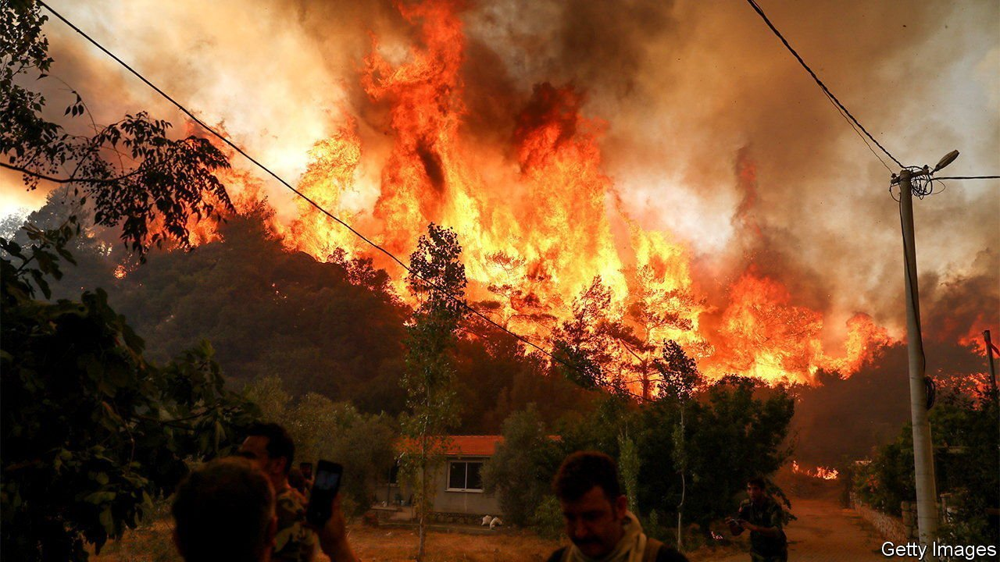
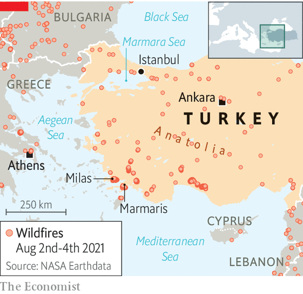

###### Up in smoke

# Turkey’s deadly fires raise the heat for Erdogan 

##### The president’s reputation as a capable manager is in ashes 

 

> Aug 7th 2021 

THE FIRES crept up the hills, scattered and grew, helped by the wind, and raced down towards the shore. In some places, desperate locals rushed to the sea, filling up plastic buckets with water to ward off the flames approaching their homes. Others ran or drove for their lives. The sky turned grey, then orange. By the time the smoke had cleared, stretches of Turkey’s coastal paradise, once covered in pine forests and olive trees, were in ashes.

At least eight people have died in the fires along Turkey’s southern and western coasts at the end of July, following record temperatures and a severe drought. Thousands more have been evacuated, including tourists from seaside resorts, some boarding boats to escape. Nearly 160,000 hectares of forest have burned in Turkey this year, according to the European Forest Fire Information System, four times the average between 2008 and 2020. Wildfires have also been raging this summer elsewhere in the region (see map).


The government of President Recep Tayyip Erdogan announced in early August that most of the fires were under control. But on August 5th parts of the region remained ablaze. In Milas, near the Aegean coast, flames spread to a thermal power plant. Officials said they had removed explosive materials from the plant and emptied its hydrogen tanks.

The government, caught badly off guard by the disaster, is also feeling the heat. As local mayors pleaded for help, ministers acknowledged they had no working water bombers, and belatedly resorted to helicopters. The head of the agency responsible for the planes admitted he had gone to a wedding at the height of the crisis. Turkey eventually accepted offers of help from Russia, Azerbaijan and the EU. Volunteers and firefighters poured in from across the country, as did police trucks mounted with water cannons, typically used against protesters. Locals seethed, sensing the government had abandoned them to their fate. To smother the outcry, Turkey’s media watchdog accused some television stations of spreading “fear and anxiety” about the fires and threatened them with “the heaviest of sanctions”.

 


Mr Erdogan, an authoritarian leader admired by his supporters as a capable manager, has not shone. He has increasingly seemed overwhelmed by the crises roiling his country. On July 31st he arrived in Marmaris, an area besieged by the fires. His motorcade blocked traffic as he tossed packages of tea from his bus at local residents. Days later, he pledged that the government would rebuild destroyed property and cover the rents of those left homeless.

Turkey is reaping the effects of decades of environmental destruction, compounded by climate change. Earlier this summer, thick sheets of marine mucilage, more crudely known as “sea snot”, spread over the Marmara Sea, to Istanbul’s south, the result of rising temperatures, a construction frenzy and industrial run-off. A severe drought and the diversion of water for farming were probably to blame for the deaths of thousands of baby flamingos at a saline lake in Anatolia. Each year the forests lining the country’s coasts recede further inland, replaced by rows of vacation homes and hotels. Mr Erdogan’s ministers have promised to keep developers away from the areas scorched by this summer’s fires. Even if they stick to their word, the fires have shown how much harder it has become to keep climate change at bay.

For more coverage of climate change, register for The Climate Issue, our fortnightly , or visit our 

