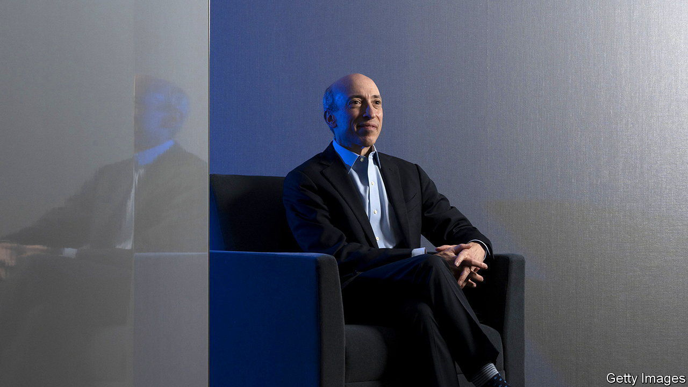

###### Here comes the sheriff

# The SEC sets its sights on the crypto “Wild West” 

##### Gary Gensler offers the most fleshed-out vision yet for what it might do 

 

> Aug 7th 2021 

WHEN GARY GENSLER took over as the head of America’s Securities and Exchange Commission (SEC) in April, he might have seemed pretty crypto-friendly. Only months before he had taught a course on cryptocurrencies at the Massachusetts Institute of Technology; he has said that the innovation associated with bitcoin will be a “catalyst for change” in finance. Yet, speaking at the Aspen Security Forum on August 3rd, he probably dashed the hopes of crypto buffs. He signalled that he would seek tougher policing of the crypto-sphere, which he described as “rife with fraud, scams and abuse”.

Mr Gensler offered the most fleshed-out vision yet for how the SEC might regulate cryptocurrencies. These tokens, he said, were not a means of exchange but “highly speculative stores of value”. That in itself was not a problem—investors should be left to gamble should they wish to. But punters often could not access “rigorous, balanced and complete information”, meaning a lot of them could be hurt.


That calls for greater investor protections, which fall into three broad buckets. The first relates to what the SEC already does. The regulator claims jurisdiction over the crypto assets that it defines as securities; issuers of these must provide disclosures and abide by other rules. The SEC‘s definition uses a number of criteria, including the “Howey Test”, which asks whether investors have a stake in a common enterprise and are led to expect profits from the efforts of a third party. Bitcoin and ether, the two biggest cryptocurrencies, do not meet this criterion (they are commodities, under American law). But Mr Gensler thinks that, among the 1,600 tokens with at least $1m in market capitalisation, a fair few probably count as securities—and do not follow the rules. These, he said, may include stablecoins, virtual monies pegged to conventional money, some of which may represent a stake in a crypto platform. Mr Gensler asked Congress for more staff to police them.

The second bucket covers work in progress: areas where Mr Gensler’s team is considering how to treat new products being brought to market. For months the SEC has sat on applications for bitcoin ETFs and related products, filed by big Wall Street names like Goldman Sachs and Fidelity. Mr Gensler hinted that, in order to be approved, these may have to comply with the stricter laws governing mutual funds. The strictures could prove too costly and rigid for firms hoping to list vehicles. (Mr Gensler did signal openness to narrower ETFs focused on bitcoin futures that trade on the Chicago Mercantile Exchange.)

The last bucket comprises new powers that the SEC will seek from Congress so as to prevent transactions and products “falling between regulatory cracks”. Mr Gensler is chiefly concerned with platforms engaged in crypto trading or lending as well as in decentralised finance (DeFi), where smart contracts replicate financial transactions without a trusted intermediary. Some of these, he said, may host tokens that should be regulated as securities; others could be riddled with scams.

Mr Gensler is not the first to toughen up on crypto, though his attack is perhaps the most comprehensive. Other officials have focused mainly on stablecoins, which back their issuance with heaps of conventional assets. Jerome Powell, the chairman of the Federal Reserve, has hinted that these should be regulated as money-market funds or even banks. Janet Yellen, America’s treasury secretary, has urged the quick adoption of rules. The sheriff may be out in front, but the cavalry is not far behind. ■

