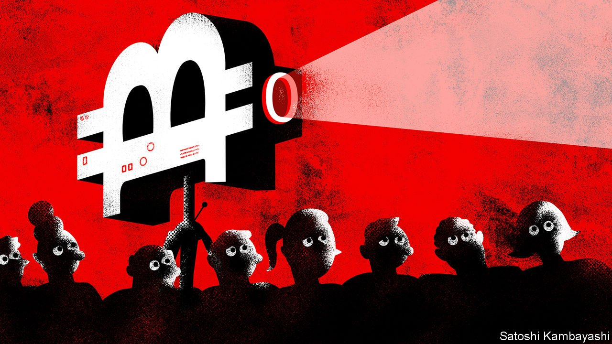
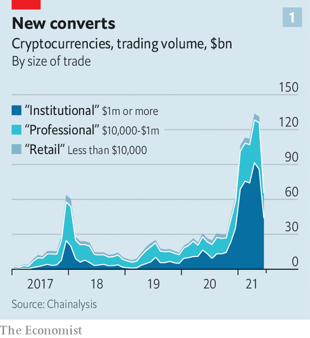
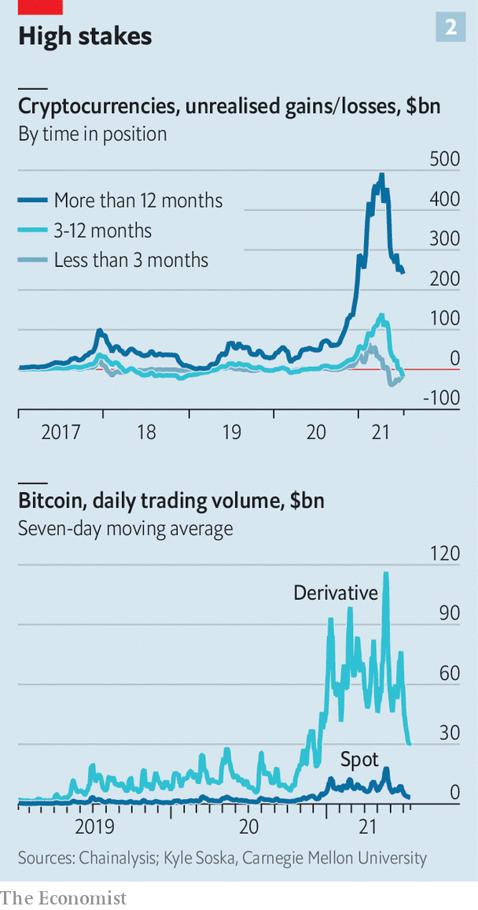

###### The disaster scenario

# What if bitcoin went to zero? 

##### A thought experiment helps uncover the links between crypto and mainstream finance 

 

> Aug 5th 2021 

THE RECENT expansion of the crypto-universe is a thing of wonder. Only a year ago there were about 6,000 currencies listed on CoinMarketCap, a website. Today there are 11,145. Their combined market capitalisation has exploded from $330bn to $1.6trn today—roughly equivalent to the nominal GDP of Canada. More than 100m unique digital wallets hold them, about three times the number in 2018.

 


Holders have become more sophisticated and deep-pocketed, too. Institutions account for 63% of trading, up from 10% in 2017 (see chart 1). SkyBridge Capital, a hedge fund run by Anthony Scaramucci, provides an illustration. Its diversified $3.5bn fund began investing in crypto in November, and it launched a $500m bitcoin fund in January. The exposure of its 26,000 clients, which range from rich individuals to sovereign funds, is rising. Bitcoin now accounts for 9% of the value of its main vehicle, up from 5%, and the dedicated fund is worth around $700m.


This maturing, however, has failed to tame the wild gyrations that characterise crypto markets. Bitcoin sank from $64,000 in April to $30,000 in May. Today it hovers around $40,000, having dipped to $29,000 as recently as July 29th. Every downward lurch raises the question of how bad the fallout might be. Too much seems at stake for the cryptocurrency to collapse—and not just for the die-hards who see bitcoin as the future of finance. Algorithmic traders now conduct a hefty share of transactions and have automatic “buy” orders when bitcoin falls below certain thresholds. Still, in order to grasp the growing links between the crypto-sphere and mainstream markets, imagine that the price of bitcoin crashes all the way to zero.

A rout could be triggered either by shocks originating within the system, say through a technical failure, or a serious hack of a big cryptocurrency exchange. Or they could come from outside: a clampdown by regulators, for instance, or an abrupt end to the “everything rally” in markets, say in response to central banks raising interest rates.

There are three types of crypto investors, says Mohamed El-Erian of Allianz, an insurer and asset manager: “fundamentalists”, who believe bitcoin will replace government-issued currencies one day; “tacticians”, who reckon its value will rise as more people invest in it; and “speculators”, who want to gamble. Though a crash would come as a monumental upset to the first group, it is least likely to sell out; the third, meanwhile, will flee at the first sign of trouble. To avoid a terminal stampede, the second group must be persuaded to stay. It is unlikely to do so if the price falls to zero.

A crash would puncture the crypto economy. Bitcoin miners—who compete to validate transactions and are rewarded with new coins—would have less incentive to carry on, bringing the verification process, and the supply of bitcoin, to a halt. Investors would probably also dump other cryptocurrencies. Recent tantrums have shown that where bitcoin goes, other digital monies follow, says Philip Gradwell of Chainalysis, a data firm.

 


The result would be the destruction of a significant amount of wealth. Long-term holders would suffer small losses relative to the price they paid, but cede huge unrealised gains (see chart 2). The biggest losses relative to the purchase price would fall on those who bought less than a year ago, at an average price of $37,000. That would include most institutional investors exposed to crypto, including hedge funds, university endowments, mutual funds and some companies.

The total value erased would go beyond the market capitalisation of digital assets. A crash would also wipe out private investments in crypto firms such as exchanges ($37bn since 2010, reckons PitchBook, a data provider) as well as the value of listed crypto firms (worth about $90bn). Payments companies like PayPal, Revolut and Visa would lose a chunk of growing, juicy business, which would dent their valuations. Others that have ridden the crypto boom, such as , a microchip-maker, would also take a hit. All in all, perhaps $2trn might be lost from this first shockwave, a little more than the market capitalisation of Amazon.

Contagion could spread through several channels to other assets, both crypto and mainstream. One channel is leverage. Fully 90% of the money invested in bitcoin is spent on derivatives like “perpetual” swaps—bets on future price fluctuations that never expire. Most of these are traded on unregulated exchanges, such as FTX and Binance, from which customers borrow to make bets even bigger. Modest price swings can trigger big margin calls; when they are not met, the exchanges are quick to liquidate their customers’ holdings, turbocharging falls in crypto prices. Exchanges would have to swallow big losses on defaulted debt.

The rush to meet margin calls in cryptocurrency—the collateral of choice for leveraged derivatives—could force punters to dump conventional assets to free up cash. Alternatively, they might give up trying to meet those calls since their crypto holdings would no longer be worth much, triggering liquidations. Meanwhile, other types of leverage exist, where regulated exchanges or even banks have lent dollars to investors who then bought bitcoin. Some have lent dollars against crypto collateral. In both cases borrowers nearing default might seek to liquidate other assets.

The extent of leverage in the system is hard to gauge; the dozen exchanges that list perpetual swaps are all unregulated. But “open interest”, the total amount in derivatives contracts outstanding at any one time, provides an idea of the direction of travel, says Kyle Soska of Carnegie Mellon University. It has grown from $1.6bn in March 2020 to $24bn today. This is not a perfect proxy for total leverage, as it is not clear how much collateral stands behind the various contracts. But forced liquidations of leveraged positions in past downturns give a sense of how much is at risk. On May 18th alone, as bitcoin lost nearly a third of its value, they came to $9bn.

A second channel of transmission comes from the “stablecoins” that oil the wheels of crypto trading. Because changing dollars for bitcoin is slow and costly, traders wanting to realise gains and reinvest proceeds often transact in stablecoins, which are pegged to the dollar or the euro. Such coins, the largest of which are Tether and USD coin, are now worth more than $100bn. On some crypto platforms they are the main means of exchange.

Issuers back their stablecoins with piles of assets, rather like money-market funds. But these are not solely, or even mainly, held in cash. Tether, for instance, says 50% of its assets were held in commercial paper, 12% in secured loans and 10% in corporate bonds, funds and precious metals at the end of March. A cryptocrash could lead to a run on stablecoins, forcing issuers to dump their assets to make redemptions. In July Fitch, a rating agency, warned that a sudden mass redemption of tethers could “affect the stability of short-term credit markets”. Officials from America’s Securities and Exchange Commission and the Federal Reserve  to the risks from cryptocurrencies, and stablecoins in particular.

A cryptocalypse could affect broader sentiment even beyond fire sales. The extent of this is unclear: more entities are now exposed to cryptocurrencies, but few have staked big shares of their wealth on them, so losses would be widespread but shallow. Crucially, banks are immune; and most will not rush to hold bitcoin on their balance-sheets any time soon. The Basel club of supervisors recently proposed making banks fund their bitcoin holdings with only capital, not debt.

But a worse case is not hard to imagine. Low interest rates have led investors to take more risk. A crypto collapse could cause them to cool on other exotic assets. In recent months the correlation between bitcoin prices and meme stocks, and even stocks at large, has risen. That is partly because punters reinvest gains made on faddish stocks into crypto, and vice versa.

A sell-off would begin with the most leveraged punters—typically individuals and hedge funds—in high-risk areas: meme stocks, junk bonds, special-purpose acquisition vehicles. Investors exposed to these, facing questions from their investment committees, would follow in turn, making risky assets less liquid, and perhaps provoking a general slump. If that sounds improbable, remember that the S&amp;P 500, America’s main stock index, fell by 2.5% in a day after retail punters’ infatuation with GameStop, a video-game retailer, wrong-footed a few hedge funds.

For general market turmoil to ensue, then, you would need a lot of things to go wrong, including the price of bitcoin to fall all the way to zero. Still, our extreme scenario suggests that leverage, stablecoins, and sentiment are the main channels through which any crypto-downturn, big or small, will spread more widely. And crypto is only becoming more entwined with conventional finance. Goldman Sachs plans to launch a crypto exchange-traded fund; Visa now offers a debit card that pays customer rewards in bitcoin. As the crypto-sphere expands, so too will its potential to cause wider market disruption. ■

An early version of this article was published online on August 2nd 2021

