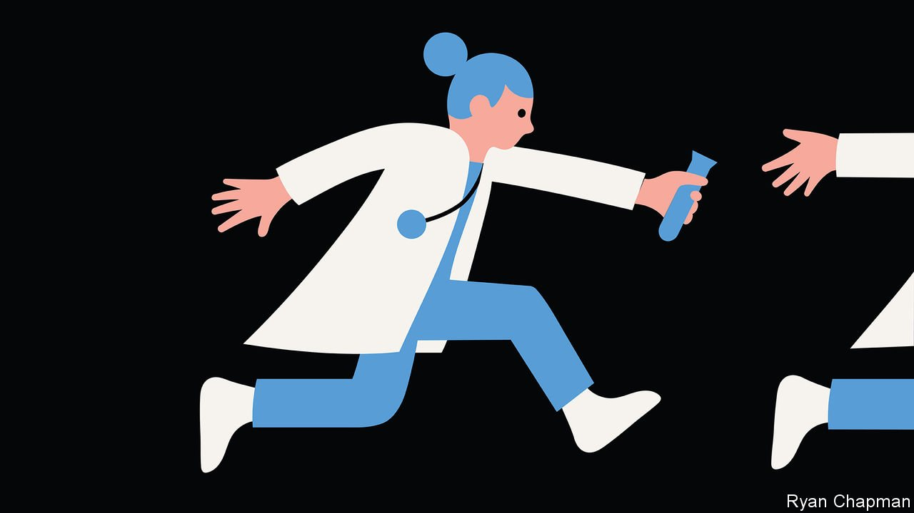

###### Vaccine development

# Scientists’ pandemic response could be even faster next time 

##### New research suggests mass vaccination can be scaled up more quickly 

 

> Aug 5th 2021 

AS THE DELTA variant of covid-19 continues to spread across large parts of the world, the shame is that vaccines are still in such short supply. Worse, they are being hogged by rich countries even though the need elsewhere is so great. For that, blame politics. The triumph, however, is that vaccines exist at all. And for that, praise science.

The sequence of the virus’s genome was made public on January 11th 2020, just one month after a new respiratory illness was first reported in Wuhan, in China. Days later, on January 15th, Moderna, working with America’s National Institutes of Health, had completed the design of the prototype molecule that would comprise its vaccine. Sixty-two days after that, on March 16th, human trials began. Maggie Keenan, a 91-year-old Briton, received the first clinical Pfizer vaccine on December 8th. By comparison, the vaccine against polio in America took 20 years to make the journey from trials to licence.


And yet scientists could do even better. By the beginning of 2021, according to our statistical model of excess deaths, the pandemic had claimed between 4m and 8m lives. If mass vaccination had got under way even a bit sooner and scaled up just a little more quickly, hundreds of thousands of people could have been saved. That is a goal worth striving for in the next pandemic—and, recent research suggests, it is entirely possible.

The foundation for this is decades of scientific and medical research. Katalin Karikó, one of the pioneers of the mRNA technology that underpins the two most successful vaccines, made by Pfizer and Moderna, spent 30 years studying how mRNA can help fight disease. Her research was often too radical to attract government grants or institutional support. But it is part of a body of work that vastly enlarges the scope to cope with infectious diseases, including those that are new.

As we , the pandemic has seen a new set of biochemical and computational tools come to the fore in predicting the evolution of viruses. One approach is called “deep mutational scanning”, which observes random changes in a pathogen’s crucial proteins under laboratory conditions. Using machine learning, scientists can form predictions about which combinations of these mutations will, for instance, make the disease spread faster and hence come to dominate a pandemic in much the way that Delta is dominating covid-19.

Armed with these predictions, manufacturers could prepare stockpiles of vaccines and therapies before pathogens have mutated and spread. One day, people could even be vaccinated pre-emptively. Such a degree of preparedness, and the rapid deployment of doses that it will make possible, could save many lives.

The same faster-is-better logic also applies to other areas of pandemic response. Testing and contact-tracing ought to be available as soon as the first signs emerge that a pathogen is going global. The pandemic has shown that large centralised testing facilities, while they are quick to get up and running from scratch, have slower turnaround times than smaller, more local facilities which can process samples on site.

Such facilities ought to be ready for the next pandemic, relying on rapid, purpose-built genetic testing that has only just started to come online in airports around the world. By the time the next pathogen arrives, the same technology which allows the covid-19 testing centre in Berlin’s new Brandenburg airport to turn around a sample in less than an hour should be widely available.

Regulators must also play their part. Health authorities are already grappling with the modular nature of the new vaccine-production systems, streamlining their approval processes so that shots may be updated to confer protection against the coronavirus variants. The new vaccine “platforms” can churn out one vaccine as easily as another, with only minor changes. The authorities should start thinking about how to ensure the safety of platform-produced vaccines against entirely new pathogens without having to start the approval process from scratch each time.

There is no knowing when the next pandemic will come. New pathogens are emerging from complex, unpredictable environments all the time, often far from scrutiny or regulatory control. A fresh disease could be about to take off right now, as a freak bacterium escapes from an antibiotic-abusing factory farm, say, or a mutated virus sweeps out of a laboratory or a forest, as a bat passes it on to a new host which can infect humans. You cannot stop all pandemics, but you can prepare for them better. ■

Dig deeper

All our stories relating to the pandemic and the vaccines can be found on our . You can also find trackers showing ,  and the virus’s spread across  and .

