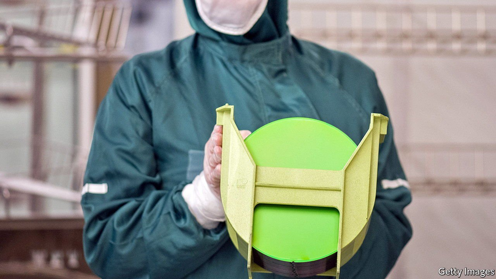
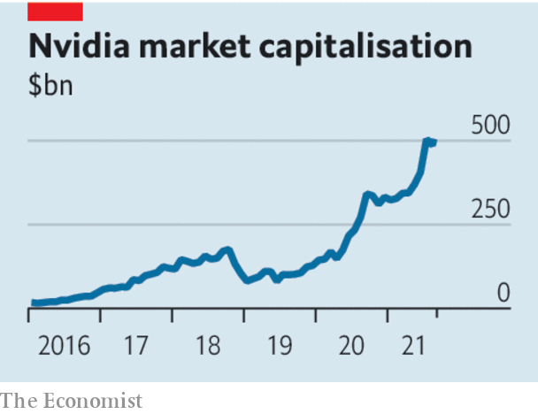

###### Chips leader

# The chip shortage is a self-solving problem 

##### Government subsidies will lead to overcapacity and waste 

 

> Aug 5th 2021 

ONE FIRM’S crisis is another’s opportunity. A shortage of semiconductors has helped pump up the valuations of firms such as , whose chips power everything from video-gaming to machine learning and data centres. But boom time for sellers means misery for buyers. Carmakers, whose products have become computers on wheels, are among the victims. Profits at Ford, America’s second-biggest carmaker by volume, fell by half in the most recent quarter amid a global shortage of chips. Analysts say the industry might build around 5m fewer cars this year, all for want of their tiniest components.

Carmakers are not the only firms feeling the pinch. Apple and Microsoft have also warned that they will be affected. Politicians are being drawn in, too. Chips will be on the agenda later this month when America’s vice-president, Kamala Harris, visits Vietnam, which has a flourishing electronics industry. Angela Merkel, the outgoing German chancellor, has lamented Europe’s small share of global chip production.


The shortage is the result of a sudden surge in demand. Chipmaking is a cyclical business which, between the peaks and troughs, has been enjoying strong growth for decades as computers creep into every corner of society. That trend was amplified by the pandemic. Locked-down consumers shopped online, logged into meetings remotely, and wiled away the hours with video-streaming and video-gaming. The result has been a spike in demand for the semiconductors that power the data centres and gadgets that make such things possible, clogging factories with orders.

The crisis has had three consequences, two encouraging and one less so. The first is an investment boom. Big producers such as Intel, Samsung and TSMC are planning to spend hundreds of billions of dollars on extra capacity over the next few years. As in many markets, high prices are the best cure for high prices.

 


The second is that the chip industry’s customers are adapting, too. When demand collapsed early in the pandemic, carmakers cut their orders with chipmakers. The car industry’s size and clout mean that it is used to ordering suppliers around. But when demand recovered, it found itself at the back of the queue, because of long lead times and competition for capacity from the even bigger and more influential tech industry.

The unpleasant experience of being the supplicant rather than the boss has prodded carmakers to take tighter control over supplies of vital components. Following in the tyre-treads of Tesla, Volkswagen has announced plans to develop driver-assistance chips in-house. Other firms are forging closer relationships with chipmakers. Toyota, a Japanese firm, has weathered the shortage relatively well, partly because it was slower to cut orders when the pandemic hit. In June Robert Bosch, a big supplier of automotive parts, cut the ribbon on a €1bn ($1.2bn) chip factory of its own in Dresden. Redesigned supply chains will be more resilient.

The third, unwelcome effect has been a surge of techno-nationalism. America is planning to hand out billions of dollars to lure chipmakers back from East Asia. Europe wants to double its share of global production, to 20%, by 2030. Even Britain has declared the fate of a small chip factory in Wales to be a matter of national security.

There is some force in the argument that chips have come to occupy what used to be called the “commanding heights” of an economy, in the way that oil refineries or car factories did in the 20th century. The concentration of production in Taiwan, in particular, is an uncomfortable geopolitical risk. But as last century’s governments discovered, subsidies lead to overcapacity and gluts—and, eventually, to yet more calls for public money to prop up uncompetitive businesses. The chip shortage is mostly a self-solving problem. Governments should resist the temptation to see themselves as saviours. ■

