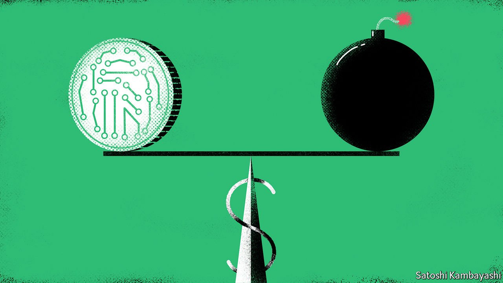
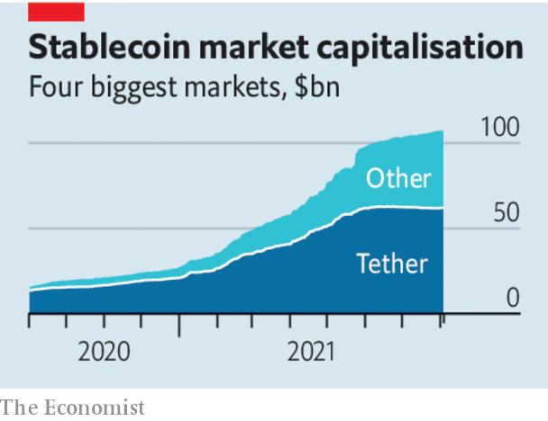

###### Unstablecoins

# Why regulators should treat stablecoins like banks 

##### Cryptocurrencies are not yet a threat to the financial system, but the dangers are growing 

 

> Aug 7th 2021 

TWELVE YEARS after bitcoin was born, governments are still struggling to cope with cryptocurrencies. Britain has banned Binance, a crypto exchange and the European Union’s regulators want transactions to be more traceable. On August 3rd Gary Gensler, the head of America’s Securities and Exchange Commission, said cryptocurrency markets were “rife with fraud, scams and abuse” and called on Congress to give his agency new regulatory powers. The price of bitcoin, the biggest cryptocurrency, gyrates with regulators’ every word.

Governments have an obligation to fight the deception, tax evasion and money laundering that plagues the crypto world. Police seizures of bitcoin suggest that they are becoming more zealous. The harder issue they must grapple with is whether cryptocurrencies threaten the financial system. Were bitcoin to collapse,  that its holders would lose hundreds of billions of dollars but that the fallout would be manageable. Yet there is another danger posed by “stablecoins”, a special type of cryptocurrency that pegs its value to conventional money.


Pledges of stability often lead to financial crises. Because banks offer deposits that are redeemable on demand and superficially riskless, but which are backed by longer-term, less liquid and riskier assets, they are vulnerable to runs. Stablecoins are similar. The biggest, Tether, has issued $62bn-worth of tokens which it says are redeemable for a dollar apiece. But of the assets backing the tokens in March only about 5% were cash or Treasury bills, according to Tether’s public disclosures. It says it will update the figures soon and that it is “fully backed by reserves”.

 


Most of the assets were riskier—about half of them commercial paper. Stablecoins’ growth from a value of $14bn in August 2020 to over $100bn today has given them a big financial footprint. Extrapolating Tether’s disclosures implies that it owns over $30bn-worth of commercial paper, which probably makes it the asset class’s seventh-largest investor, not far off funds run by Vanguard and BlackRock, according to JPMorgan Chase. With estimated leverage of 383-to-1, Tether would be unable to honour all its tokens after losses of just 0.26%—a safety cushion that regulators would never allow at a bank.

Few stablecoins say much about their balance-sheets. Tether’s disclosures of the breakdown of its assets are puny and fall far below the standards expected of a bank. In February Tether was among the defendants who agreed to an $18.5m fine with New York’s attorney-general, which said that in 2017 Tether had misled the market about its US dollar backing and that it had not accurately disclosed the transfer of $625m of its assets to Bitfinex, an online trading platform. Tether says the funds were repaid and that it has a “total commitment to transparency”.

No wonder Mr Gensler calls cryptocurrencies a Wild West. Some policymakers have compared stablecoins to the period of “free banking”, when privately issued banknotes of uncertain backing and worth circulated in America’s economy in the 19th century. A more useful comparison is with money-market funds, which were created in the 1970s to circumvent rules limiting the interest banks could pay depositors. After promising to maintain the value of their shares at a dollar, money-market funds blew up in 2008 in the global financial crisis. American taxpayers stepped in to forestall a fire sale of their assets and a crash in the market for commercial paper, on which the real economy depends. A collapse of stablecoins could look similar.

Regulators must act quickly to subject stablecoins to bank-like rules for transparency, liquidity and capital. Those failing to comply should be cut off from the financial system, to stop people drifting into an unregulated crypto-ecosystem. Policymakers are right to sound the alarm, but if stablecoins continue to grow, governments will need to move faster to contain the risks.

It may be tempting to ban stablecoins, especially if central banks launch their own digital currencies—much as private banknotes were replaced with government monopolies on physical cash. Yet it is possible that regulated private-sector stablecoins will eventually bring benefits, such as making cross-border payments easier, or allowing self-executing “smart contracts”. Regulators should allow experiments whose goal is not merely to evade financial rules. But first they must prevent the repackaging of risks with which the world is all too familiar. ■

