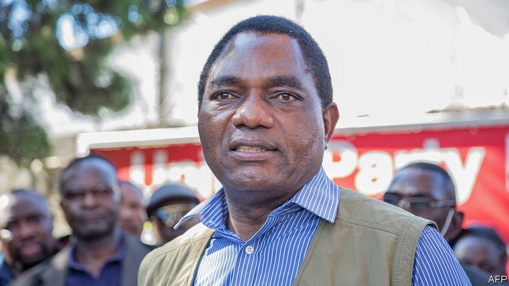

###### Democracy in Africa

# Zambia’s election is crucial, but it’s not a fair fight 

##### Hakainde Hichilema deserves to be elected, but the world should prepare for a rigged vote 

 

> Aug 7th 2021 

IN THE LATE 1980s Zambians, inspired by the changes sweeping through eastern Europe, demanded the end of their own one-party state. In 1991 Kenneth Kaunda, the country’s founding president, reluctantly agreed to multiparty elections. He lost. But in leaving office willingly, even personally removing the presidential pennant from his car, Kaunda ensured that his country was a trailblazer for democracy. By the end of the decade nearly every country in Africa had gone to the polls. During the commodities boom of the 2000s the economy of the continent’s second-largest copper producer grew by about 7% per year. Though far from perfect, Zambia seemed more likely to become the next Botswana (democratic and middle-income) than the next Zimbabwe (despotic and wretched).

How things have changed. Since it took office in 2011 the Patriotic Front (PF) has failed Zambians. In particular, under Edgar Lungu, president since 2015, corruption, human-rights abuses and poverty have all spread. The PF has increased external debt at least sevenfold, with loans spent on graft-ridden Chinese-built infrastructure. In June Amnesty International reported an “increasingly brutal crackdown” on opponents of the regime. Annual inflation is running at 25%, nearly the highest in two decades, and forcing 40% of Zambians to eat fewer or smaller meals, according to a recent study by a local NGO. Some middle-class Zambians are considering what Zimbabweans have done for decades: fleeing to South Africa.


All of which explains why the forthcoming elections matter. On August 12th Zambians should do as they did in 1991 and 2011—vote out the incumbent president. The main opposition candidate, Hakainde Hichilema, would be a huge improvement on Mr Lungu. The businessman promises to clamp down on graft, open serious talks with the IMF about reforms and a loan, and win back the trust of foreign investors put off by the PF’s punitive policies of heavily taxing and seizing mines. Zambians seem to like his ideas. Academic analysis of polls suggests that, in a fair fight, he would win just over half of the vote.

Sadly, it is not a fair fight. The PF must have read a textbook on election-rigging. While campaigning, it has abused state resources, from handing farmers subsidies to using taxpayer-funded helicopters. It has corroded the guard-rails of democracy, dismissing impartial members of the electoral commission, installing pliant judges in the Constitutional Court, and co-opting civil-society leaders. The police have blocked Mr Hichilema from campaigning, citing covid-19 rules which seem not to apply to Mr Lungu. PF stooges have intimidated the opposition.

There are also fears that, after the polls close,  and the internet shut off. Whether the declared outcome is an outright victory for one candidate or a run-off if no one gets over 50%, Zambia could see legal challenges, protests and blood on the streets.

Outsiders must hope for the best and prepare for the worst. Unfortunately, when it comes to criticising their peers’ elections, African countries are as toothless as an anteater. China, for all its pontificating about non-interference, usually backs the incumbent; the Chinese ambassador spoke warmly of the PF at the party conference at which it nominated Mr Lungu as its candidate, in April. America, Britain and the European Union often point out flaws in elections but are sometimes too willing to declare rigged votes “good enough”, as with Malawi’s stolen election of 2019. A year later Malawians peacefully overturned that dodgy ballot and voted for a new president in a re-run.

Anteaters with teeth

This would be harder in Zambia. Judges are less independent and the security forces have more guns. Still, Western countries can, for instance, warn against further violence and put pressure on the electoral commission to allow independent monitors to observe not just voting but the counting of votes as well. Western diplomats can also start to identify African mediators who could help in any post-election negotiations. They must not suggest that an election is passable by “African standards”.

Mr Hichilema has highlighted the stakes in the election. It could be the difference, he says, between recovery and “Zambia deteriorating into a broken economy and failed state”. Zambians should heed his warning. So should the rest of the world. ■

