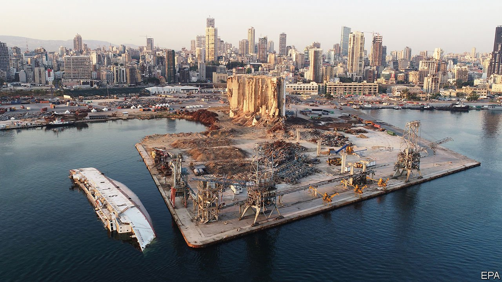
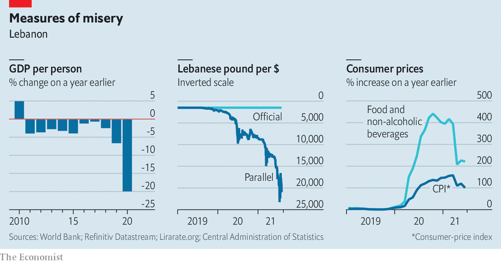

###### Into the abyss

# A year after the Beirut blast: still no bottom to Lebanon’s crisis 

##### The disastrous explosion in the port should have been a nadir. But things keep getting worse 

 

> Aug 5th 2021 

THE PROTEST outside Mohammad Fahmi’s well-guarded house last month was a microcosm of Lebanon’s seemingly bottomless collapse. In the crowd were relatives of the more than 200 people killed in the catastrophic explosion at Beirut’s port on August 4th 2020. They were furious that Mr Fahmi, the interior minister, was stonewalling the investigation into the blast by refusing to lift immunity for a general.

It should not have been his decision to make. Mr Fahmi serves under a prime minister, Hassan Diab, who resigned last year. But Mr Diab and his cabinet lurch along in a caretaker role because Lebanon’s shambolic politicians cannot agree on a new government. When the crowds grew rowdy, they were pushed back by police whose wages, paid in the debased local currency, have shrivelled to less than $100 a month. They are agents of a bankrupt state—albeit one that can still afford tear gas.


Wandering through the capital in the hours and days after the explosion, it was hard to imagine things could get any worse. Caused by a cache of ammonium nitrate—some 2,750 tonnes of the stuff had been impounded in 2013 and stored improperly—the blast left much of the city centre in ruins. Shattered glass rained down from buildings. Residents were thrown against the walls of their apartments by an explosion large enough to be felt in Cyprus, 240km (150 miles) away.

Yet a year later things are indeed worse, almost immeasurably so. The blast was not a nadir, just another twist on Lebanon’s long downward spiral. There has been no accountability for the disaster. Nor is there a government empowered to tackle an economic crisis that, according to the World Bank, may rank as the third worst anywhere in the world since the 1850s.


Soon after the explosion, Lebanon’s cabinet set up a committee to investigate what happened. It promised results within five days. It has had that, and 360 more, yet today even the basic facts remain a mystery. The most commonly cited death toll of 218 may be too low because it fails to count refugees and migrants. America’s FBI, invited to help with the probe a year ago, believes that only about a fifth of the 2,750 tonnes of ammonium nitrate exploded. What happened to the rest—whether it was sold, moved elsewhere or somehow disposed of—is unclear.

The judge overseeing the probe, Tarek Bitar, has run into a wall of opposition. He has pushed to interrogate several ex-ministers and Abbas Ibrahim, the head of Lebanon’s main intelligence agency. But lawmakers have refused to allow them to be questioned. Blame for the blast is widely shared: many senior officials knew the ammonium nitrate was there, a time-bomb waiting to go off, and did nothing about it. They have closed ranks. (Mr Bitar’s predecessor was dismissed earlier this year after he charged four officials with negligence.)

Mr Diab resigned days after the explosion. But two men tapped to form a new government—Mustapha Adib, a little-known diplomat, and Saad Hariri, a former prime minister—failed to do so. On July 26th lawmakers asked another ex-prime minister, Najib Mikati, to try his hand.

He may not be successful either. The post-civil-war political system in Lebanon doles out portfolios based on religious sect, and efforts to form a cabinet have run into internecine disputes. The two main Shia parties, Hizbullah and Amal, both want to control the finance ministry. The president, Michel Aoun, wants to preserve his power base so that he can install his son-in-law, Gebran Bassil, as his successor next year. Mr Hariri wanted a government that would satisfy his backers in the Gulf. Everyone has an eye on parliamentary elections scheduled for May.

__________

Read more: 


__________

Lebanon cannot afford such a delay. It tipped into economic crisis in 2019, the result of a years-long Ponzi scheme overseen by the central bank, which borrowed billions from an outsized banking industry to sustain a currency peg. The scheme unravelled when banks no longer took in enough fresh deposits to keep it going. Mr Diab estimated there was an $83bn hole in their balance-sheets last year.

The country defaulted in 2020, and Mr Diab presented a plan for repairing the banking industry. But it was doomed by opposition from the banks and their political allies. Talks with the IMF about a rescue package have stalled, as have negotiations with creditors. Western countries are unwilling to help without serious reforms, to include an audit of the central bank, whose governor, Riad Salamé, is under investigation in France and Switzerland for alleged money-laundering. The bank has burned through most, if not all, of its usable foreign reserves, which stood at $38bn before the crisis. In June it lowered the share of deposits that private banks must keep with it from 15% to 14%, in effect freeing up a bit of cash to spend on imports.

Once reliably pegged at 1,500 to the dollar, the Lebanese pound traded as low as 23,000 on the black market in July (see chart). It later rebounded to nearly 15,000—still a 90% depreciation. Inflation was 101% in June, and 222% for food. Half the country now lives below the poverty line. A family of five needs 3.5m pounds, five times the minimum wage, just to buy food each month, estimate researchers at the American University of Beirut. Some shops and restaurants have stopped listing prices because they change so often. Medicine remains subsidised, but is often hard to find. Visiting expats stuff suitcases with drugs that are no longer available, including basic items such as paracetamol.

 


Creaky power plants are short on fuel and provide only a few hours of electricity each day. Residents have always relied on private generators to fill the gaps, but their operators are also struggling to find fuel and buy spare parts to fix machines that were never meant to run round the clock. Nightfall brings an eerie darkness to Beirut. Dawn brings a new ritual: drivers trudge down to their cars and queue up for petrol, a litre of which, at subsidised prices, costs as little as 20 cents. That has fuelled a brisk black market. Smugglers buy the stuff in Lebanon and sell it in Syria, which is struggling with its own fuel crisis.

A glance at newspaper headlines over the past few weeks offers a bleak portrait of collapse. A young girl died from a scorpion sting that could not be treated for lack of antivenom in depleted hospitals and pharmacies. A teenage boy died trying to battle wildfires that the bankrupt state is struggling to control. A man was killed in a traffic accident while queuing for fuel on a main road south of Beirut.

The country feels exhausted. Beirutis wander the streets glassy-eyed; no one is sleeping well, without even a fan to cut the heat and humidity. Everyone seems to have caught a stomach bug this summer from food spoiled by power cuts. A small, well-heeled elite is still hosting lavish weddings and expensive lunches by the sea, but for most Lebanese the days are a brew of rage and despair. Once again, it is hard to imagine things could get any worse.

Once again, they probably will. The worsening shortage of hard currency will make it more difficult to subsidise goods. Fuel subsidies have kept inflation from being even higher. They were already reduced in June; when they are curtailed further, prices will soar higher still. The army is struggling to keep up morale. It has asked for foreign aid to feed soldiers and offers tourists joyrides in military helicopters for $150 a pop to drum up foreign currency. There will be longer blackouts and deeper shortages as the state struggles to finance basic imports. The World Bank calls this a “deliberate depression”, a man-made crisis—and the men who made it are still in power, with no plan to fix it. ■

An early version of this article was published online on August 3rd 2021

