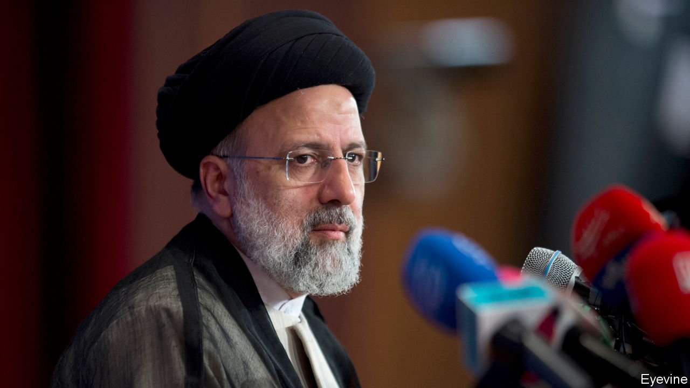
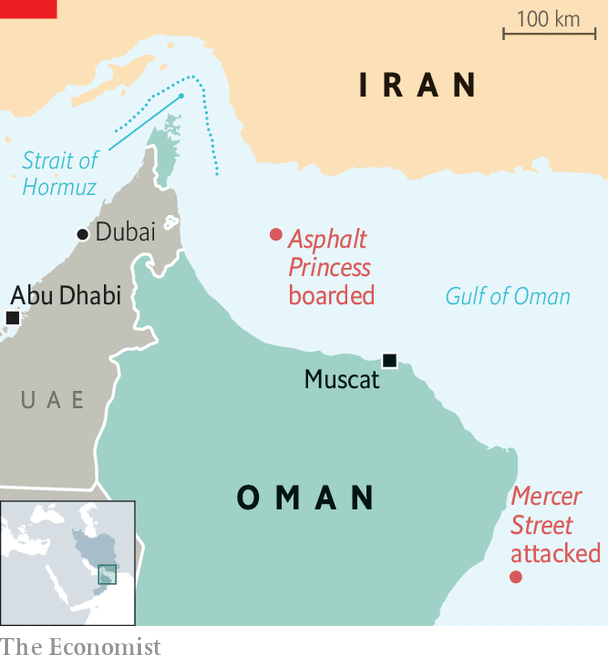

###### Off to an interesting start

# Ebrahim Raisi takes office, as Iran and the West face off 

##### Iran’s new president is greeted with a crisis over attacks on shipping. But he may not mind 

 

> Aug 2nd 2021 

ON THE FIRST day of his two-part inauguration on August 3rd, Ebrahim Raisi regretted that he could not kiss the hand of his mentor, Ayatollah Ali Khamenei, owing to covid-19 restrictions. But there was no doubting the bond between Mr Raisi, Iran’s new president, and Mr Khamenei, its supreme leader. Both men are hardline clerics who view the world, and the West in particular, with suspicion. “Trusting the West does not yield results,” said Mr Khamenei in the run-up to the ceremony.

Some in Iran may be pushing for confrontation. On July 29th, just days before the inauguration, a drone laden with explosives was flown into the MV Mercer Street, an oil tanker off the coast of Oman managed by an Israeli-owned firm. Two crew members, a Briton and a Romanian, were killed. America, Britain, Israel and Romania blamed Iran, which denied involvement. Saeed Khatibzadeh, an Iranian foreign-ministry spokesman, accused Israel of creating “instability, terror and violence” and warned that “whoever sows the wind shall reap the whirlwind”.

 


Then, on August 3rd, came another incident in nearby waters (see map). Gunmen boarded a bitumen tanker, the MV Asphalt Princess, and sailed it towards Iran before disembarking some 15 hours later, after the crew reportedly sabotaged the engines. The crew said the assailants were Iranians, according to recordings of communications between the ship and the Emirati coastguard heard by Argus Media, an energy-information firm. Iran denied involvement. The Asphalt Princess is owned by a firm in Dubai that had another vessel hijacked two years ago by the Islamic Revolutionary Guard Corps (IRGC), Iran’s most powerful military force.


Iran and its proxies have exchanged attacks with America, Saudi Arabia and the United Arab Emirates in recent years. A shadow war between Iran and Israel has also been escalating. Several vessels have been attacked, with each side blaming the other. Israel has struck Iranian positions in Syria and is accused of attacking people and facilities in Iran, sometimes with cyber-weapons. An attack earlier this year on Iran’s main uranium-enrichment complex, in Natanz, using planted explosives, did significant damage.

If the IRGC is behind the attacks on shipping, it will come as no surprise. Its workings are murky, but it often seems to pursue a policy at odds with that of the weak elected government. Or at least, it did when Hassan Rouhani, a pragmatist who reached out to the West, was still president (he handed over to Mr Raisi after the maximum two consecutive terms). With hardliners now in control of the entire government, there should be less tension. “Under the new administration, Iran will be much more assertive,” says Mohammad Marandi, an academic who is close to the IRGC.

All of this complicates efforts to revive the nuclear deal signed in 2015 by Iran and six world powers. That agreement, called the Joint Comprehensive Plan of Action (JCPOA), had Iran curb its nuclear programme and agree to rigorous inspections in return for the lifting of some international sanctions. But in 2018, during the presidency of Donald Trump, America abandoned the deal. In response, Iran began breaking parts of it.

President Joe Biden has promised to return to the deal if Iran comes back into compliance. In an address on August 3rd Mr Raisi said his government would take steps to lift the “tyrannical” sanctions imposed by America. But a sixth round of indirect negotiations to revive the JCPOA ended in June. There is no date set for the resumption of talks. Iran, meanwhile, has continued to expand its nuclear activity. It is enriching uranium beyond the levels required for civilian use and it has sharply curbed co-operation with inspectors.

Britain will raise the strike on the Mercer Street at the UN. “The UK is working with our international partners on a concerted response to this unacceptable attack,” said Dominic Raab, its foreign secretary. “Ultimately, we have got to restore deterrence,” said General Sir Nick Carter, its most senior military officer.

Still, America and Britain may want to limit any response in order to keep the JCPOA talks alive. Israel’s leaders, never fans of the nuclear deal, may prefer more forceful action. “This time the price is going up,” says Amos Yadlin, a former head of Israeli military intelligence. ■

An early version of this article was published online on August 2nd 2021

