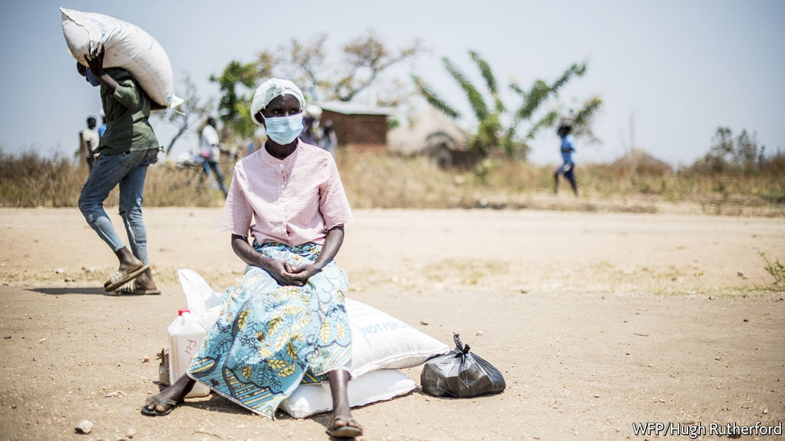

###### Rationed out

# Refugees in east Africa go hungry as funds dry up 

##### In Uganda, rations have been cut by 40% 

 

> Aug 5th 2021 

AT A FOOD distribution centre in Bidibidi, a refugee settlement in Uganda, a handwritten cardboard sign tells refugees their maize ration: 15kg for two months. That works out to 250 grams a day, to go with 60 grams of beans, a splash of oil and half a teaspoon of salt. A day after receiving hers, Ito Juani has already used some of it to repay a loan of cassava that got her through a lean spell. “The world has given up on us,” she says.

Who can deny it? In the past year the World Food Programme (WFP) has slashed rations for more than 3m refugees in seven countries across eastern Africa—by 40% in the case of Uganda. In some settlements, where it gives out cash instead of food, refugees must make do with 19,000 shillings ($5.36) a month. In South Sudan, where rations have fallen by half, the WFP is taking from the hungry to feed the starving, writes its executive director, David Beasley. Officials say they have only half the money they need to feed east African refugees for the rest of the year. Donor fatigue had set in before covid-19, but tight pandemic budgets have made things worse.


Most of the 238,000 people who live in Bidibidi fled from South Sudan in 2016, walking for days to escape ethnic killings and war. The settlement briefly became the largest refugee camp in the world. Today it feels like an endless village, clusters of thatched houses sprawling over the horizon. It has shops, video halls and small businesses. Uganda’s government, which is unusually welcoming, has given the refugees land to till and the right to work. But the sheer number of arrivals strains resources. The small, stony plots are the scrawniest of vegetable patches.

Handouts provide staple food and lubricate the settlement’s complex economy. A miller will grind maize into flour for a cut of a few handfuls. A few more can be bartered for firewood from locals from nearby villages. Some are sold to maize dealers to buy goods like soap, sugar and fish. But such trade has slowed since rations were cut, says a dealer, clutching an empty sack.

The rhythm of life is set not by the seasons but by “the cycle”, as aid workers call the routines of food distribution. The meagre rations rarely last until the cycle ends. “When food is distributed, the church is vibrant,” says Felix Taban, a pastor. “But when it runs out, people stop coming.” In the last weeks of each cycle children “don’t have energy” and drop out of school, says Anna Uba Joseph, a teacher. Meanwhile, more patients show up at hospital with gastric problems and stress, says a health worker there.

Ms Juani’s own ration ran out 20 days before the cycle ended, which was why she had to borrow. For those hungry weeks she stopped taking the antiretroviral drugs that treat her AIDS, because she felt ill after swallowing them on an empty stomach. Others resort to casual labour. Jane Mandera worked on a local farm with her two sons, aged ten and seven, digging under the equatorial sun for a meal and 4,000 shillings a day. In the evening she boiled up vegetables she had grown herself.

A WFP survey in March found that 42% of people in Ugandan refugee settlements had inadequate diets. Three-quarters of households skipped meals; three-fifths borrowed to eat. Stephan Deutscher of the WFP in Uganda says more are resorting to emergency measures such as selling assets or pulling children from school.

Aid workers praise Uganda’s openness to refugees, but the model falters without the funds to support it. Some hungry refugees now risk returning to their abandoned farms in South Sudan. A former policeman says he can no longer provide for his family, so he is going back home to join the rebels. When will he set off? “As soon as possible,” he says.

