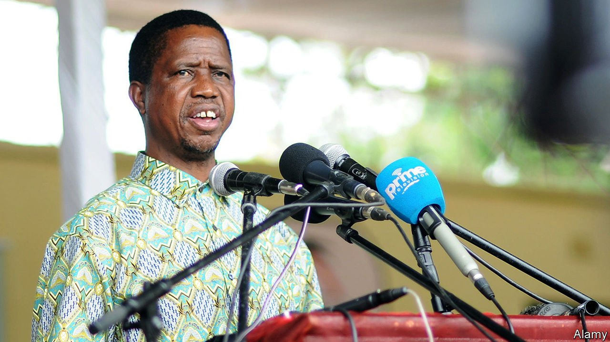

###### Victory by default

# Zambia heads towards a pivotal election 

##### Polls suggest Edgar Lungu is unpopular. But is he on the way out? 

 

> Aug 5th 2021 

FOR EDGAR LUNGU, Zambia’s president, elections on August 12th would seem to come at an inauspicious time. Over the six years since he took office in 2015, the economy has on average grown at a slower rate than the population. Last year Africa’s second-largest copper producer had its first recession since 1998. Inflation is at its highest level in 19 years. In July food prices were almost a third higher than a year before. In a poll published in May by Afrobarometer, a research group, more than three-quarters of Zambians said economic conditions were bad and that the country was heading in the wrong direction.

Yet it is uncertain whether time is up for Mr Lungu (pictured). “The economy will determine how people will vote, but it may not determine the result,” says Laura Miti, the head of the Alliance for Community Action, an NGO based in the capital, Lusaka. Since 2000 roughly three-quarters of incumbent African presidents have won re-election, by hook or by crook. Many use the power of the state to buy off or bully voters. And that is what Mr Lungu’s party, the Patriotic Front (PF), seems to be doing, to the detriment of a country that was once a trailblazer for African democracy.


Consider some of the financial ploys used by the PF. Last year it increased tenfold the budget for subsidised seeds and fertiliser to woo farmers and help business allies of the party. In May of this year it rushed through yet more subsidies ahead of the election. In July the government said it would “restructure” the personal debts owed by civil servants and transfer the liabilities to a state-owned creditor.

Incumbent parties everywhere court voters with conveniently timed bungs. But few have bailed out their bureaucrats while also claiming that they have no money to pay their own creditors. In November the government defaulted on a dollar bond, making Zambia the first African country to do so during the pandemic. Not that covid-19 has much to do with the mess. Government debt as a share of GDP has risen from 34% to 110% under Mr Lungu. Though there are some Chinese-built roads to show for the splurge, much of the money has been wasted.

Fear and repression

Inducements are coupled with intimidation. The police use covid-19 regulations as a pretext for limiting opposition candidates’ travel and rallies. The ostensibly independent electoral commission has repeatedly favoured the PF in its decisions. Last year the government ditched the electoral roll and gave voters just 38 days to sign up anew. Civil-society groups say this was far easier in PF strongholds. Ruling-party “cadres” terrorise its opponents, too. Last month Amnesty International published a report about the “fear and repression” of the PF regime, which the rights group says uses illegal and at times lethal force to break up protests. In June a convoy belonging to the main opposition candidate, Hakainde Hichilema, was shot at by police. On July 16th a group of Catholic bishops warned that “acts of violence are intended to intimidate the citizenry to belong to a party or to choose leaders out of fear”. In a worrying development, on August 1st Mr Lungu said he would mobilise the army ahead of the vote.

Zambia, one of the first African countries to embrace multi-party democracy in the 1990s, has become a place where criticism of the government is punished. The state forced the closure of an independent newspaper in 2016 and a TV station in 2020. PF loyalists storm critical local radio stations. In March 2020 the police arrested a 15-year-old boy for allegedly libelling Mr Lungu on Facebook. (He was later released.) There are fears of an internet blackout when election results are reported. State media, meanwhile, favour the PF.

Below the belt

Will the chicanery work? Zambian election results reflect two patterns. The first is the ability of parties to mobilise their core support, often ethnically based, in rural areas. The second is winning in more competitive urban areas such as Lusaka and the Copperbelt. Support for the PF appears to be waning in these parts: it lost a by-election in the Copperbelt in 2019 and, despite restrictions, there have been large gatherings for the opposition in the capital.

Mr Hichilema, whom authorities have jailed 15 times during his political career, is making his sixth run for president. This is probably his best and last chance. In the past voters have been wary of his minority Tonga ethnicity and liberal policies. But ahead of this election, with the help of social media, he has presented himself as a unifying reformist. The result is hard to call, but an analysis of the Afrobarometer data by academics at the University of Cape Town suggests that his United Party for National Development (UPND) would narrowly win more than 50% of the vote—and avoid a run-off—in a fair fight.

UPND insiders fear they will not face a fair fight, and that the PF will fiddle voter tallies and rely on a Constitutional Court packed with allies of Mr Lungu to stay in power. A proposal to subject all local election monitors to covid-19 testing seems designed to reduce accountability. Observers from the EU and other bodies are present, but spread thinly.

They will witness a pivotal election. If Mr Hichilema wins, he says that Zambia will open talks with the IMF about a bail-out, tackle corruption and embrace growth-boosting reforms. But if Mr Lungu stays in office, it will mean five more years of hostility to business and impunity for graft. “This election is the most important moment in modern Zambian history,” says Mr Hichilema. It is hard to disagree. ■

